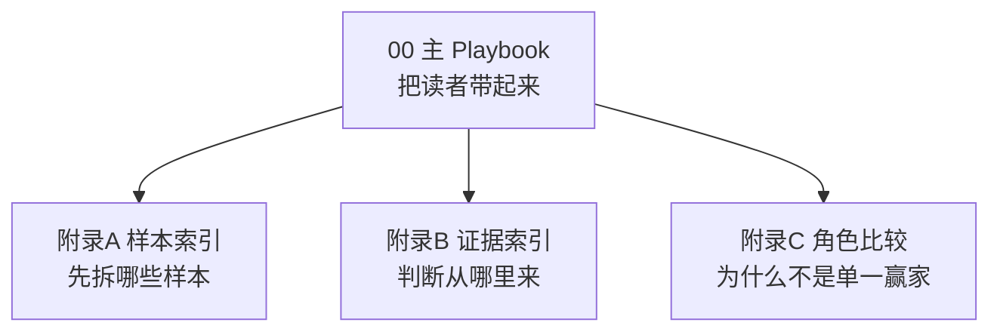
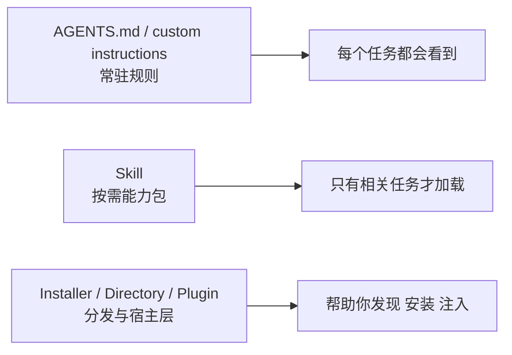
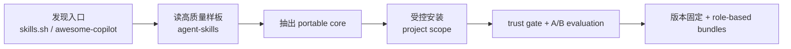
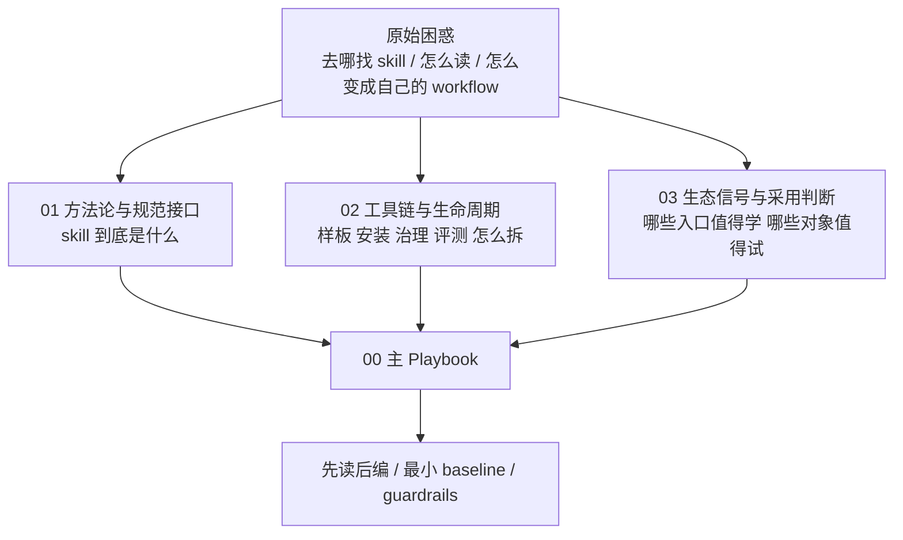
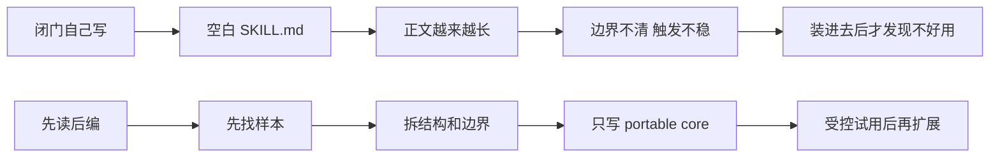
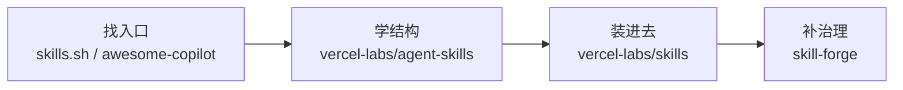
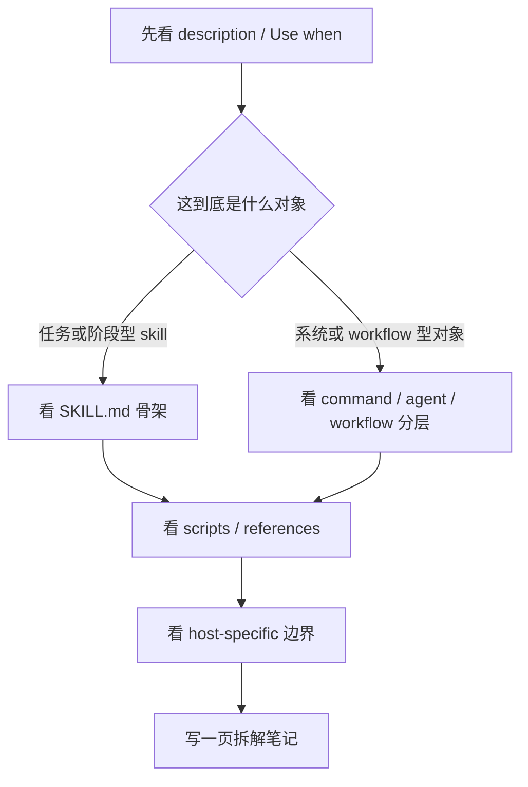
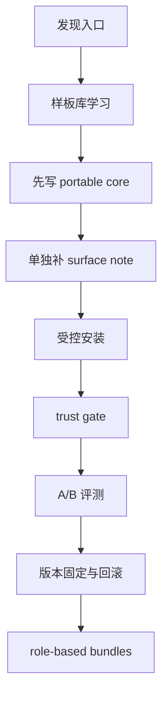
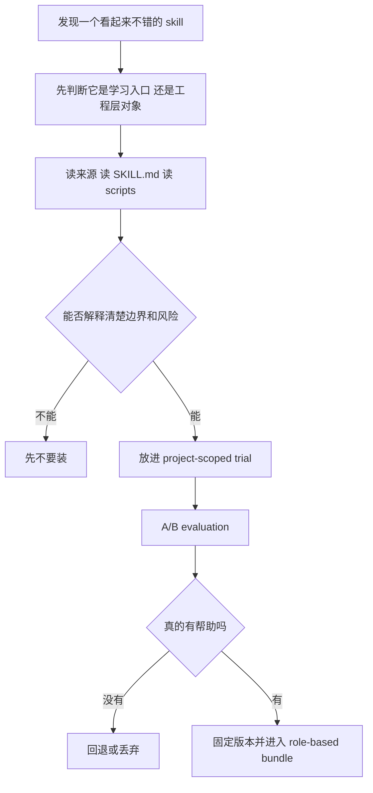

# Skill 工程从借鉴到编制的实践 Playbook

> 读者画像：
>
> - 你已经和 AI coding agent 合作过一段时间
> - 你知道 skill 很重要，但常见卡点还是：
>   - 去哪找
>   - 找到了怎么看
>   - 拿到了敢不敢装
>   - 自己写时为什么总像零散 prompt
>
> 这份 Playbook 不打算写成科学研究报告。
> 它要做的，是把你从“知道一点 skill”带到“知道先看什么、先练什么、怎么借鉴、怎么起自己的 baseline”。

## 这套包怎么读

这份 `00` 不是孤立正文，而是整套 final package 的主导航。

如果你现在最关心的是不同问题，建议这样读：

| 你现在最关心什么 | 先读哪里 | 再跳哪里 |
| --- | --- | --- |
| 我连 skill 到底是什么都还没彻底想明白 | 本页“如果你刚接触，先把 skill 想成什么” | 再顺着读本页后续章节 |
| 现成 skill 到底去哪找、先看什么 | 本页“为什么先读后编”到“怎样读一个现成 skill” | [附录A-代表性Skill样本与拆解索引](./附录A-代表性Skill样本与拆解索引.md) |
| 到底哪些对象该扮演什么角色 | 本页 `3` 和 `5` 节 | [附录C-角色分工与组合比较](./附录C-角色分工与组合比较.md) |
| 我想知道这些判断背后的证据从哪来 | 本页先通读 | [附录B-证据总表与引用索引](./附录B-证据总表与引用索引.md) |

也可以先把这张包结构图记住：



## 如果你刚接触，先把 skill 想成什么

很多人第一次接触 skill 时，脑子会混成一团，原因不是你理解力不够，而是生态里确实有几种长得很像、但职责完全不同的东西：

- `AGENTS.md` 这类 repo-level、常驻的指导
- `SKILL.md` 这类 task-level、按需加载的能力包
- installer、directory、plugin 这类围绕 skill 的分发或宿主层

如果这个边界不先讲清，后面所有“去哪找 skill”“怎么读 skill”“怎么编 skill”的建议都会悬在空中。[E18][E19][E20]

### 一句话定义

在这轮研究里，我们把 skill 先理解成：

> 一个围绕特定任务或流程阶段设计的、按需加载的目录级能力包。这个包通常有一个 `SKILL.md` 入口文件，并且可以附带脚本、参考资料、样例或其他 supporting files。[E18][E19][E21]

这里最重要的不是“它是 Markdown”，而是三件事：

- 它是 `目录级对象`
- 它是 `task-level / on-demand`
- 它是 `能力包`，而不是一段散落提示词

### 为什么会有 skill，而不是只靠 AGENTS 或 custom instructions

因为很多经验并不适合常驻在 every task 里。

有些规则确实应该一直存在，比如：

- 仓库用什么测试命令
- 代码风格约定
- 哪些目录不能碰

这类东西更像 `AGENTS.md` 或 custom instructions。

但有些能力如果常驻，反而会让上下文变脏，或者让 agent 在不该用的时候乱用。比如：

- 只在合并前才需要的 PR review 规则
- 只在数据库迁移时才需要的 checklist
- 只在排查线上 bug 时才需要的 debugging flow
- 只在做无障碍检查时才需要的 UI 审查步骤

这类东西更适合被打包成 skill，在相关任务发生时再加载。这样做的意义就在于：

- 平时不污染上下文
- 需要时能被发现
- 复杂细节可以按需展开
- 同一套能力能被复用，而不是每次重新讲一遍[E18][E19][E21]

这张图会比文字更好记：



### 一个 skill 常见会分装什么

如果把 skill 当成一个“能力包”来看，它通常会分成下面几层：

| 层 | 里面常放什么 | 它解决什么问题 |
| --- | --- | --- |
| 入口层 | `SKILL.md`、`name`、`description` | 让 agent 知道这是什么、什么时候该用 |
| 核心步骤层 | 主正文里的 procedure / checklist | 让 agent 知道大致应该怎么走 |
| supporting 层 | `references/`、`examples/`、`assets/` | 把细规则、长示例、模板、附图下沉出去 |
| 执行层 | `scripts/` 或命令 | 把重复动作和可执行步骤稳定下来 |
| 兼容层 | `compatibility`、host-specific note | 把通用部分和宿主特定部分拆开 |

这也是为什么一个好的 skill，往往不是把所有知识都塞进 `SKILL.md`，而是把 metadata、instructions、references、scripts 分层组织起来。[E19][E21][E22]

### 一个最小例子：为什么“分装”比“一股脑写进去”更好

假设你想做一个“数据库迁移前检查”能力。

第一次接触 skill 的人，最容易写成这样：

```md
# Database Migration

Before any migration, check backup, rollback plan, data compatibility,
index rebuild, long-running transactions, dependent services, release notes,
monitoring, alerting...
```

这类写法的问题不是不对，而是所有信息都挤在了一层里。  
agent 看到了很多话，但不容易知道：

- 这到底什么时候该触发
- 哪几步是主线
- 哪些细节是需要时再展开的
- 哪些检查其实更适合脚本化

更像 skill 的写法，会把它拆成这样：

```md
---
name: db-migration-check
description: Use when preparing or reviewing a database schema migration and you need a pre-flight safety pass.
---

1. 先确认这是 schema migration，不是普通 SQL 查询变更。
2. 先检查 rollback 方案、影响范围和高风险表。
3. 详细检查项去看 `references/migration-checklist.md`。
4. 如果要做重复验证，运行 `scripts/preflight-check.sh`。
```

这时一个能力包就被拆成了：

- `description` 负责路由
- 正文负责主线
- `references/` 负责长 checklist
- `scripts/` 负责重复动作

读到这里，你就会开始明白：skill 的价值不只是“教 agent 一件事”，而是把一件复杂但重复出现的任务，拆成一个可发现、可加载、可维护的能力包。

### 常见使用场合到底有哪些

如果你还是觉得 skill 很抽象，最简单的办法是直接看它常被用在什么场合。

这轮 research 里反复出现、也最适合打成 skill 的场合，大致有四类：

| 场合 | 为什么适合做成 skill | 一个直观例子 |
| --- | --- | --- |
| 流程阶段型任务 | 只在某个阶段出现，但步骤稳定 | PR review、release、retro、migration |
| 专项检查型任务 | 需要固定检查顺序和标准 | security review、performance check、accessibility audit |
| 领域操作型任务 | 有稳定的 domain procedure | API 设计、前端 UI 检查、数据库变更 |
| 系统编排型任务 | 不只是写内容，还要调度角色或工具 | debugging flow、subagent workflow、QA pipeline |

换句话说，skill 最擅长承载的，不是“泛泛的建议”，而是“某类任务里反复出现、又需要稳定步骤和边界的做法”。

如果你只记一个判断，就记这个：  
当一件事“不是每个任务都该常驻，但一旦遇到又总要重复讲很多遍”，它通常就已经很像 skill 了。

## 先给结论

如果把整套方法压缩成一句话，其实就是：

先用目录站和社区入口把视野打开，再用高质量样板学结构，接着只写自己的 `portable core`，然后通过受控安装、来源审查和 A/B 评测慢慢把 skill 变成真正能用的工作流，而不是一上来就追“最强仓库”或者“最全配置”。[E02][E03][E04][E09][E12]



如果你只想先记住最重要的三件事，可以先记这三条：

1. 不要从空白 `SKILL.md` 开始。先读现成样本，再编自己的 skill，成长速度会快得多。[E02][E09]
2. 当前最稳的答案不是找“单一赢家”，而是先把 skill 生态拆成不同职责层：学习入口、样板库、installer、治理层。[E03][E12]
3. 对新进入者最有杠杆的三个入口仍然是 `skills.sh`、`github/awesome-copilot`、`vercel-labs/agent-skills`。[E03][E06][E07]

## 1. 我们为什么会做这轮研究

这轮研究原本并不是为了做一个“生态盘点大全”。

它真正要解决的是一个很具体的问题：当 AI coding agent 已经进入真实工程之后，我们到底该怎样找 skill、读 skill、借 skill、编 skill，最后把它变成自己的工作流，而不是一直停留在“看别人很厉害，自己写出来却像 prompt 碎片”的阶段。[E01]

这也是为什么最开始会拆成三个 topic：

| Topic | 它负责解决什么 |
| --- | --- |
| `01` 方法论与规范接口 | skill 到底是什么，最小共同层是什么，哪些约定值得当工作标准 |
| `02` 工具链与生命周期 | 哪些对象在管样板、安装、治理、发布、评测，职责怎么拆 |
| `03` 生态信号与采用判断 | 哪些入口最值得学，哪些对象值得试，哪些对象只能参考不能直接信 |

如果不先把这三件事拆开，最终就很容易把下面这些东西混成一团：

- 样板库
- installer
- 目录站
- 社区学习入口
- 治理和发布工具

一混类，后面就会开始追“总冠军”；一旦追“总冠军”，你很快就会误把学习入口当工程基座，或者误把安装便利当可信度。[E02][E12]

如果你想先用一张图把这 3 个 topic 的关系看明白，可以先看这个：



## 2. 为什么这件事最该坚持“先读后编”

先说一个最现实的判断：

今天在网上找到现成 skill，通常已经不是最难的一步。真正难的，是你拿到这些东西之后，到底会不会读、会不会拆、会不会借、会不会把别人的经验转成自己的判断。[E06][E07][E09]

这也是为什么“先读后编”不是一个姿态问题，而是一个效率问题。

一个很典型的失败场景是这样的：你脑子里已经有一个“PR review skill”的想法，于是直接新建一个 `SKILL.md`，正文上来就是一大段“请帮我认真 review PR”。表面上它好像已经有了用途，但几个关键问题都没解决：

- 它什么时候该触发，什么时候不该触发
- review 时应该先看范围、风险还是测试
- 细的检查项该留在正文，还是该下沉到 supporting files
- 它是不是只适合某一个宿主

结果就是：这个 skill 也许偶尔能用，但它既不稳定，也很难复用。

而“先读后编”的路径会完全不同。你会先去看别人是怎样把 `Use when` 写清楚的，怎样把正文和 `references/` 分开，怎样用少量步骤把一个 skill 的边界固定下来。等你真正开始写自己的版本时，起点已经不是空白页，而是一套你能看懂、能拆开、也能判断哪里该借、哪里不该抄的现成经验。[E05][E09]

下面这张图可以把差别看得更直白：



这也是为什么先读现成样本会更快：

- 目录站和社区聚合站已经把“去哪里找样本”这件事大幅简化了。[E06][E07]
- 官方样板库已经把“优秀 skill 一般长什么样”展示得很直白。[E05]
- 官方 guide 也在主动鼓励“先看、先借鉴、再改造成自己的 workflow”，但同时强调要把 skill 当 code-like asset 来审查。[E09]

可以把这条路径记成一句很实用的话：

> 先借现成样本缩短冷启动，再靠实验把借来的东西变成自己的经验。

## 3. 先看哪几类样本，而不是乱看一圈

最省时间的做法，不是漫无目的看很多仓库，而是先按职责去看。

| 先看什么 | 它最适合回答什么问题 | 正确用法 | 最容易误读成什么 |
| --- | --- | --- | --- |
| `skills.sh` | 现成 skill 在哪里、生态入口长什么样 | 当 discovery / directory 入口 | 误当质量背书系统 |
| `github/awesome-copilot` | 社区都在分享什么、教程入口在哪里 | 当 learning hub 和扩搜入口 | 误当工程基座 |
| `vercel-labs/agent-skills` | 一个高质量样板库通常怎么组织 | 当结构样板和内容参考库 | 误当 installer / governance 层 |
| `vercel-labs/skills` | 现成 skill 怎么安装、更新、对接多宿主 | 当 install / distribution 层 | 误当 trust / evaluation 层 |
| `skill-forge` | skill 怎么走审计、发布、治理 | 当 governance / publish 层跟踪对象 | 误当冷启动时唯一答案 |

这张表背后的意思很简单：

- `skills.sh` 和 `awesome-copilot` 解决的是“找什么看”
- `agent-skills` 解决的是“优秀样板长什么样”
- `skills` 解决的是“怎么装进去”
- `skill-forge` 解决的是“怎么把质量和治理补上”[E03][E08][E12]

把它画成一张职责图，会更容易记，也更不容易混类：



你可以把这四层理解成“先学会看，再学会搭”。如果你现在只是在冷启动阶段，前两层最重要；如果你已经准备在真实项目里试用 skill，后两层才会开始变得关键。

这里给一个最小示范。假设你现在想做一个“内部 PR review skill”，最稳的起步方式不是直接写，而是：

1. 先在 `skills.sh` 或 `awesome-copilot` 上看大家怎样组织 review / QA / code-review 类样本。
2. 再去读一个高质量样板库，观察它怎么写 `Use when`、怎么拆正文和 supporting files。
3. 只有到了第三步，你才开始写自己的第一版，并且只先写最小的 review 流程，而不是把所有公司规范一次性塞进去。

### 一个够用的阅读顺序

1. 先用 `skills.sh` 和 `awesome-copilot` 把视野打开。[E06][E07]
2. 再去读 `vercel-labs/agent-skills` 这种高质量样板库，看结构和 use-when。[E05]
3. 读到想试时，再看 `vercel-labs/skills` 这类 installer / manager 是怎么把东西装到 project 或 global scope 的。[E08]
4. 真要进入团队使用，再把 trust gate、evaluation、versioning、治理补上。[E03][E04]

如果你现在就想按顺序挑具体样本，直接跳到 [附录A-代表性Skill样本与拆解索引](./附录A-代表性Skill样本与拆解索引.md)。

## 4. 怎样读一个现成 skill，才不会只看热闹

很多人拿到一个 skill 仓库时，只会看 README，或者只盯着入口文件。

这远远不够。

更有效的读法，其实更像在读一个小系统，而不是在看一段文案：



### 第一步：先看它在解决什么任务，不要先看它写了多少话

先找：

- `description`
- `Use when`
- skill 名称
- 这组 skill 是按什么切分的

你要先判断它到底在解决：

- 一个任务
- 一个流程阶段
- 一个角色
- 还是一个完整系统

如果这一步看不清，后面很容易把样板库、runtime、workflow system 全混掉。

举个最小例子。你看到一个对象时，先不要急着研究它写得多详细。先问一句很土但很好用的话：它是在教 agent 做“一件事”，还是在教 agent 走“整条流程”？  
如果是前者，你接下来重点看 `SKILL.md` 本体和 supporting files；如果是后者，你就应该准备去看 command、workflow、hook、template 这些外围结构。

### 第二步：再看它的骨架，而不是先钻细节

对标准 `SKILL.md` 样本，先看：

- frontmatter
- 正文的阶段切分
- supporting files 有没有被合理下沉
- `scripts/` 和 `references/` 怎么配合

`vercel-labs/agent-skills` 就是非常好的骨架样本：它清楚地暴露了 `SKILL.md + scripts + references` 这种结构，也把 `Use when` 写成了真正的路由线索。[E05]

这里最值得学的，不是它“写得很完整”，而是它没有把所有细节都塞进正文。  
它给你的真正示范是：什么该留在主 skill，什么该下沉，什么该通过 supporting files 按需展开。

### 第三步：读作者怎么管边界

真正值得借的，不只是写法，更是边界感。

你应该专门找：

- 哪些东西进 `SKILL.md`
- 哪些东西被下沉到 `references/`
- 哪些步骤必须先验证再继续
- 哪些内容是 host-specific 的

这一步非常关键，因为很多新手最容易复制的是表面格式，最容易漏掉的是作者如何避免乱触发、如何做 progressive disclosure、如何限制工具和上下文膨胀。[E02][E17]

如果你读到这里还觉得抽象，可以直接用一个简单判断来练手：  
当你看到一个 skill 的正文越来越长时，不要先想“是不是信息更全”，先想“这里面哪些东西应该被拆到 `references/` 或脚本里”。这就是在训练边界感。

### 第四步：用“拆解例子”训练自己的眼睛

本地其实已经有几组很好的拆解样本，可以直接拿来练手。它们分别适合训练不同的“眼睛”：

| 样本 | 最适合训练什么眼睛 | 你应该重点看什么 |
| --- | --- | --- |
| `agent-skills` | 生命周期眼睛 | Define / Plan / Build / Verify / Review / Ship 怎么串起来 [E13] |
| `get-shit-done` | 系统分层眼睛 | command / agent / workflow / reference / template 五层结构 [E14] |
| `superpowers` | 宿主与验证眼睛 | bootstrap、hooks、宿主适配、行为测试 [E15] |
| `gstack` | 高级系统眼睛 | 模板、浏览器 runtime、specialist review、多宿主适配 [E16] |

### 一个很实用的阅读口诀

```text
先看入口 -> 再看骨架 -> 再看边界 -> 再看支撑层 -> 最后才模仿
```

如果你想把这套读法落到具体样本上，不要停在这里，直接去看 [附录A-代表性Skill样本与拆解索引](./附录A-代表性Skill样本与拆解索引.md)。

## 5. 自己起步时，一个够稳的 baseline 长什么样

当前最稳的结论不是“挑一个项目 all in”，而是先搭一个职责拆分清楚的最小 baseline。[E03][E12]



### 这条 baseline 的最小组成

| 层 | 当前最像的对象 | 你应该怎么用 |
| --- | --- | --- |
| discovery / learning | `skills.sh`, `github/awesome-copilot` | 找样本、找入口、扩视野 |
| sample library | `vercel-labs/agent-skills` | 学结构、学分层、学 `Use when` |
| install / distribution | `vercel-labs/skills` | 受控装载到 project 或 global scope |
| governance / publish | `skill-forge` | 补审计、发布、质量门槛 |
| evaluation / versioning discipline | 你自己的流程 | 防止 skill 污染和回归扩散 |

### 当前最小可执行 workflow

真正的最小 workflow，不该理解成一串口号，而应该理解成一条很具体的工程动作链：

先从现成样板开始，不从空白文档起步；然后只用最小共同层起草自己的 skeleton，把 host-specific 的扩展单独写进 compatibility note；接着用 installer / manager 放进受控 scope，而不是一上来全局扩散；装好以后立刻走 trust gate，读 `SKILL.md`、`scripts/` 和关键 `references/`；最后用 with / without A/B evaluation 看它到底有没有帮助，再决定是否固定版本、是否进入 role-based bundle。[E02][E04][E08][E09][E10][E11]

这条 workflow 最重要的特征，不是“工具很多”，而是职责拆得清楚。[E04][E12]

### 一个最小示范：如果你今天要做“内部 PR review skill”

下面这个例子是示意，不是规范模板。它的作用只是让你看见“先读后编”在工程上长什么样。

#### 第一步：不要先写大而全的 skill

很多人第一次会写成这样：

```md
# PR Review Skill

Review pull requests carefully.
Check architecture, coding style, tests, security, performance,
documentation, migration risk, release notes...
```

这类写法的问题不是信息少，而是没有路由、没有边界、没有下沉结构。

#### 第二步：先写最小 portable core

更稳的第一版会更像这样：

```md
---
name: internal-pr-review
description: Use when reviewing a pull request before merge and you need a structured pass over risk, tests, and regressions.
---

1. 先确认这是不是“合并前 review”，而不是需求澄清或故障排查。
2. 先看变更范围，再看高风险文件，再看测试和回归风险。
3. 如果需要详细检查项，去读 `references/review-checklist.md`。
```

然后你再把很细的 checklist 下沉到 `references/review-checklist.md`，把宿主相关行为写到 compatibility note 里。这样一来，主 skill 是轻的，边界是清楚的，也更容易测试。

如果你想看“为什么是这几层、每层最容易被误读成什么”，直接跳到 [附录C-角色分工与组合比较](./附录C-角色分工与组合比较.md)。

## 6. 从借鉴到自己会编，不要一步跳太远

最常见的失败不是“没有资料”，而是跳得太快。

更稳的练法是四段，而且这四段最好被理解成一条成长曲线：


### 阶段 1：先借一个好样本，不要先发明

这一阶段的目标，不是写产物，而是长眼睛。你要真正看懂：什么叫合理的 `description`，正文和 supporting files 怎么分层，作者是怎样把边界写出来的。  
这一阶段最好的产物，不是一个半成品 skill，而是一页拆解笔记，以及一张“哪些值得借、哪些不值得抄”的清单。

### 阶段 2：只改写 portable core

这一阶段最重要的是克制。你先不要追平台特性，也不要追花哨配置，先让自己的 skill 具备最小共同层。  
对大多数人来说，这一阶段真正该完成的只有两样东西：一个干净的 `SKILL.md` skeleton，以及一份很短的 `compatibility note`。

### 阶段 3：进入受控试用

从这一步开始，你的关注点要从“看起来合理”切到“真实任务上有没有帮助”。  
也就是说，skill 已经不是写作对象，而是试验对象。你需要一个 controlled trial、一组 with / without 对照结果，以及一条最近验证通过的版本记录。

### 阶段 4：再做组合、注入和治理

只有前三步走稳之后，你才值得进入第四步。  
这一步的目标已经不是“会写一个 skill”，而是“会维护一套 skill 工作流”。这时才开始谈 role-based bundles、trust gate、version pinning、rollback 和定期清理策略，才不会变成概念堆叠。

如果你现在还没有稳定写过一个最小 skill，不要先去学最复杂的 runtime 框架。先把前三步走稳，收益最高。

## 7. 一定要保留的 guardrails

下面这几条不是锦上添花，而是 baseline 本体。

如果把安装前后的判断流程画出来，它其实长这样：



### Guardrail 1：把 skill 当 code-like asset 看

不要因为它是 Markdown 或目录对象，就把它当“安全的上下文素材”。

装之前至少看：

- `SKILL.md`
- `scripts/`
- 会进上下文的 `references/`
- 权限和工具边界

官方和社区层都已经明确给出这个提醒：现成 skill 很好找，但安装前必须检查来源和内容。[E07][E09][E10]

换句话说，你在目录站上看到一个 skill 时，默认心态不该是“终于找到现成的了”，而应该是“终于找到一个值得审查的候选对象了”。

### Guardrail 2：不要把“能发现”误当“值得信任”

目录站证明的是 discovery，不是质量保证；社区聚合站证明的是学习入口，不是工程背书；download、star、收录都不能自动替代任务级验证。[E06][E07][E10][E11]

这里有个非常常见的误判：看到某个 skill “被很多地方收录”，就把它当成可直接采用的工程对象。更稳的理解应该是，它更可能先是一个学习入口，然后才是一个待验证候选。

### Guardrail 3：不要把 installer 误当 evaluation system

`vercel-labs/skills` 很强，但它解决的是安装、更新、兼容和单一事实源，不是“它装进去以后一定更好用”。[E08][E12]

### Guardrail 4：不要全量激活，优先 role-based bundles

skill 一多，selection failure 和 recall overload 会很快出现。

更稳的策略是：

- 先按任务包
- 再按角色包
- 最后才考虑扩库

这一步不是优化项，而是避免 selection failure 的 baseline 纪律。[E04]

### Guardrail 5：不要把一个平台的扩展字段抄成通用标准

跨 `Codex / GitHub / Claude` 真正稳的是 `portable core`，不是所有 frontmatter 扩展都能自然通用。[E02][E17]

如果你需要把这几条 guardrail 讲给别人听，并且希望能回指到证据，不要只用主文档口头转述，直接配合 [附录B-证据总表与引用索引](./附录B-证据总表与引用索引.md)。

## 8. 如果你今天就要开始，先做这 5 件事

如果你今天就要开始，不妨把第一轮练习压缩成这样一张行动卡：

| 时间 | 你该做什么 | 产物 |
| --- | --- | --- |
| `20` 分钟 | 用 `skills.sh` 或 `awesome-copilot` 找 `3` 个风格不同的样本 [E06][E07] | 一个候选清单 |
| `30` 分钟 | 认真拆一个 `vercel-labs/agent-skills` 类样本 [E05][E13] | 一页拆解笔记 |
| `20` 分钟 | 只写一个最小 `portable core` skeleton [E02][E17] | 第一版 `SKILL.md` |
| `20` 分钟 | 放进 project-scoped controlled trial [E04][E08] | 一个试用入口 |
| 后续任务中 | 做最小 A/B 对照并记录版本 [E04][E11] | 一条验证记录 |

如果你照这五步走，你已经不再是在“碰运气地试 skill”，而是在建立自己的 skill engineering 手感。

## 9. 读完之后，你下一步该怎么练

给自己定一个很小但完整的练习循环：

### 第一次练习

读一个高质量样板，拆出它的结构和边界，然后写自己的最小骨架。第一轮只求“轻、稳、可解释”，不要追求“完整、强大、覆盖所有场景”。

### 第二次练习

把它装进一个 project-scoped controlled trial，做一次 with / without 对照，再修掉最明显的误触发和上下文膨胀问题。到这一步，你才会真正感受到“好不好用”和“写得像不像”其实是两回事。

### 第三次练习

再读一个系统级样本，例如 `superpowers` 或 `get-shit-done`，然后问自己：我现在缺的是内容能力、编排能力、注入能力，还是治理能力？这一步的重点已经不是模仿，而是识别自己的下一段学习台阶。

当你开始能稳定回答下面这几个问题时，你就不再只是“会用别人 skill”，而是在长自己的 skill engineering 能力：

- 我为什么选这个样本，不选那个
- 我借的是它的哪一层，不是整套照抄
- 我的 portable core 和 host-specific extension 分界在哪里
- 我的 trust gate、evaluation、rollback 在哪里

这时你再去追更复杂的 skill system，就会快很多。
