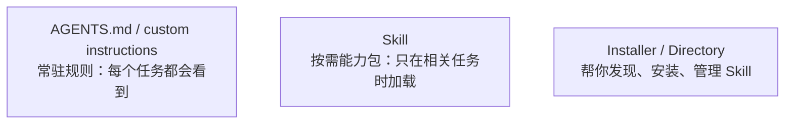
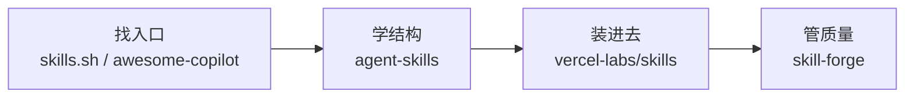

# Skill 工程实战指南

你大概已经在用 AI coding agent 了——Claude Code、Copilot、Codex，随便哪个。你也大概试过往 `AGENTS.md` 或 custom instructions 里塞各种规则：代码风格、测试命令、目录约定。这些常驻指令确实好用。

但你有没有碰到过这种情况：

你想让 agent 帮你 review PR。于是你写了一大段 prompt：「请仔细检查架构、测试覆盖、安全风险、性能问题、文档……」有时候效果还行，有时候 agent 一看就不知道从哪下手，或者在一个不该 review 的场合突然开始 review。更糟的是，这段 prompt 常驻在那里，每次启动都占上下文，哪怕你今天只想改一行 CSS。

这份指南要解决的就是这个问题：**怎样把这类"不该常驻、但每次遇到都得重复讲"的经验，变成一个 agent 能按需加载的能力包——也就是 Skill。**

这不是一份研究报告，也不是生态盘点。它更像一条路径：从"skill 到底是什么"，到你亲手写完并用上自己的第一个 skill，一步一步来。

---

## 1. Skill 到底是什么

### 你已经在用的东西，和它解决不了的问题

如果你用过 `AGENTS.md` 或 custom instructions，你已经知道常驻指令长什么样了。它们适合放那些**每个任务都该遵守的规则**：

- 仓库用 `pnpm test` 跑测试
- 代码风格用 4 空格缩进
- `src/generated/` 目录不要手动改

这些东西常驻在上下文里完全合理——agent 做任何事都应该知道。

但有些经验放在常驻指令里就不对了。比如：

- 只在合并前才需要的 PR review 流程
- 只在做数据库迁移时才需要的安全检查
- 只在排线上 bug 时才需要的 debugging 步骤
- 只在做无障碍检查时才需要的 UI 审查规则

这些东西如果也塞进 `AGENTS.md`，会怎样？

首先，**上下文会变脏**。agent 处理一个简单的 CSS 改动时，脑子里塞着一整套 PR review 规则和 DB migration checklist，这些噪音只会让它分心。其次，**可能会乱触发**。你没让它 review PR，它看到一段代码变更就开始自作主张地"帮你检查"。最后，**维护起来很痛苦**。所有经验挤在一个文件里，越来越长，越来越难改。

这就是 Skill 要解决的问题。

### 你可以先这样理解 Skill

Skill 就是一个文件夹，里面装着一组和特定任务相关的指令、脚本和参考资料。**平时不加载，只有你需要的时候才让 agent 读进来。**

用更准确一点的话说：

> Skill 是一个按需加载的、目录级的能力包。它有一个 `SKILL.md` 入口文件，可以附带脚本、checklist、模板或其他参考资料。

这里最重要的三个词是：

- **按需**——不是常驻的，只在相关任务发生时加载
- **目录级**——不是散落的一段 prompt，而是一个有组织的文件夹
- **能力包**——不只是"告诉 agent 一些事"，而是把一件复杂任务的指令、资料、脚本打包在一起

### 一张图看清三层关系

你的 agent 环境里其实有三种不同的东西，把它们分清楚很重要：



**常驻指令**管的是"agent 做任何事都该知道的规矩"。**Skill** 管的是"只有做某件特定事时才需要的完整能力"。**Installer 和 Directory** 管的是"去哪找 skill、怎么装进来"。

三层不要混，后面所有事情都会清楚很多。

### Skill 最擅长承载什么

如果你还不确定什么东西适合做成 skill，看看这四类场景——它们是实践中最常被打成 skill 的：

**流程阶段型**：只在某个阶段出现，但步骤稳定。比如 PR review、release checklist、retro 模板。

**专项检查型**：需要固定检查顺序和标准。比如 security review、performance audit、accessibility 检查。

**领域操作型**：有稳定的领域流程。比如 API 设计规范、数据库变更流程、前端 UI 检查。

**系统编排型**：不只是写内容，还要调度工具或角色。比如 debugging flow、多 agent 协作、QA pipeline。

一个很好用的判断标准：**当一件事"不该每个任务都常驻，但一旦遇到又总要重复讲很多遍"，它大概就该是一个 skill 了。**

你回想一下上面那个 PR review 的例子——它完美符合这个标准。后面几章，我们就用它当主线，一步步把它从一段散装 prompt 变成一个真正的 skill。

### 🛠 动手

现在不用急着写东西。先在脑子里（或者随手记一下）想一件事：**在你的日常工作里，有什么经验是"不该常驻但每次遇到都得重复讲"的？** 记住它，后面会用到。

---

## 2. 一个 Skill 长什么样

上一章说了 skill 是"目录级能力包"。但一个能力包具体长什么样？里面怎么组织？什么该放主文件，什么该拆出去？

最快的学习方式不是看定义，而是直接拆一个真实的例子。

### 先看一个好骨架

`vercel-labs/agent-skills` 是目前公认质量最高的 skill 样板库之一。我们拿它的一个 skill 来看看骨架是什么样的。下面不是完整内容，但结构是真实的：

```
skills/
  code-review/
    SKILL.md          ← 入口文件
    scripts/
      check-coverage.sh
    references/
      review-checklist.md
      style-guide.md
```

打开 `SKILL.md`，你会看到大致这样的结构：

```markdown
---
name: code-review
description: Use when reviewing code changes before merge and you need a structured pass over quality, risk, and test coverage.
---

## Steps

1. Identify the scope of changes — which files changed, which modules are affected.
2. Check for high-risk patterns (security, data mutation, breaking changes).
3. Verify test coverage — see `scripts/check-coverage.sh`.
4. For detailed review criteria, refer to `references/review-checklist.md`.
```

就这么多。它不长，但每一层都有明确的职责。

### 拆开看：五层结构

一个组织良好的 skill，通常可以拆成五层。不是每层都必须有，但知道这个分层会帮你理解为什么好的 skill 看起来"轻"而不是"长"：

**入口层**：`SKILL.md` 文件，加上 `name` 和 `description`。这一层的职责是让 agent 知道"这是什么"和"什么时候该用"。这里有一个非常关键的点——`description` 不是给人看的简介，**它是路由规则**。agent 就是靠这段话来决定要不要加载这个 skill 的。写得太模糊，它不知道什么时候该用；写得太宽泛，它在不该用的时候也会乱用。

**核心步骤层**：正文里的主要步骤或 checklist。这一层要保持精炼——只写主线流程，不要把所有细节都塞进来。

**Supporting 层**：`references/` 目录下的长 checklist、规范文档、模板等。这是"需要时再展开"的细节。agent 在执行主线步骤时如果需要更多信息，才会去读这些文件。

**执行层**：`scripts/` 目录下的可执行脚本。把重复的、机械的操作稳定下来，而不是每次都让 agent 临时拼命令。

**兼容层**：host-specific 的说明或 compatibility notes。比如"这个 skill 在 Claude Code 里会自动触发，但在 Copilot 里需要手动调用"。这一层把通用部分和平台特定部分拆开。

### 同一件事，两种写法

现在回到我们的 PR Review 例子。上一章说过，你可能第一次会写成这样：

```markdown
# PR Review

Review pull requests carefully.
Check architecture, coding style, tests, security, performance,
documentation, migration risk, release notes...
```

这不是不对，但所有信息挤在一层里。agent 看到了很多话，却不知道：

- 这到底什么时候该触发（没有 `description`）
- 哪几步是主线，哪些是细节
- 哪些检查适合脚本化
- 这段话是只适合 Claude Code，还是跨平台通用

如果按上面的五层结构来改写，它会变成这样：

```markdown
---
name: pr-review
description: Use when reviewing a pull request before merge and you need a structured pass over scope, risk, tests, and regressions.
---

## Steps

1. Confirm this is a pre-merge review, not a requirements discussion or incident triage.
2. Scan change scope — which files, which modules, any cross-boundary changes.
3. Check high-risk areas — security-sensitive files, data mutations, breaking API changes.
4. Verify test coverage — run `scripts/check-test-coverage.sh` if available.
5. For the full review checklist, see `references/review-checklist.md`.
```

然后你的目录结构会是：

```
skills/
  pr-review/
    SKILL.md
    scripts/
      check-test-coverage.sh
    references/
      review-checklist.md
```

对比一下两个版本：

**散装版**把所有东西塞进一段话，agent 只能整段读、整段用。**分层版**把路由交给 `description`，主线交给正文，细节交给 `references/`，机械操作交给 `scripts/`。主 skill 文件是轻的，边界是清楚的，也容易测试和迭代。

这里最值得学的不是格式——不是说你也得用 YAML frontmatter、也得有 `scripts/` 目录。**最值得学的是思路：什么该留在主文件，什么该下沉，什么该自动化。**

### 再看一个例子：数据库迁移

为了加深印象，再看一个不同类型的例子。假设你要做一个"数据库迁移前检查"skill：

**天真版**：

```markdown
# Database Migration

Before any migration, check backup, rollback plan, data compatibility,
index rebuild, long-running transactions, dependent services, release notes,
monitoring, alerting...
```

**分层版**：

```markdown
---
name: db-migration-check
description: Use when preparing or reviewing a database schema migration and you need a pre-flight safety pass.
---

1. Confirm this is a schema migration, not a regular SQL query change.
2. Check rollback plan, impact scope, and high-risk tables.
3. For the full pre-flight checklist, see `references/migration-checklist.md`.
4. To run automated validation, use `scripts/preflight-check.sh`.
```

同样的模式：`description` 负责路由，正文负责主线，`references/` 负责长清单，`scripts/` 负责重复动作。

到这里你应该开始感觉到了：**skill 的价值不只是"教 agent 一件事"，而是把一件复杂但反复出现的任务，拆成一个可发现、可加载、可维护的能力包。**

### 怎么读别人的 Skill：不要只看热闹

当你去看别人写的 skill 时（下一章就会讲去哪看），不要只翻 README 或者只盯着入口文件。更有效的读法更像在读一个小系统：

**第一步：看它在解决什么任务**。先找 `description`、`Use when`、skill 名称。判断它到底在解决一个任务、一个流程阶段、一个角色，还是一个完整系统。如果第一步判断不清，后面很容易把样板库、runtime、workflow system 全混在一起。

**第二步：看它的骨架**。正文分了几步？supporting files 有没有合理下沉？`scripts/` 和 `references/` 怎么配合？最值得关注的不是它"写了多少内容"，而是它**没有把什么塞进主文件**。

**第三步：看它怎么管边界**。哪些东西在 `SKILL.md` 里？哪些被下沉到 `references/`？哪些步骤必须先验证再继续？有没有 host-specific 的说明？新手最容易复制的是表面格式，最容易忽略的是作者如何避免乱触发、如何做按需展开。

**第四步：写一页拆解笔记**。记下这个 skill 的结构、你觉得最值得借鉴的点、以及你觉得不适合照搬的地方。

一个口诀：**先看入口 → 再看骨架 → 再看边界 → 再看支撑层 → 最后才模仿。**

### 读样本时问自己的 6 个问题

不管你看哪个 skill，都可以先问这 6 个问题：

1. 它到底在解决一个任务、一个流程阶段、一个角色，还是一个完整系统？
2. 它的入口层是什么？（`description` 写了什么？路由够精准吗？）
3. 它的正文和 supporting layer 是怎么分的？
4. 它最值得借的是结构、路由、边界，还是编排？
5. 它最容易被照抄的是哪一层？（通常就是最不该照抄的）
6. 如果装进真实项目，最先需要补的安全措施是什么？

这 6 个问题答清了，你看样本就不再只是"看热闹"，而是在训练自己的拆解能力。

### 🛠 动手

去 [skills.sh](https://skills.sh) 或 [awesome-copilot](https://github.com/jmagar/awesome-copilot) 上找一个你感兴趣的 skill。用上面教的方法和 6 个问题，认真读它一遍。不需要很久——花 15 分钟就好。重点不是"读完"，而是感受一下好的 skill 和你之前写的散装 prompt 有什么不同。

---

## 3. 去哪里找好样本

上一章你已经知道了 skill 长什么样、怎么拆着读。现在自然的问题是：**去哪找这些东西？**

答案其实很简单——当前 skill 生态已经有不少地方可以找到现成样本了。但这里有一个坑，很多人一头扎进去之后会踩：**把"能找到"等同于"值得信"。**

在讲具体去哪看之前，先把这个原则记住。它会在后面反复救你。

### 按你的阶段选入口

与其列一张大表让你自己挑，不如按你现在所处的阶段来：

**如果你想找灵感、看看别人都在做什么 skill**——去 [skills.sh](https://skills.sh)。这是目前最大的 skill 目录站，收录了大量现成 skill，支持多 agent 平台。你可以把它当作一个商场大厅：走一圈看看有什么、什么类型最热门、大家都在为哪些任务做 skill。但要记住——**商场大厅不是质检机构**。一个 skill 在 skills.sh 上有条目，只证明它被收录了，不证明它好用、安全或者适合你的场景。

**如果你想看社区层的教程和学习资源**——去 [awesome-copilot](https://github.com/jmagar/awesome-copilot)。这个仓库把社区里的 skill 资源、教程和工具聚合在了一起。它更像一个学习入口——帮你扩搜视野、看看别人怎么组织和分享 skill。但同样，**收录不等于背书**。它给你一个清单，帮助你决定先看什么，但不替你做质量判断。

**如果你想学好 skill 长什么结构**——去看 [vercel-labs/agent-skills](https://github.com/vercel-labs/agent-skills)。上一章我们拆的骨架就来自这里。这是目前公认最值得学的样板库之一——它的 skill 结构清晰、`Use when` 写法规范、supporting files 组织合理。你可以把它当作一份高质量的参考答案，用来训练你"什么该放主文件、什么该下沉"的感觉。但要注意，**它是一个样板库，不是 installer，也不是治理平台**。你不能直接从它那里"安装"一个 skill 到你的项目里。

**如果你想把 skill 装进项目用**——看 [vercel-labs/skills](https://github.com/vercel-labs/skills)。这是一个 installer / manager 层的工具，它解决的是"怎么把一个 skill 受控地安装到你的 project scope 或 global scope"。它支持 symlink、目标目录映射、统一查找。但——**installer 不是信任系统**。它帮你装进去，不帮你判断"装进去以后是不是真有用"。那是你自己的事（第 6 章会讲怎么做）。

**如果你开始关心质量、审计和治理**——关注 [skill-forge](https://github.com/xnz00/skill-forge)。这个项目专注于 skill 的后处理——审计、发布、质量门槛。当你已经有了一些 skill、开始在团队里推广时，这一层就变得重要了。但**在冷启动阶段，你不需要先搞治理**。先把前面几步走稳。

### 为什么不存在"总冠军"

你可能注意到了——我没有说"用这个就够了"。因为这些工具解决的是完全不同的问题：

- `skills.sh` 和 `awesome-copilot` 解决的是**"去哪找"**
- `agent-skills` 解决的是**"好 skill 长什么样"**
- `vercel-labs/skills` 解决的是**"怎么装进去"**
- `skill-forge` 解决的是**"怎么把质量管起来"**



如果你硬要从里面挑一个"总冠军"，信息会丢掉一大半。一个样板库再好，它也不能帮你安装；一个 installer 再方便，它也不能替代你的人工审查。接受它们本来就是不同层，反而一切都简单了。

### 最常见的几个误判

刚开始接触 skill 生态的人，最容易犯的不是"找不到"，而是"找到了就以为靠谱了"。几个最常见的误判：

**"在 skills.sh 上能搜到，所以应该不错"**——不一定。目录站解决的是发现，不是质量保证。这就像 npm 上能搜到一个包不代表你该装——你还是得看一眼代码、看看维护状态。

**"vercel-labs/skills 能装，所以装进去就行了"**——装进去只是开始。installer 解决的是装载和兼容，不是效果验证。装进去以后好不好用，你得自己试（第 6 章讲怎么做 A/B 对照）。

**"agent-skills 看起来最完整，就用它当基座吧"**——它是样板库，强在教你学，但它没有治理层和发布层。把它当学习参考，别把它当全链路工程基座。

**"这个 skill 被很多地方收录了，应该可以直接用"**——被收录说明 discoverability 高，不说明质量高。更稳的心态是：它是一个值得审查的候选，不是一个可以直接采用的结论。

一句话总结：**能找到 ≠ 能信，能安装 ≠ 有效，很好学 ≠ 全链路能押。**

### 🛠 动手

现在花 20 分钟，做一件简单的事：

1. 去 `skills.sh` 或 `awesome-copilot` 找一个和你工作相关的 skill 样本
2. 用上一章的"6 个问题"拆解法认真读一遍
3. 写一页简短的拆解笔记——它在解决什么任务？骨架怎么分的？哪里值得借鉴、哪里不该照抄？

这一步不用写代码。它的目的是**在你动手写 skill 之前，先训练你看 skill 的眼睛**。

---

## 4. 先读后编——写你的第一个 Skill

好了，到了全文最重要的章节。前面三章你已经知道了 skill 是什么、长什么样、去哪找。现在开始写你自己的第一个。

### 为什么不要从空白页开始

很多人的第一反应是新建一个 `SKILL.md`，然后开始写。这几乎总是错的。

原因很简单：从空白页开始，你脑子里没有锚点。你不知道 `description` 应该写多详细、正文应该分几步、什么时候该拆 `references/`、什么时候该上脚本。你最可能写出的东西，就是一段比较长的 prompt——和你之前塞进 `AGENTS.md` 的东西没有本质区别。

**先看别人怎么写 skill，再动手写自己的——这不是什么高级方法论，纯粹是因为从空白页开始太慢了。**

如果你在上一章的动手环节已经认真拆过一个样本，你现在脑子里应该有了一个"好 skill 大概长什么样"的感觉。这个感觉就是你的起点。

### Step 1：先写一个"天真版"

还记得第 1 章结尾让你想的那件事吗——"不该常驻但每次遇到都得重复讲"的某个经验？拿出来。

我们继续用 PR Review 这个例子。假设你脑子里的第一版是这样的：

```markdown
# PR Review Skill

Review pull requests carefully.
Check architecture, coding style, tests, security, performance,
documentation, migration risk, release notes...
```

先写出来，没关系。承认这个"天真版"存在，是改进的起点。

### Step 2：加上路由——写好 description

现在想想上一章说的：`description` 是路由规则，agent 靠它来决定什么时候该加载这个 skill。

你的 `description` 应该回答一个很具体的问题：**agent 在什么情况下应该用这个 skill？**

不要写成"帮你 review 代码"这种模糊的东西。要写成 agent 能判断的条件。比如：

```yaml
description: Use when reviewing a pull request before merge and you need a structured pass over scope, risk, tests, and regressions.
```

这句话告诉 agent 三件事：触发场景（reviewing a pull request）、时机（before merge）、目的（structured pass over scope, risk, tests, regressions）。有了这个，agent 就不太会在你修一行 CSS 的时候突然开始 review PR 了。

### Step 3：精简主线——正文只放骨架

现在改写正文。记住五层结构里"核心步骤层"的原则：**只写主线，不塞细节。**

问自己：PR Review 时，最核心的步骤是什么？不是 20 条检查项的完整清单——那是细节，该放在 `references/` 里。主线可能就是 4-5 步：

```markdown
1. Confirm this is a pre-merge review, not a requirements discussion or incident triage.
2. Scan change scope — which files, which modules, any cross-boundary changes.
3. Check high-risk areas — security-sensitive files, data mutations, breaking API changes.
4. Verify test coverage — run `scripts/check-test-coverage.sh` if available.
5. For the full review checklist, see `references/review-checklist.md`.
```

注意第 1 步——它在做**边界检查**。这一步非常重要：它告诉 agent "如果这不是 pre-merge review，就不要继续了"。很多 skill 乱触发的问题，就是因为缺了这种边界步骤。

### Step 4：把细节下沉

现在创建 `references/review-checklist.md`，把那些具体的检查项放进去。比如：

```markdown
# PR Review Checklist

## Architecture
- [ ] Changes are consistent with existing module boundaries
- [ ] No unnecessary coupling introduced
- [ ] API contracts maintained

## Security
- [ ] No secrets or credentials in code
- [ ] Input validation on new endpoints
- [ ] Auth checks on new routes

## Testing
- [ ] New code has corresponding tests
- [ ] Edge cases covered
- [ ] No test-only dependencies leaked to production

## Documentation
- [ ] Breaking changes documented
- [ ] README updated if public API changed
```

这些细节现在住在一个单独的文件里。agent 在执行主线步骤时，只有走到第 5 步才会去读它。其他时候，这些细节不占上下文。

### Step 5：如果有机械操作，考虑脚本化

比如检查测试覆盖率，你可以写一个简单的 `scripts/check-test-coverage.sh`：

```bash
#!/bin/bash
echo "=== Test Coverage Report ==="
pnpm test --coverage --summary 2>/dev/null || echo "Coverage check not available"
```

不是每个 skill 都需要脚本，但如果你发现 agent 每次都要拼同样的命令，把它脚本化会稳定很多。

### 最终成果

你的第一个 skill 现在长这样：

```
skills/
  pr-review/
    SKILL.md
    scripts/
      check-test-coverage.sh
    references/
      review-checklist.md
```

`SKILL.md` 的完整内容：

```markdown
---
name: pr-review
description: Use when reviewing a pull request before merge and you need a structured pass over scope, risk, tests, and regressions.
---

## Steps

1. Confirm this is a pre-merge review, not a requirements discussion or incident triage.
2. Scan change scope — which files, which modules, any cross-boundary changes.
3. Check high-risk areas — security-sensitive files, data mutations, breaking API changes.
4. Verify test coverage — run `scripts/check-test-coverage.sh` if available.
5. For the full review checklist, see `references/review-checklist.md`.
```

和最开始那段"Review pull requests carefully. Check architecture, coding style, tests..."比一下。信息量差不多，但结构完全不同。这个版本：

- **有路由**：agent 知道什么时候该用
- **有边界**：第 1 步排除了不该触发的场景
- **有分层**：细节在 `references/`，脚本在 `scripts/`
- **主文件很轻**：核心只有 5 步，好改、好测、好维护

这就是"先读后编"的威力——你不是从零发明，而是站在好样本的基础上，改写成自己的版本。

### 关于 portable core 的一个提醒

你可能注意到了，上面这个 skill 没有任何 Claude Code 特有的字段，也没有 Copilot 或 Codex 特有的配置。这是有意的。

**先写 portable core——用最通用的那些字段（`name`、`description`、`SKILL.md` 入口、标准目录结构）把 skill 写好。** 平台特有的扩展以后再加。

为什么？因为每个平台的扩展字段都不一样，如果你一上来就加了一堆 Claude Code 特有的东西，这个 skill 就很难在其他环境复用了。更重要的是——portable core 才是你真正需要想清楚的部分。把路由、主线步骤、下沉结构和边界搞清楚了，平台适配反而是最简单的一步。

如果你的 skill 确实有 host-specific 的行为差异（比如在 Claude Code 里自动触发，但在 Copilot 里需要手动调用），可以单独写一份 `compatibility.md` 放在目录里。但这是后面的事，不是现在。

### 🛠 动手

现在该写代码了。用你在第 1 章想好的那件事（或者直接用 PR Review），按上面的 5 步流程写出你的第一个 skill：

1. 先写天真版
2. 加上 `description`（路由规则）
3. 精简正文为 4-5 步主线
4. 创建 `references/` 放细节
5. 如果有重复操作，创建 `scripts/`

写完以后先别急着用。下一章讲怎么把它装进项目、受控试用。

---

## 5. 装进去试试——但要受控

你现在有了第一个 skill——一个有路由、有主线、有分层的目录级能力包。下一步自然是把它装进项目跑一跑。

但在装之前，有两件事值得想清楚。

### Project scope，不要 global scope

第一次试用 skill，**一定要装在 project scope 里，而不是全局**。

全局安装意味着你所有的项目都会看到这个 skill。你的 PR Review skill 还没经过验证，就出现在了一个你不想被 review 的 side project 里——这种事真的会发生。

更稳的做法是：先只在一个项目里试用。如果你用 `vercel-labs/skills` 这类 installer，它支持 `project scope` 和 `global scope` 两种安装方式。第一次选 project。

如果你没有用 installer，最简单的方式就是直接把你的 skill 目录放在项目根目录下：

```
your-project/
  .claude/
    skills/
      pr-review/
        SKILL.md
        scripts/
          check-test-coverage.sh
        references/
          review-checklist.md
```

具体的路径和约定取决于你用的 agent 平台。Claude Code 通常在 `.claude/skills/` 下查找。重点不是路径，而是原则：**先在一个项目里试，验证有效后再考虑扩展。**

### 装之前：Trust Gate

当你装的是自己写的 skill，信任问题不大。但如果你从外面找了一个 skill 准备装进来——**在安装之前，至少做一次人工审查。**

该看什么？

**看 `SKILL.md`**：它要求 agent 做什么？有没有超出你预期的操作？有没有要求 agent 执行任意命令或者读取敏感文件？

**看 `scripts/`**：这是最需要审查的地方。skill 的 scripts 会在你的环境里执行。一个恶意或者写得不好的脚本，可能删文件、泄露环境变量、或者改你的 git config。看不懂的脚本，先不要装。

**看 `references/`**：这些文件会进入 agent 的上下文。确认里面没有注入式的指令（是的，prompt injection 可以藏在 reference 文件里）。

**看权限边界**：这个 skill 要求 agent 用哪些工具？需要网络访问吗？需要文件系统写入权限吗？scope 超出了你的预期，就是一个 flag。

这套检查不需要很长时间——几分钟就够了。但它是一个习惯，一旦建立了，能帮你避开很多坑。

在 skills.sh 上能搜到一个 skill，不代表它经过了安全审计。**你发现它的渠道再权威，安装前的审查也不能省。**

### 🛠 动手

1. 把你在第 4 章写好的 skill 放进一个测试项目的 skill 目录下
2. 启动 agent，看看它能不能发现你的 skill
3. 给它一个应该触发这个 skill 的任务（比如"帮我 review 这个 PR"），看看它的反应
4. 再给它一个**不应该**触发这个 skill 的任务（比如"帮我修一下这个 CSS bug"），看看它会不会误触发

第一次跑不完美很正常。下一章讲怎么判断"到底有没有帮助"以及怎么迭代。

---

## 6. 它真的有用吗？——验证和迭代

skill 装进去了，agent 也能用了。但"能用"和"有用"是两回事。

很多人的 skill 之旅在上一步就停了——装进去、跑了一次、觉得"还行"，然后就放在那里不管了。半个月后才发现 agent 在不该用的时候乱用它，或者在该用的时候反而不触发。

要避免这种情况，你需要做一件简单但大多数人懒得做的事：**with / without 对照。**

### 最简单的 A/B 测试

方法很朴素：

1. 拿一个你接下来真正要做的任务（比如真的要 review 一个 PR）
2. **不加载 skill**，让 agent 先做一遍，记下它的输出
3. **加载 skill**，让 agent 再做一遍，记下它的输出
4. 对比两次结果——结构化程度、覆盖面、有没有遗漏关键检查项

不需要 20 次对照，也不需要什么测试框架。做一次，你就能感觉到这个 skill 是真有帮助，还是只是看起来比较正式。

### 两个最常见的问题

跑完对照后，你最可能发现两个问题：

**误触发**。agent 在你没有让它 review PR 的时候，自作主张地开始 review。这通常是 `description` 写得太宽泛了。解决方法是收窄路由：

```yaml
# 太宽泛 — 改 CSS 时也可能触发
description: Use when looking at code changes.

# 更精准
description: Use when reviewing a pull request before merge and you need a structured pass over scope, risk, tests, and regressions.
```

关键词是 `before merge`。加上这个限定条件，agent 就不太会在你只是在看代码改动的时候触发 review 流程了。

**上下文膨胀**。skill 把太多细节塞进了正文或 references，导致 agent 的上下文被大量信息占满，处理速度变慢，或者开始在不相关的细节上纠缠。解决方法是更积极地下沉：

- 主 `SKILL.md` 只留 4-5 步主线
- 超过 10 条的 checklist 一定放 `references/`
- `references/` 里的文件也不要一个无限长的——按类别拆成几个文件

### 版本固定和回滚

当你调好了一个版本、对照测试也确认有效了，给它做一个版本记录。最简单的方式是在 skill 目录里加一个 `CHANGELOG.md`：

```markdown
## v1.1 - 2025-01-15
- Narrowed description to "before merge" to reduce false triggers
- Moved security checklist to references/security-review.md

## v1.0 - 2025-01-10
- Initial version
```

为什么要这样？因为你以后会改它——加检查项、调路由、拆文件。如果改完以后反而变差了，你需要能回到上一个好的版本。这不是工程洁癖，这是现实需要。

### 🛠 动手

1. 用你装好的 skill 做一次真实任务
2. 再不加载 skill 做一次同样的任务
3. 对比两次结果，问自己：加载 skill 以后，输出在哪些方面更好了？哪些方面没变化？有没有反而变差的地方？
4. 如果发现了误触发或上下文膨胀问题，按上面的方法调整，再测一次

---

## 7. 从一个 Skill 到一套工作流

如果你走到了这里——写了第一个 skill、装进了项目、做了对照测试、迭代过路由和结构——恭喜，你已经有了真正的 skill engineering 手感。

但一个人用一两个 skill，和一个团队用一整套 skill，是完全不同的事。这一章聊的是当你准备扩展时，需要注意什么。

### 不要全量激活

这是最重要的一条。

当你有了 5 个、10 个、20 个 skill 以后，不要把它们全部激活。agent 看到的候选 skill 越多，它选错的概率就越高。这个问题叫 **selection failure**——agent 面对一堆 skill 时，可能在该用 A 的时候用了 B，或者把两个 skill 的步骤混在一起。

更稳的做法是 **role-based bundles**：按角色或任务类型分组，每次只激活当前任务需要的那一组。

举个例子：

```
bundles/
  code-review/        ← review PR 时激活
    pr-review/
    security-review/
  
  release/            ← 准备发版时激活
    release-checklist/
    changelog-generator/
  
  debugging/          ← 排查线上问题时激活
    incident-triage/
    log-analysis/
```

你不需要一个复杂的 bundle 管理系统。在最简单的情况下，按目录组织、每次手动指定加载哪组就够了。重点是原则：**不要让 agent 同时看到所有 skill，按任务分组。**

### 跨平台：先写通用，再补适配

如果你的团队里有人用 Claude Code、有人用 Copilot、有人用 Codex，你会自然想到一个问题：skill 能不能跨平台通用？

答案是：核心可以通用，但细节要适配。

你在第 4 章写的那个 `pr-review` skill——它用的是最基本的字段（`name`、`description`、`SKILL.md`），这些在大多数平台上都能用。这就是 **portable core**。

但每个平台都有自己的扩展：Claude Code 有自己的 skill 加载路径、Copilot 有自己的 agent skill 格式、Codex 有自己的 task 定义方式。这些平台特有的东西，不要混进 portable core 里。

更好的做法是：在 skill 目录里加一份 `compatibility.md`，记录不同平台的差异和适配方式：

```markdown
# Compatibility Notes

## Claude Code
- Place in `.claude/skills/pr-review/`
- Auto-detected by description routing

## Copilot
- Requires manual slash command registration
- See platform docs for agent skill format

## Codex
- Map to task definition format
- description field maps to task trigger
```

这样你的核心 skill 是跨平台的，适配信息在一个单独文件里，不污染主体。

### 治理：什么时候开始关心

当你的 skill 开始在团队里使用——多个人在用、在改、在加新 skill——治理就变得重要了。

治理不是一个抽象概念，它就是几个很实际的问题：

- 谁能往 skill 库里加新 skill？（准入）
- 加之前需要谁审查？（审计）
- 一个 skill 改了以后，怎么通知用它的人？（版本通知）
- 一个 skill 被证明有害（误触发、安全风险），怎么快速撤回？（回滚）
- 外部来源的 skill 需要经过什么流程才能进入内部库？（trust gate）

`skill-forge` 这个项目就是在尝试解决这些问题。它关注的是 skill 的后处理——审计、质量门槛、发布流程。如果你的团队已经走到了这一步，它值得跟进。

但如果你还只是个人使用、或者团队刚开始接触 skill，**治理不是第一优先级**。先把前面几章的基础打牢——写得出好 skill、能受控试用、能验证效果——这些比治理流程重要得多。

### 🛠 动手

如果你现在已经有了不止一个 skill（或者你打算写更多），花 10 分钟做一件事：

1. 列出你现有的（或计划中的）skill
2. 按任务类型分组，画一个简单的 bundle 规划
3. 想想哪些 skill 应该一起加载，哪些绝对不应该同时出现

这一步不需要搭什么系统。一个简单的目录结构或一张纸上的分组图就够了。

---

## 8. 接下来练什么

如果你跟着前面的章节走到了这里，你应该已经：

- 知道 skill 和常驻指令的区别
- 会拆读一个现成 skill 的结构和边界
- 写了自己的第一个 skill（可能还调了好几版）
- 在项目里受控试用过，做过至少一次 with/without 对照
- 对 bundle 分组有了初步想法

这已经不是"随便试试 skill"的状态了。你在建立自己的 skill engineering 手感。

### 下一步：三级练习

**第一级：再拆一个更复杂的样本。** 上面我们一直用的是任务型 skill（PR Review 这种）。现在去看一个系统级的样本，比如 [get-shit-done](https://github.com/jmagar/awesome-copilot) 里能找到的那种，或者 [superpowers](https://github.com/jmagar/awesome-copilot) 这类。系统级样本和任务型 skill 的最大区别是：它不只有 `SKILL.md`，还有 command、agent、workflow、reference、template 等多层结构。看完你会知道——skill engineering 不只是"写 SKILL.md 卡片"，它可以演化成一整套 workflow-enforcing 的系统。

**第二级：把你的 skill 给别人用。** 让一个同事在他的项目里试你的 skill。你会立刻发现很多自己看不到的问题——你觉得显然的触发条件，别人不理解；你觉得够用的 checklist，别人觉得漏了关键项。这种反馈是独自迭代永远得不到的。

**第三级：问自己一个升级问题。** 当你的 skill 稳定运行了一段时间，问自己：我现在缺的到底是什么——是内容能力（skill 写得不够好）、编排能力（不会把多个 skill 串起来）、注入能力（不会控制 skill 的加载时机），还是治理能力（不会管版本和准入）？这个问题的答案，就是你下一段学习的方向。

### 四个自检问题

当你开始能稳定回答下面这几个问题时，你就不再只是"会用别人的 skill"，而是在发展自己的 skill engineering 能力：

1. **我为什么选这个样本，不选那个？**——你有了选择标准，而不是随便翻。
2. **我借的是它的哪一层，不是整套照抄？**——你开始有意识地选择性借鉴。
3. **我的 portable core 和 host-specific extension 的分界在哪里？**——你有了跨平台意识。
4. **我的 trust gate、evaluation 和 rollback 在哪里？**——你有了工程纪律。

这四个问题答得清楚了，再去追更复杂的 skill system、runtime framework、multi-agent 编排，速度会快很多。

### 回到起点

还记得这份指南一开始讲的那个场景吗——你写了一大段 prompt 让 agent 帮你 review PR，有时好用有时不行，还常驻在上下文里占空间。

现在你知道了：那段 prompt 应该变成一个 skill。它有自己的目录、有精准的路由、有分层的结构、有受控的试用流程。它平时不在，你需要的时候才出来，用完以后不留噪音。

这就是 skill engineering 的起点。不复杂，但很实用。

---

*如果你需要快速查阅本文提到的样本、工具和对比信息，可以翻阅配套的 [参考资料与样本索引](./附录-参考资料与样本索引.md)。*
