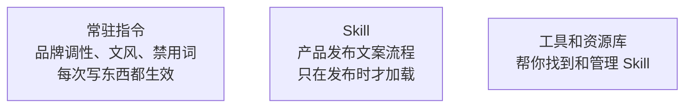
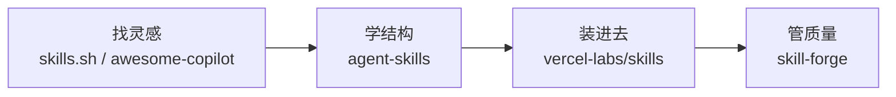

# Skill 实战指南：让 AI 写出你真正想要的文案

你大概已经在用 AI 帮你写东西了——ChatGPT、Claude、Copilot，随便哪个。你也大概试过给它一些"规矩"：品牌调性要怎样、文风要怎样、哪些词不能用。有时候效果还行。

但你有没有碰到过这种情况：

新功能要上线了，你需要写一轮发布文案——公众号长文、官网 banner、用户邮件、社交媒体短文。于是你给 AI 写了一大段 prompt：「帮我写一篇产品发布文案，要有吸引力，突出新功能亮点，符合品牌调性，注意不同渠道的格式……」

有时候 AI 写得还行，有时候它完全抓不住重点。更头疼的是，你每次发布新功能都要重新讲一遍品牌调性、渠道差异、审核要点。这些"规矩"你明明已经讲过很多遍了，但 AI 就是记不住——或者说，你没有一个好的方式让它"记住"。

这份指南要解决的就是这个问题：**怎样把这类"每次都要重复讲"的写作经验，打包成一个 AI 能按需调用的能力包——也就是 Skill。**

你不需要会写代码。这份指南会用你熟悉的场景（写文案、做内容）来讲所有概念。跟着走，到最后你会亲手做出自己的第一个 skill。

---

## 1. Skill 到底是什么

### 你已经在做的事，和它的局限

如果你用过 AI 写作工具的"自定义指令"或者"系统提示词"，你已经知道怎么给 AI 设规矩了。比如：

- 所有文案用"你"而不是"您"
- 品牌名称统一写成"XX科技"而不是"xx科技"
- 不要用"赋能""抓手""闭环"这类词

这些规矩适合**常驻**——不管 AI 帮你写什么，都应该遵守。

但有些经验放在常驻指令里就不对了。比如：

- 只在新功能发布时才需要的多渠道文案流程
- 只在写季度报告时才需要的数据呈现规范
- 只在做竞品分析时才需要的对比框架
- 只在写危机公关稿时才需要的审核清单

这些东西如果也塞进常驻指令里，会怎样？

首先，**AI 会被干扰**。你只是想让它帮你写一条朋友圈文案，它脑子里却塞着一整套产品发布流程和危机公关清单——这些噪音只会让它分心，写出来的东西反而不对味。

其次，**可能会乱用**。你没让它走发布流程，它看到你提了一句"新功能"就自作主张地开始按发布模板来写——但你只是想随便聊聊这个功能。

最后，**越来越难维护**。所有经验挤在一个地方，越来越长，改一处怕影响另一处。

这就是 Skill 要解决的问题。

### 你可以先这样理解 Skill

Skill 就是一个文件夹，里面装着一组和特定任务相关的指令、参考资料和检查工具。**平时不加载，只有你需要的时候才让 AI 读进来。**

用更直白的话说：

> Skill 是一个"按需调用的能力包"。它有一个主文件告诉 AI"这是什么、什么时候用、怎么做"，还可以附带品牌指南、模板、检查工具等配套资料。

这里最重要的三个词是：

- **按需**——不是一直开着的，只在做相关任务时才加载
- **打包的**——不是散落的一段提示词，而是一组有组织的文件
- **能力包**——不只是"告诉 AI 一些事"，而是把一件复杂任务的流程、资料、工具打包在一起

### 一张图看清三层关系

你用 AI 写东西时，其实有三种不同的"规矩"，把它们分清楚很重要：



**常驻指令**管的是"AI 帮你写任何东西都该遵守的规矩"。**Skill** 管的是"只有做某件特定事时才需要的完整流程"。**工具和资源库**管的是"去哪找别人做好的 skill、怎么装进来"。

三层不要混，后面所有事情都会清楚很多。

### 什么东西适合做成 Skill

如果你还不确定什么东西适合做成 skill，看看这四类场景——它们是实践中最常被打成 skill 的：

**流程型任务**：有固定步骤，但不是每天都做。比如产品发布文案、季度报告、活动策划方案。

**专项检查型任务**：需要按固定标准检查。比如文案合规审核、品牌一致性检查、SEO 优化检查。

**领域型任务**：有特定的行业知识和写法。比如医疗行业文案（有广告法限制）、金融产品介绍（有合规要求）、教育行业招生文案。

**多角色协作型任务**：需要 AI 扮演不同角色或串联多个步骤。比如先做用户调研分析、再写文案、再做 A/B 测试方案。

一个很好用的判断标准：**当一件事"不该每次写东西都常驻，但一旦遇到又总要重复讲很多遍"，它大概就该是一个 skill 了。**

你回想一下开头那个产品发布文案的例子——每次发布都要重新讲品牌调性、渠道差异、审核要点。它完美符合这个标准。后面几章，我们就用它当主线，一步步把它从一段散装 prompt 变成一个真正的 skill。

### 🛠 动手

现在不用急着做什么。先想一件事：**在你的日常工作里，有什么写作任务是"不该每次都讲，但一旦遇到又总要重复讲很多遍"的？** 记住它，后面会用到。

---

## 2. 一个 Skill 长什么样

上一章说了 skill 是"按需调用的能力包"。但一个能力包具体长什么样？里面怎么组织？什么该放主文件，什么该拆出去？

最快的学习方式不是看定义，而是直接看一个例子。

### 先看一个好的骨架

假设有人已经做了一个"产品发布文案"的 skill，它的文件结构大概是这样的：

```
skills/
  product-launch-copy/
    SKILL.md              ← 主文件（入口）
    scripts/
      word-count-check.sh     ← 字数检查工具
      sensitive-word-scan.sh   ← 敏感词扫描
    references/
      brand-voice-guide.md     ← 品牌调性指南
      channel-templates.md     ← 各渠道格式模板
      past-hits.md             ← 历史爆款案例
```

打开主文件 `SKILL.md`，你会看到大致这样的内容：

```markdown
---
name: product-launch-copy
description: 当需要为新功能或新产品上线撰写多渠道发布文案时使用。
---

## 步骤

1. 先确认这是一次产品/功能发布，而不是日常内容更新或活动推广。
2. 明确本次发布的核心功能点和目标用户。
3. 确定需要覆盖的渠道（公众号、官网、邮件、社交媒体等）。
4. 按品牌调性指南撰写初稿，参考 `references/brand-voice-guide.md`。
5. 各渠道格式适配，参考 `references/channel-templates.md`。
6. 用 `scripts/word-count-check.sh` 检查各渠道字数是否合规。
7. 用 `scripts/sensitive-word-scan.sh` 扫描敏感词。
```

就这么多。它不长，但每一层都有明确的职责。

### 拆开看：五层结构

一个组织良好的 skill，通常可以拆成五层。不是每层都必须有，但知道这个分层会帮你理解为什么好的 skill 看起来"轻"而不是"长"：

**入口层**：主文件 `SKILL.md`，加上名称和描述。这一层的职责是让 AI 知道"这是什么"和"什么时候该用"。这里有一个非常关键的点——描述不是给人看的简介，**它是触发条件**。AI 就是靠这段话来决定要不要加载这个 skill 的。写得太模糊，它不知道什么时候该用；写得太宽泛，它在不该用的时候也会乱用。

**核心步骤层**：主文件里的主要步骤。这一层要保持精炼——只写主线流程，不要把所有细节都塞进来。

**参考资料层**：`references/` 文件夹下的品牌指南、模板、案例库等。这是"需要时再展开"的细节。AI 在执行主线步骤时如果需要更多信息，才会去读这些文件。

**工具层**：`scripts/` 文件夹下的检查工具。把重复的、机械的检查稳定下来——比如每次都要数字数、扫敏感词，与其每次口头提醒 AI，不如做成一个固定的检查步骤。

**适配层**：不同渠道或不同场景的差异说明。比如"公众号长文要 2000-3000 字，社交媒体短文要 100 字以内"。这一层把通用流程和渠道特定要求拆开。

### 同一件事，两种写法

现在来看看产品发布文案这件事，两种写法的差别。

你可能第一次会这样给 AI 写 prompt：

```
帮我写一篇产品发布文案，要有吸引力，突出新功能亮点，
符合品牌调性（年轻、专业、不要太正式），
公众号版本 2000-3000 字，社交媒体版本 100 字以内，
注意不要用"赋能""抓手"这类词，
检查一下有没有敏感词，字数别超...
```

这不是不对，但所有信息挤在一段话里。AI 看到了很多要求，却不知道：

- 这到底什么时候该用这套流程（没有触发条件）
- 哪几步是主线，哪些是细节
- 品牌调性的完整规范在哪里（只提了几个关键词）
- 各渠道的具体格式要求是什么（只提了字数）

如果按上面的五层结构来组织，它会变成一个清晰的 skill——主文件只有 7 步主线，品牌指南在 `references/` 里随时可查，字数检查和敏感词扫描有专门的工具。

对比一下两个版本：

**散装版**把所有东西塞进一段话，AI 只能整段读、整段用。**分层版**把触发条件交给描述，主线交给正文，品牌规范交给参考资料，机械检查交给工具。主文件是轻的，边界是清楚的，也容易修改和迭代。

这里最值得学的不是文件格式——**最值得学的是思路：什么该留在主文件，什么该拆出去，什么该自动化。**

### 再看一个例子：季度业务报告

为了加深印象，再看一个不同类型的例子。假设你要做一个"季度业务报告"的 skill：

**散装版**：

```
帮我写季度业务报告，包括业绩概览、重点项目进展、
团队亮点、下季度计划，要用数据说话，
图表要清晰，语气要专业但不枯燥...
```

**分层版**：

```markdown
---
name: quarterly-report
description: 当需要撰写季度业务报告或年度总结时使用。
---

1. 先确认这是季度/年度报告，不是周报或项目汇报。
2. 收集本季度核心数据（业绩、用户、项目里程碑）。
3. 按报告模板组织内容，参考 `references/report-template.md`。
4. 用数据可视化建议优化图表呈现，参考 `references/data-viz-guide.md`。
```

同样的模式：描述负责触发条件，正文负责主线，`references/` 负责详细模板和规范。

到这里你应该开始感觉到了：**skill 的价值不只是"教 AI 写一篇东西"，而是把一件复杂但反复出现的写作任务，拆成一个可调用、可维护的能力包。**

### 怎么看别人的 Skill：不要只看表面

当你去看别人做的 skill 时（下一章会讲去哪看），不要只看主文件写了什么。更有效的看法是把它当一个小系统来读：

**第一步：看它在解决什么任务**。先看描述和名称。它到底在帮你做一件事（写一篇文案）、走一个流程（从调研到发布的全流程）、还是管一个完整系统（内容日历+多平台+数据分析）？

**第二步：看它的骨架**。主文件分了几步？参考资料有没有合理拆分？工具和主线怎么配合？最值得关注的不是它"写了多少内容"，而是它**没有把什么塞进主文件**。

**第三步：看它怎么管边界**。哪些东西在主文件里？哪些被拆到参考资料里？有没有明确的"这个 skill 不适用于什么场景"的说明？新手最容易复制的是表面格式，最容易忽略的是作者如何避免 AI 乱用这个 skill。

**第四步：记一页笔记**。记下这个 skill 的结构、你觉得最值得借鉴的点、以及你觉得不适合照搬的地方。

一个口诀：**先看触发条件 → 再看骨架 → 再看边界 → 再看配套资料 → 最后才模仿。**

### 看 Skill 时问自己的 6 个问题

不管你看哪个 skill，都可以先问这 6 个问题：

1. 它到底在解决一个任务、一个流程、一个角色，还是一个完整系统？
2. 它的触发条件是什么？（描述写了什么？够精准吗？）
3. 它的主文件和参考资料是怎么分的？
4. 它最值得借鉴的是结构、触发条件、边界，还是流程编排？
5. 它最容易被照抄的是哪一层？（通常就是最不该照抄的）
6. 如果用在你的真实工作里，最先需要调整的是什么？

这 6 个问题答清了，你看别人的 skill 就不再只是"看个热闹"，而是在训练自己的拆解能力。

### 🛠 动手

去 [skills.sh](https://skills.sh) 上找一个和写作、内容相关的 skill。用上面的方法和 6 个问题，认真看一遍。花 15 分钟就好。重点不是"看完"，而是感受一下好的 skill 和你之前写的散装 prompt 有什么不同。

---

## 3. 去哪里找好的 Skill

上一章你已经知道了 skill 长什么样、怎么拆着看。现在自然的问题是：**去哪找这些东西？**

好消息是，现在已经有不少地方可以找到现成的 skill 了。但这里有一个坑，很多人一头扎进去就会踩：**把"能找到"等同于"质量好"。**

先记住这个原则，后面会反复用到。

### 按你的需求选入口

与其给你列一张大表，不如按你现在的需求来：

**想找灵感、看看别人都在做什么 skill**——去 [skills.sh](https://skills.sh)。这是目前最大的 skill 目录站，收录了大量现成 skill。你可以把它当作一个大商场：走一圈看看有什么、什么类型最热门。但要记住——**商场不是质检机构**。一个 skill 在 skills.sh 上有条目，只证明它被收录了，不证明它好用或者适合你。

**想看社区里的教程和学习资源**——去 [awesome-copilot](https://github.com/jmagar/awesome-copilot)。这个地方把社区里的 skill 资源、教程和工具聚合在了一起。它更像一个学习入口——帮你看看别人怎么组织和分享 skill。但同样，**收录不等于推荐**。

**想学好 skill 长什么结构**——去看 [vercel-labs/agent-skills](https://github.com/vercel-labs/agent-skills)。上一章我们看的骨架就参考了这里。这是目前公认最值得学的样板库之一——结构清晰、触发条件写法规范、参考资料组织合理。你可以把它当作一份高质量的参考答案。但要注意，**它是一个样板库，不是安装工具**。你不能直接从它那里"一键安装"一个 skill。

**想把 skill 装进自己的 AI 工具里用**——看 [vercel-labs/skills](https://github.com/vercel-labs/skills)。这是一个安装和管理工具，帮你把 skill 放进你的工作环境。但——**安装工具不是质量保证**。它帮你装进去，不帮你判断"装进去以后是不是真有用"。

**开始关心质量管理**——关注 [skill-forge](https://github.com/xnz00/skill-forge)。当你有了好几个 skill、开始在团队里推广时，质量管理就变得重要了。但**刚开始的时候，你不需要先搞管理**。先把基础打好。

### 为什么没有"最好的那一个"

你可能注意到了——我没有说"用这个就够了"。因为这些工具解决的是完全不同的问题：

- `skills.sh` 和 `awesome-copilot` 帮你**找到**好东西
- `agent-skills` 帮你**学会**好结构
- `vercel-labs/skills` 帮你**装进去**
- `skill-forge` 帮你**管起来**



一个样板库再好，它也不能帮你安装；一个安装工具再方便，它也不能替代你自己的判断。接受它们本来就是不同层，反而一切都简单了。

### 最容易犯的几个错

刚开始接触 skill 的人，最容易犯的不是"找不到"，而是"找到了就以为靠谱了"：

**"在 skills.sh 上能搜到，所以应该不错"**——不一定。目录站解决的是发现，不是质量保证。这就像淘宝上能搜到一个商品不代表它好用——你还是得看评价、看详情。

**"能安装，所以装进去就行了"**——装进去只是开始。好不好用，你得自己试。

**"这个 skill 被很多地方推荐了，应该可以直接用"**——被推荐说明知名度高，不说明适合你的场景。更稳的心态是：它是一个值得看看的候选，不是一个可以直接照搬的结论。

一句话总结：**能找到 ≠ 质量好，能安装 ≠ 有效，被推荐 ≠ 适合你。**

### 🛠 动手

花 20 分钟做一件简单的事：

1. 去 `skills.sh` 找一个和你工作相关的 skill
2. 用上一章的"6 个问题"认真看一遍
3. 写一页简短的笔记——它在解决什么任务？结构怎么分的？哪里值得借鉴、哪里不适合你？

这一步不用做任何东西。目的是**在你动手做 skill 之前，先训练你看 skill 的眼睛**。

---

## 4. 先看后做——写你的第一个 Skill

好了，到了全文最重要的章节。前面三章你已经知道了 skill 是什么、长什么样、去哪找。现在开始做你自己的第一个。

### 为什么不要从空白页开始

很多人的第一反应是打开一个新文档，然后开始写。这几乎总是错的。

原因很简单：从空白页开始，你脑子里没有参照。你不知道触发条件应该写多详细、主线应该分几步、什么时候该拆参考资料。你最可能写出的东西，就是一段比较长的 prompt——和你之前直接给 AI 的那段话没有本质区别。

**先看别人怎么做 skill，再动手做自己的——这不是什么高级方法论，纯粹是因为从空白页开始太慢了。**

如果你在上一章的动手环节已经认真看过一个样本，你现在脑子里应该有了一个"好 skill 大概长什么样"的感觉。这个感觉就是你的起点。

### Step 1：先写一个"天真版"

还记得第 1 章结尾让你想的那件事吗——"不该每次都讲但总要重复讲"的某个写作任务？拿出来。

我们继续用产品发布文案这个例子。假设你脑子里的第一版是这样的：

```
帮我写产品发布文案。
要有吸引力，突出新功能亮点，符合品牌调性，
公众号版本 2000-3000 字，社交媒体版本 100 字以内，
注意不要用"赋能""抓手"这类词...
```

先写出来，没关系。承认这个"天真版"存在，是改进的起点。

### Step 2：加上触发条件——写好描述

现在想想上一章说的：描述是触发条件，AI 靠它来决定什么时候该用这个 skill。

你的描述应该回答一个很具体的问题：**AI 在什么情况下应该用这个 skill？**

不要写成"帮你写文案"这种模糊的东西。要写成 AI 能判断的条件：

```
当需要为新功能或新产品上线撰写多渠道发布文案时使用。
```

这句话告诉 AI 三件事：触发场景（新功能或新产品上线）、任务类型（撰写发布文案）、特征（多渠道）。有了这个，AI 就不太会在你只是想写一条日常推文的时候突然启动整套发布流程了。

### Step 3：精简主线——主文件只放骨架

现在改写主文件。原则是：**只写主线，不塞细节。**

问自己：写产品发布文案时，最核心的步骤是什么？不是品牌指南的完整内容——那是细节，该放在参考资料里。主线可能就是这几步：

```markdown
1. 先确认这是一次产品/功能发布，而不是日常内容更新或活动推广。
2. 明确本次发布的核心功能点（不超过 3 个）和目标用户。
3. 确定需要覆盖的渠道（公众号、官网、邮件、社交媒体等）。
4. 按品牌调性指南撰写初稿，参考 `references/brand-voice-guide.md`。
5. 各渠道格式适配，参考 `references/channel-templates.md`。
6. 检查字数和敏感词。
```

注意第 1 步——它在做**边界检查**。这一步非常重要：它告诉 AI "如果这不是产品发布，就不要用这套流程"。很多 skill 被 AI 乱用的问题，就是因为缺了这种边界步骤。

### Step 4：把细节拆出去

现在创建参考资料。比如 `references/brand-voice-guide.md`：

```markdown
# 品牌调性指南

## 整体调性
- 年轻、专业、不端着
- 用"你"而不是"您"
- 可以适度幽默，但不要硬凹

## 禁用词
- 不要用：赋能、抓手、闭环、打通、沉淀、颗粒度
- 不要用：业界领先、行业首创（除非有数据支撑）

## 句式偏好
- 短句优先，一句话不超过 30 字
- 多用具体数字，少用"大幅提升""显著改善"
- 开头要抓人，不要用"随着...的发展"这类套话

## 历史爆款参考
- 见 `past-hits.md` 中的案例
```

再创建 `references/channel-templates.md`：

```markdown
# 各渠道格式要求

## 公众号长文
- 字数：2000-3000 字
- 结构：标题 + 导语 + 功能亮点（分段）+ 用户故事 + CTA
- 配图：至少 3 张，首图尺寸 900x383

## 官网 Banner
- 主标题：10 字以内
- 副标题：20 字以内
- CTA 按钮文案：4 字以内

## 用户邮件
- 标题：20 字以内，要有打开欲望
- 正文：500 字以内
- 必须包含退订链接提示

## 社交媒体（微博/朋友圈）
- 字数：100 字以内
- 必须带话题标签
- 可以用 emoji，但不超过 3 个
```

这些细节现在住在单独的文件里。AI 在执行主线步骤时，只有走到第 4、5 步才会去读它们。其他时候，这些细节不占空间。

### Step 5：如果有重复检查，考虑做成工具

比如每次都要检查字数是否符合各渠道要求、有没有用到禁用词。你可以让 AI 在最后一步固定执行这些检查，而不是每次口头提醒。

在主文件的最后一步写清楚：

```markdown
6. 完成初稿后，逐一检查：
   - 各渠道字数是否在规定范围内
   - 是否包含禁用词（参考品牌调性指南中的禁用词列表）
   - 公众号版本是否有配图位置标注
   - 邮件版本是否包含退订提示
```

不是每个 skill 都需要复杂的检查工具，但如果你发现 AI 每次都会漏掉同样的检查项，把它固定在流程里会稳定很多。

### 最终成果

你的第一个 skill 现在长这样：

```
skills/
  product-launch-copy/
    SKILL.md
    references/
      brand-voice-guide.md
      channel-templates.md
      past-hits.md
```

`SKILL.md` 的完整内容：

```markdown
---
name: product-launch-copy
description: 当需要为新功能或新产品上线撰写多渠道发布文案时使用。
---

## 步骤

1. 先确认这是一次产品/功能发布，而不是日常内容更新或活动推广。
2. 明确本次发布的核心功能点（不超过 3 个）和目标用户。
3. 确定需要覆盖的渠道（公众号、官网、邮件、社交媒体等）。
4. 按品牌调性指南撰写初稿，参考 `references/brand-voice-guide.md`。
5. 各渠道格式适配，参考 `references/channel-templates.md`。
6. 完成初稿后，逐一检查：
   - 各渠道字数是否在规定范围内
   - 是否包含禁用词
   - 公众号版本是否有配图位置标注
   - 邮件版本是否包含退订提示
```

和最开始那段"帮我写产品发布文案，要有吸引力，突出新功能亮点..."比一下。信息量差不多，但结构完全不同。这个版本：

- **有触发条件**：AI 知道什么时候该用
- **有边界**：第 1 步排除了不该触发的场景
- **有分层**：品牌指南和渠道模板在参考资料里
- **主文件很轻**：核心只有 6 步，好改、好测、好维护

这就是"先看后做"的威力——你不是从零发明，而是站在好的结构基础上，填入自己的内容。

### 关于通用性的一个提醒

你可能注意到了，上面这个 skill 没有绑定任何特定的 AI 工具。它不是只能在 Claude 里用，也不是只能在 ChatGPT 里用。这是有意的。

**先把核心流程写好——触发条件、主线步骤、参考资料的组织方式。** 具体在哪个 AI 工具里用、怎么加载，那是后面的事。

为什么？因为每个 AI 工具的使用方式都不一样。如果你一上来就按某个工具的特定格式来写，这个 skill 就很难在其他工具里复用了。更重要的是——核心流程才是你真正需要想清楚的部分。把触发条件、主线步骤和参考资料搞清楚了，适配到具体工具反而是最简单的一步。

### 🛠 动手

现在该动手了。用你在第 1 章想好的那件事（或者直接用产品发布文案），按上面的 5 步流程做出你的第一个 skill：

1. 先写天真版（就是你平时给 AI 的那段话）
2. 加上触发条件（什么时候该用）
3. 精简主文件为 5-7 步主线
4. 创建 `references/` 放品牌指南、模板、案例等细节
5. 在最后一步加上固定的检查项

做完以后先别急着用。下一章讲怎么试用和验证。

---

## 5. 试用——但要有控制

你现在有了第一个 skill——一个有触发条件、有主线、有参考资料的能力包。下一步自然是让 AI 用起来试试。

但在试之前，有两件事值得想清楚。

### 先在一个场景里试，不要全面铺开

第一次试用 skill，**先只在一个具体任务上试**。

比如你做了一个"产品发布文案"的 skill，不要一上来就在所有发布任务上用。先挑一个不太紧急的发布——比如一个小功能更新——让 AI 按你的 skill 走一遍流程，看看效果。

为什么？因为你的 skill 还没经过验证。如果第一次就用在一个重要的大版本发布上，万一效果不好，你还得赶着改。先在一个低风险的场景里试，心态会轻松很多。

### 试之前：检查一下外来的 Skill

如果你用的是自己写的 skill，信任问题不大。但如果你从外面找了一个 skill 准备用——**先花几分钟看一遍内容。**

该看什么？

**看主文件**：它要求 AI 做什么？有没有超出你预期的操作？比如有些 skill 会让 AI 去搜索网络或者读取你的文件——确认这些是你想要的。

**看参考资料**：这些内容会进入 AI 的"脑子"。确认里面的品牌调性、写法规范是不是符合你的要求。别人的品牌指南不是你的品牌指南。

**看整体范围**：这个 skill 管的事情是不是太多了？一个好的 skill 应该专注于一件事，而不是试图覆盖所有写作场景。

这套检查不需要很长时间——几分钟就够了。但它是一个好习惯。

**在 skills.sh 上能搜到一个 skill，不代表它适合你的品牌和场景。别人的"好"不一定是你的"好"。**

### 🛠 动手

1. 把你在第 4 章做好的 skill 准备好
2. 找一个真实但不太紧急的任务来试（比如一个小功能更新的发布文案）
3. 让 AI 按你的 skill 走一遍流程，看看它的输出
4. 再给它一个**不应该**触发这个 skill 的任务（比如"帮我写一条日常推文"），看看它会不会误用

第一次跑不完美很正常。下一章讲怎么判断"到底有没有帮助"以及怎么改进。

---

## 6. 它真的有用吗？——验证和改进

skill 做好了，AI 也能用了。但"能用"和"有用"是两回事。

很多人的 skill 之旅在上一步就停了——试了一次、觉得"还行"，然后就放在那里不管了。一个月后才发现 AI 在不该用的时候乱用它，或者在该用的时候写出来的东西还是不对味。

要避免这种情况，你需要做一件简单但大多数人懒得做的事：**对比测试。**

### 最简单的对比方法

方法很朴素：

1. 拿一个你接下来真正要做的任务（比如真的要写一轮发布文案）
2. **不用 skill**，让 AI 先写一遍，保存结果
3. **用 skill**，让 AI 再写一遍，保存结果
4. 对比两次结果——结构化程度、品牌调性一致性、渠道适配准确度、有没有遗漏关键信息

做一次，你就能感觉到这个 skill 是真有帮助，还是只是看起来比较正式但实际没什么区别。

### 两个最常见的问题

对比完后，你最可能发现两个问题：

**AI 乱用**。你没让它写发布文案，它看到你提了一句"新功能"就自作主张地启动整套发布流程。这通常是触发条件写得太宽泛了。解决方法是收窄描述：

```
# 太宽泛 — 提到"新功能"就可能触发
description: 当写和产品相关的内容时使用。

# 更精准
description: 当需要为新功能或新产品上线撰写多渠道发布文案时使用。
```

关键词是"多渠道发布文案"。加上这个限定，AI 就不太会在你只是想随便聊聊新功能的时候启动整套流程了。

**输出太长或跑偏**。skill 的参考资料太多，AI 被大量信息淹没，开始在不相关的细节上纠缠——比如你只是想写一条社交媒体短文，它却把公众号长文的所有规范都考虑进去了。解决方法是更清楚地分层：

- 主文件只留主线步骤
- 各渠道的详细规范分开放在不同的参考文件里
- 在主线步骤里明确"先确定渠道，再只看对应渠道的规范"

### 记录版本

当你调好了一个版本、对比测试也确认有效了，给它做一个简单的版本记录。可以在 skill 文件夹里加一个 `更新记录.md`：

```markdown
## v1.1 - 2025-01-15
- 收窄了触发条件，加上"多渠道"限定
- 把各渠道模板拆成独立文件，避免信息过载

## v1.0 - 2025-01-10
- 初始版本
```

为什么？因为你以后会改它——加新渠道、调品牌指南、改检查项。如果改完反而变差了，你需要能回到上一个好的版本。

### 🛠 动手

1. 用你的 skill 做一次真实任务
2. 再不用 skill 做一次同样的任务
3. 对比两次结果：用了 skill 以后，哪些方面更好了？哪些没变化？有没有反而变差的？
4. 如果发现了问题，按上面的方法调整，再测一次

---

## 7. 从一个 Skill 到一套工作流

如果你走到了这里——做了第一个 skill、试用过、对比测试过、改进过——恭喜，你已经有了真正的 skill 使用手感。

但一个人用一两个 skill，和一个团队用一整套 skill，是不同的事。这一章聊的是当你准备扩展时，需要注意什么。

### 不要一次性全部开启

这是最重要的一条。

当你有了 5 个、10 个 skill 以后，不要把它们全部同时激活。AI 看到的候选 skill 越多，它选错的概率就越高——可能在该写发布文案的时候用了季度报告的流程，或者把两个 skill 的步骤混在一起。

更好的做法是**按任务分组**：每次只激活当前任务需要的那一组。

举个例子：

```
我的 skill 库/
  产品发布/          ← 发布新功能时激活
    product-launch-copy/
    release-notes/
  
  日常运营/          ← 做日常内容时激活
    social-media-calendar/
    newsletter/
  
  商务文档/          ← 写提案时激活
    client-proposal/
    case-study/
```

你不需要什么复杂的管理系统。按文件夹分组、每次手动选择用哪组就够了。重点是原则：**不要让 AI 同时看到所有 skill，按任务分组。**

### 团队共享时的注意事项

如果你的团队也想用你的 skill，有几个实际问题需要考虑：

**品牌指南要统一**。你的 `references/brand-voice-guide.md` 应该是团队共享的，而不是每个人各写一份。

**谁能改 skill？** 如果任何人都能随便改主文件或参考资料，很快就会乱。最简单的规则：改之前先说一声，改完记录版本。

**外面找来的 skill 要先审查**。不是每个人从网上找来的 skill 都适合直接用。至少让一个人看过内容、确认符合你们的品牌和流程，再放进共享库。

**定期清理**。skill 会过时——品牌调性变了、渠道规范更新了、某个检查项不再需要了。每个季度花半小时看一遍，删掉过时的、更新变化的。

### 🛠 动手

如果你现在已经有了不止一个 skill（或者你打算做更多），花 10 分钟做一件事：

1. 列出你现有的（或计划中的）skill
2. 按任务类型分组
3. 想想哪些 skill 应该一起用，哪些绝对不应该同时出现

---

## 8. 接下来练什么

如果你跟着前面的章节走到了这里，你应该已经：

- 知道 skill 和常驻指令的区别
- 会看一个现成 skill 的结构和边界
- 做了自己的第一个 skill（可能还调了好几版）
- 试用过，做过至少一次对比测试
- 对分组管理有了初步想法

这已经不是"随便试试"的状态了。你在建立自己的 skill 使用手感。

### 下一步：三级练习

**第一级：再做一个不同类型的 skill。** 上面我们一直用的是"产品发布文案"这种流程型 skill。现在试试做一个检查型的——比如"文案合规审核"或者"SEO 优化检查"。检查型 skill 的结构会不太一样：它的主线不是"写什么"，而是"检查什么"。做完你会发现，同样的五层结构可以适配很不同的任务类型。

**第二级：把你的 skill 给同事用。** 让一个同事试试你的 skill。你会立刻发现很多自己看不到的问题——你觉得显然的触发条件，别人不理解；你觉得够用的品牌指南，别人觉得漏了关键信息。这种反馈是独自迭代永远得不到的。

**第三级：问自己一个升级问题。** 当你的 skill 稳定运行了一段时间，问自己：我现在缺的到底是什么——是内容能力（skill 里的参考资料不够好）、流程能力（步骤设计不够合理）、还是管理能力（skill 太多了管不过来）？这个问题的答案，就是你下一步的方向。

### 四个自检问题

当你开始能稳定回答下面这几个问题时，你就不再只是"会用 AI 写东西"，而是在发展自己的 skill 设计能力：

1. **我为什么选这个样本来参考，不选那个？**——你有了选择标准。
2. **我借鉴的是它的哪一层，不是整套照搬？**——你开始有意识地选择性学习。
3. **我的核心流程和特定场景适配是怎么分开的？**——你有了通用性意识。
4. **我怎么知道这个 skill 是真有用还是只是看起来正式？**——你有了验证意识。

### 回到起点

还记得这份指南一开始讲的那个场景吗——每次新功能发布都要重新给 AI 讲一遍品牌调性、渠道差异、审核要点，有时候效果好有时候不好。

现在你知道了：那些重复讲的东西应该变成一个 skill。它有自己的文件夹、有精准的触发条件、有分层的结构、有经过验证的流程。你需要的时候调用它，不需要的时候它不碍事。

这就是 skill 的起点。不复杂，但很实用。

---

*如果你需要快速查阅本文提到的资源和工具，可以翻阅配套的 [参考资料索引](./附录-参考资料索引.md)。*
