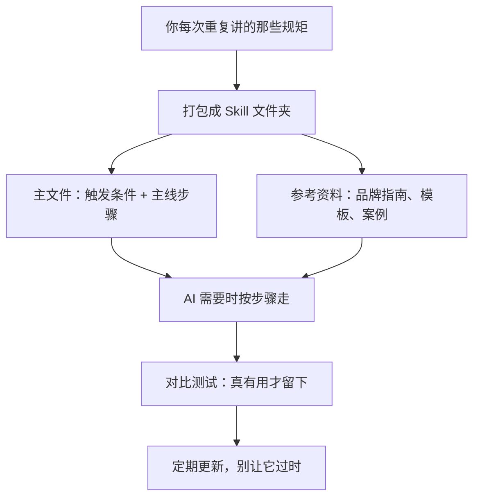

# Skill 快速上手：别再每次都重新教 AI 了

## 一句话说清楚

你每次让 AI 写东西，是不是总要重复讲一堆规矩？品牌调性、格式要求、检查清单……讲了八百遍它还是记不住。

**Skill 就是把这些"每次都要重复讲的规矩"打包成一个文件夹，AI 需要的时候自己去读，不需要的时候不碍事。**

就这么简单。但"简单"不等于"随便搞搞就行"。这份指南会带你从理解到动手，把第一个 Skill 做出来、用起来、调好。

---

## 哪些东西该常驻，哪些该做成 Skill

想象你有两个抽屉：

**常驻抽屉**（AI 做什么都该知道的）：
- 品牌名写"XX科技"不写"xx科技"
- 用"你"不用"您"
- 不要用"赋能""闭环"

这些规矩不管 AI 帮你写什么——一条推文、一封邮件、一篇长文——都应该遵守。放在常驻指令里完全合理。

**Skill 抽屉**（只有做特定事才需要的）：
- 产品发布文案的完整流程
- 季度报告的数据呈现规范
- 危机公关稿的审核清单

这些东西如果也塞进常驻指令里，会出问题。你只是想让 AI 帮你写一条朋友圈，它脑子里却装着一整套产品发布流程和危机公关清单——这些噪音会让它分心，写出来的东西反而不对味。更糟的是，它可能在你没要求的时候自作主张地启动某个流程——你随口提了一句"新功能"，它就开始按发布模板来写了。

判断标准很简单：**如果一件事不是每次都用，但每次遇到都要重新讲一遍——它就该是个 Skill。**

你现在可以想一件自己工作里符合这个标准的事。后面会用到。

---

## 一个 Skill 长什么样

别想复杂了。就是一个文件夹，里面几个文件，各管各的事：

```
产品发布文案/
  SKILL.md              ← 主文件：什么时候用、大致怎么做
  references/
    品牌调性指南.md        ← 详细的品牌规范
    渠道格式模板.md        ← 各平台的格式要求
    历史爆款案例.md        ← 以前效果好的文案
```

主文件 `SKILL.md` 长这样：

```markdown
---
name: product-launch-copy
description: 当需要为新功能上线撰写多渠道发布文案时使用。
---

1. 先确认这是产品发布，不是日常推文或活动推广。
2. 明确核心功能点（不超过 3 个）和目标用户。
3. 确定要覆盖哪些渠道（公众号、官网、邮件、社交媒体等）。
4. 按品牌指南写初稿，参考 references/品牌调性指南.md。
5. 按渠道模板适配格式，参考 references/渠道格式模板.md。
6. 检查：字数合规？有没有禁用词？配图标注了吗？
```

注意几个关键设计：

**触发条件**（description 那一行）不是给人看的简介，它是 AI 的"开关"。AI 就是靠这句话来判断"现在该不该用这个 Skill"。写得太模糊（比如"写文案时用"），AI 写什么文案都会触发；写得精准（"为新功能上线写多渠道发布文案时用"），它就只在该用的时候用。

**第 1 步是边界检查**。它告诉 AI："如果这不是产品发布，就别用这套流程。"很多 Skill 被 AI 乱用，就是因为缺了这一步。

**主文件只有 6 步**。品牌调性的完整规范、各渠道的详细格式要求——这些都不在主文件里，而是拆到了 `references/` 文件夹下。AI 走到第 4、5 步需要的时候才会去读，其他时候不占空间。

**主文件轻，细节在旁边，需要时再展开。** 这就是 Skill 和"一大段 prompt"的本质区别。

---

## 为什么不能把所有东西塞进一段话

你之前大概是这样给 AI 的：

> "帮我写产品发布文案，要有吸引力，突出亮点，符合品牌调性，年轻专业不要太正式，公众号 2000-3000 字，社交媒体 100 字以内，不要用赋能抓手，检查敏感词……"

问题不是信息不够，而是**全挤在一起**。AI 面对这一大段话，不知道：

- 什么时候该用这套流程，什么时候不该（没有触发条件）
- 先做什么后做什么（没有步骤顺序）
- 哪些是每次都要遵守的主线，哪些是可以按需展开的细节
- 品牌调性的完整规范到底是什么（你只提了几个关键词）
- 各渠道的具体格式要求是什么（你只提了字数）

Skill 的做法是把这些信息分层，各归各位：

| 层 | 放什么 | 为什么拆开 |
|----|--------|----------|
| 触发条件 | "新功能上线 + 多渠道" | AI 知道什么时候该用 |
| 主线步骤 | 6 步核心流程 | AI 知道先做什么后做什么 |
| 参考资料 | 品牌指南、渠道模板、爆款案例 | 需要时再看，不占空间 |
| 检查项 | 字数、禁用词、配图 | 每次都跑，不会漏 |

你可以把它想成一个菜谱：主文件是步骤（先切菜、再炒、再调味），参考资料是详细的配料表和火候说明。你不会把配料表和步骤混在一起写，对吧？

---

## 动手做你的第一个 Skill

好了，到了最重要的部分。前面都是理解，现在开始做。

### Step 1：把你平时给 AI 的那段话写下来

就是那段每次都要重复讲的东西。先原样写出来，不管多乱。

比如你每次让 AI 写产品发布文案时，大概会说：

```
帮我写产品发布文案。新功能是 XXX，目标用户是 XXX。
要有吸引力，突出亮点，符合品牌调性（年轻、专业、不端着）。
公众号版本 2000-3000 字，社交媒体 100 字以内。
不要用"赋能""抓手""闭环"。
开头要抓人，不要用"随着...的发展"。
检查一下有没有敏感词，字数别超。
```

这就是你的"天真版"。承认它存在，是改进的起点。

### Step 2：加一句触发条件

问自己：**AI 什么时候该用这套流程？**

把答案写成一句话，要具体到 AI 能判断的程度：

```
# 太模糊 — AI 写什么文案都会触发
description: 写文案时用。

# 好一点但还是太宽
description: 写产品相关内容时用。

# 够精准了
description: 当需要为新功能或新产品上线撰写多渠道发布文案时使用。
```

最后这个版本告诉 AI 三件事：什么事（新功能/新产品上线）、做什么（撰写发布文案）、什么特征（多渠道）。有了这三个限定，AI 就不太会在你只是想写一条日常推文的时候启动整套发布流程了。

### Step 3：把主线提炼成 5-7 步

砍掉细节，只留骨架。问自己：**如果只能告诉 AI 5-7 件事，是哪几件？**

关键原则：

- **第 1 步一定是边界检查**。"先确认这是产品发布，不是日常推文或活动推广。"这一步防止 AI 乱用。
- **中间步骤是主线流程**。按什么顺序做事——先确认功能点、再定渠道、再写初稿、再适配格式。
- **最后一步是固定检查**。每次都要查的东西放在这里，不会漏。
- **超过 7 步就太长了**。如果你发现步骤超过 7 个，说明有些细节应该拆到参考资料里。

### Step 4：把细节拆到参考资料里

这一步很关键——它决定了你的 Skill 是"轻而好用"还是"又长又乱"。

**品牌调性指南**单独建一个文件 `references/品牌调性指南.md`：

```markdown
# 品牌调性指南

## 整体调性
- 年轻、专业、不端着
- 用"你"而不是"您"
- 可以适度幽默，但不要硬凹

## 禁用词
- 不要用：赋能、抓手、闭环、打通、沉淀、颗粒度
- 不要用：业界领先、行业首创（除非有数据支撑）

## 句式偏好
- 短句优先，一句话不超过 30 字
- 多用具体数字，少用"大幅提升""显著改善"
- 开头要抓人，不要用"随着...的发展"这类套话
```

**渠道格式模板**也单独建一个文件 `references/渠道格式模板.md`：

```markdown
# 各渠道格式要求

## 公众号长文
- 字数：2000-3000 字
- 结构：标题 + 导语 + 功能亮点（分段）+ 用户故事 + CTA
- 配图：至少 3 张，首图尺寸 900x383

## 官网 Banner
- 主标题：10 字以内
- 副标题：20 字以内
- CTA 按钮文案：4 字以内

## 用户邮件
- 标题：20 字以内，要有打开欲望
- 正文：500 字以内
- 必须包含退订链接提示

## 社交媒体
- 字数：100 字以内
- 必须带话题标签
- 可以用 emoji，但不超过 3 个
```

如果你有以前效果好的文案，也可以建一个 `references/历史爆款案例.md`，把几个代表性案例放进去。AI 写初稿的时候可以参考风格和结构。

### Step 5：组装起来

你的第一个 Skill 现在长这样：

```
skills/
  产品发布文案/
    SKILL.md
    references/
      品牌调性指南.md
      渠道格式模板.md
      历史爆款案例.md
```

`SKILL.md` 完整内容：

```markdown
---
name: product-launch-copy
description: 当需要为新功能或新产品上线撰写多渠道发布文案时使用。
---

1. 先确认这是一次产品/功能发布，而不是日常内容更新或活动推广。
2. 明确本次发布的核心功能点（不超过 3 个）和目标用户。
3. 确定需要覆盖的渠道（公众号、官网、邮件、社交媒体等）。
4. 按品牌调性指南撰写初稿，参考 references/品牌调性指南.md。
5. 各渠道格式适配，参考 references/渠道格式模板.md。
6. 完成初稿后逐一检查：
   - 各渠道字数是否在规定范围内
   - 是否包含禁用词
   - 公众号版本是否标注了配图位置
   - 邮件版本是否包含退订提示
```

和最开始那段"帮我写产品发布文案，要有吸引力，突出亮点……"比一下。信息量差不多，但结构完全不同：

- **有触发条件**：AI 知道什么时候该用
- **有边界**：第 1 步排除了不该触发的场景
- **有分层**：品牌指南和渠道模板在参考资料里，不挤在主文件
- **有固定检查**：最后一步确保每次都不漏

---

## 试用的正确姿势

做好以后别急着全面铺开。

### 先挑一个低风险的任务试

比如一个小功能更新的发布文案，不是年度大版本。万一效果不好，你有时间调整，不用赶着交稿。

让 AI 按你的 Skill 走一遍完整流程，看看它的输出。重点观察：

- 它有没有按你的步骤顺序来？
- 品牌调性对不对味？
- 各渠道的格式有没有适配到位？
- 检查项有没有漏掉？

### 再做一次对比

这一步大多数人懒得做，但它是判断"Skill 到底有没有用"的最靠谱方法：

1. **不用 Skill**，让 AI 写一遍同样的发布文案
2. **用 Skill**，让 AI 再写一遍
3. 把两次结果放在一起对比

你会很快看出来：用了 Skill 以后，结构化程度、品牌一致性、渠道适配准确度是不是真的更好了。如果差别不大，说明你的 Skill 还需要调。

### 也测一下"不该触发"的场景

给 AI 一个不应该触发这个 Skill 的任务——比如"帮我写一条日常推文"或者"帮我回复一封客户邮件"。看看它会不会自作主张地启动发布流程。如果会，说明触发条件还不够精准，需要收窄。

---

## 最常见的问题和怎么修

### 问题 1：AI 乱用——你没让它写发布文案，它自己开始了

原因几乎都是触发条件太宽泛。

```
# 太宽泛
description: 当写和产品相关的内容时使用。

# 收窄后
description: 当需要为新功能或新产品上线撰写多渠道发布文案时使用。
```

加上"新功能/新产品上线"和"多渠道"这两个限定，误触发会大幅减少。

### 问题 2：输出跑偏或太长

通常是参考资料太多，AI 被信息淹没了。比如你只是想写一条社交媒体短文，它却把公众号长文的所有规范都考虑进去了。

解决方法：

- 主文件里明确写"先确定渠道，再只看对应渠道的规范"
- 如果参考资料文件太长，按渠道拆成独立文件（`公众号规范.md`、`社交媒体规范.md`）
- 主文件步骤不要超过 7 个，超出的拆到参考资料里

### 问题 3：做完就不管了，半年后发现过时了

品牌调性会变、渠道规范会更新、新渠道会出现。一个半年没更新的 Skill，可能比没有 Skill 还糟——因为它会让 AI 按过时的规范来写。

最简单的办法：在 Skill 文件夹里加一个 `更新记录.md`，每次改了什么记一笔。每隔一两个月扫一眼，过时的就更新。

```markdown
## v1.1 - 2025-03-15
- 收窄了触发条件，加上"多渠道"限定
- 新增小红书渠道模板
- 禁用词列表更新

## v1.0 - 2025-01-10
- 初始版本
```

---

## 当你有了好几个 Skill

当你做了第二个、第三个 Skill 以后，有一件事要注意：**不要同时全部开启。**

AI 看到的候选 Skill 越多，它选错的概率就越高。你有 10 个 Skill 全开着，它可能在该写发布文案的时候用了季度报告的流程。

更好的做法是按任务分组，每次只开当前需要的那一组：

```
我的 Skill 库/
  产品发布/          ← 发布新功能时用
    产品发布文案/
    更新日志/
  
  日常运营/          ← 做日常内容时用
    社交媒体内容/
    Newsletter/
  
  商务文档/          ← 写提案时用
    客户提案/
    案例研究/
```

不需要什么复杂的管理工具。按文件夹分好组，每次手动选用哪组就够了。

---

## 去哪找灵感

在你动手做之前或者做完想找参考时，这几个地方值得逛逛：

**[skills.sh](https://skills.sh)**——目前最大的 Skill 目录站。逛一圈看看别人都在做什么类型的 Skill、怎么组织的。但记住，这是个商场大厅，不是质检机构。能搜到不代表质量好。

**[awesome-copilot](https://github.com/jmagar/awesome-copilot)**——社区资源聚合，教程和工具都有。适合扩视野、看看社区趋势。但收录不等于推荐。

**[vercel-labs/agent-skills](https://github.com/vercel-labs/agent-skills)**——高质量样板库，学结构最好的地方。看看别人怎么写触发条件、怎么分层、怎么组织参考资料。

看别人的 Skill 时，问自己这几个问题就够了：

1. 它在解决什么任务？
2. 触发条件写得精准吗？
3. 主文件和参考资料是怎么分的？
4. 哪里值得借鉴，哪里不适合我的场景？

**别人的 Skill 拿来参考结构就好，内容还是得填你自己的。** 别人的品牌指南不是你的品牌指南，别人的渠道模板不是你的渠道模板。

---

## 一张图总结全文



核心就这几件事：

1. **分清常驻和按需**——不是每次都用的东西，做成 Skill
2. **分层不堆砌**——主文件只放主线，细节拆到参考资料
3. **触发条件要精准**——防止 AI 乱用
4. **对比验证**——用了 Skill 真的更好才算数
5. **定期维护**——过时的 Skill 比没有 Skill 更糟

去做你的第一个 Skill 吧。
