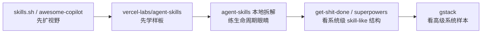

# 附录 A：代表性 Skill 样本与拆解索引

这份附录不想做“越多越好”的样本目录。

它只做一件事：告诉你，当前这轮研究里哪些样本最值得先看，它们分别适合学什么，以及最容易被误读成什么。

## 何时打开这份附录

- 当你已经读完 `00` 的第 `3-4` 节，准备真的去拆样本时
- 当你知道“先读后编”是对的，但还不知道先拆哪一个例子时
- 当你希望把“看样本”从随便翻仓库，变成有顺序的阅读动作时

先把这张阅读路线图记住，会比纯列表更容易用：

## A1. 先看这 5 个生态入口样本

| 样本 | 对象类型 | 最适合回答什么问题 | 先看什么 | 不要误读成什么 | 证据 |
| --- | --- | --- | --- | --- | --- |
| `skills.sh` | `registry / directory` | 现成 skill 去哪里找 | 首页定位、统一安装命令、多 agent 暴露、`Official / Audits / Docs` 入口 | 质量背书系统 | `E06` |
| `github/awesome-copilot` | `community learning hub` | 社区都在分享什么、教程入口在哪里 | collection 定位、Learning Hub、安装前检查提醒 | 工程基座 | `E07` |
| `vercel-labs/agent-skills` | `sample-library` | 高质量样板库通常怎么组织 | `SKILL.md`、`scripts/`、`references/`、`Use when` | installer / governance 层 | `E05` |
| `vercel-labs/skills` | `installer / manager` | 现成 skill 怎样受控安装、更新、定位 | `project scope`、`global scope`、`symlink`、目标目录映射 | 自动可信 / 自动有效 | `E08` |
| `skill-forge` | `governance / publish` | skill 走向治理和发布时要补哪一层 | post-authoring、audit、publish、quality gate | 冷启动阶段的唯一模板 | `E03` |

## A2. 先读后编时，最值得拆的 4 组本地例子

### 1. `agent-skills`

- 最适合学什么：
  - 生命周期切分
  - skill 组合关系
  - `Use when`
  - Define / Plan / Build / Verify / Review / Ship 的连贯性
- 先看路径：
  - `/Users/bowhead/ai_dev_skill/addyosmani-agent-skills-analysis/eval_skills/01-总览.md`
  - `/Users/bowhead/ai_dev_skill/addyosmani-agent-skills-analysis/eval_skills/02-Define与Plan阶段.md`
- 这组样本最值钱的地方：
  - 让你明白 skill 不是平铺知识点，而是能围绕工程生命周期组织
- 最容易误读的地方：
  - 误以为“命令很多”就是重点；其实重点是阶段切分和验证纪律
- 对应证据：
  - `E13`

### 2. `get-shit-done`

- 最适合学什么：
  - command / agent / workflow / reference / template 五层结构
  - skill-like system 怎么长成 runtime
- 先看路径：
  - `/Users/bowhead/ai_dev_skill/get-shit-done-analysis/eval_skills/01-总览.md`
  - `/Users/bowhead/ai_dev_skill/get-shit-done-analysis/eval_skills/02-结构拆解.md`
- 这组样本最值钱的地方：
  - 让你看见 skill engineering 不是只能长成标准 `SKILL.md` 卡片
- 最容易误读的地方：
  - 只盯 front matter，忽略编排层、规则层和模板层
- 对应证据：
  - `E14`

### 3. `superpowers`

- 最适合学什么：
  - bootstrap
  - hooks
  - 宿主适配
  - 行为测试
- 先看路径：
  - `/Users/bowhead/ai_dev_skill/superpowers-analysis/eval_skills/01-总览.md`
- 这组样本最值钱的地方：
  - 它说明 skill 可以从“内容仓库”进化成“workflow-enforcing plugin”
- 最容易误读的地方：
  - 以为它只是多了几个 skill；其实它强在注入和验证
- 对应证据：
  - `E15`

### 4. `gstack`

- 最适合学什么：
  - 高级系统样本的阅读重点
  - 模板治理
  - 浏览器 runtime
  - specialist review
- 先看路径：
  - `/Users/bowhead/ai_dev_skill/gstack-analysis/eval_skills/01-总览.md`
- 这组样本最值钱的地方：
  - 它能让你看见 skill engineering 如何进一步变成产品化工作流系统
- 最容易误读的地方：
  - 只看 README、命令数量或营销文案，漏掉真正的系统骨架
- 对应证据：
  - `E16`

## A3. 一个最省时间的阅读顺序

如果你现在时间有限，最推荐的顺序不是“多看”，而是“看得有递进”：

先用 `skills.sh` 知道现成 skill 到底有多容易找到，再用 `github/awesome-copilot` 看社区层和学习层怎么组织入口，然后第一次认真拆一个 `vercel-labs/agent-skills` 这样的高质量样板库。等你有了样板感之后，再去读 `agent-skills` 的本地拆解，训练“按生命周期读样本”的视角。最后再进入 `superpowers` 或 `get-shit-done` 这类系统级样本，开始看 skill-like 结构怎样和 runtime、hook、workflow 连起来。

## A4. 每个样本都要问的 6 个问题

无论你看哪个样本，都先问：

1. 它到底在解决一个任务、一个流程阶段、一个角色，还是一个完整系统？
2. 它的入口层是什么？
3. 它的正文和 supporting layer 是怎么分层的？
4. 它最值得借的是结构、路由、边界、编排，还是治理？
5. 它最容易被误抄的是哪一层？
6. 它如果装进真实 workflow，最先需要补的 guardrail 是什么？

这 6 个问题答清了，你看样本就不再只是“看热闹”。
