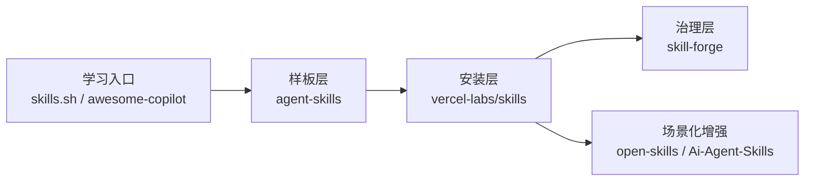

# 附录 C：角色分工与组合比较

这份附录的目标很简单：

- 不给一个误导性的“总冠军榜”
- 直接把当前对象的职责边界、适合的使用语义和最容易误读的地方摆清楚

## 何时打开这份附录

- 当你读到 `00` 的第 `3` 节和第 `5` 节，想知道为什么不能直接追单一赢家
- 当你需要快速判断某个对象到底应该拿来学、拿来装，还是拿来治理
- 当你希望把“学习入口”和“工程基座”彻底分开

如果只记一张图，就记这张：

## C1. 当前最稳的比较结论

### 学习层和工程层不是同一批对象

| 分层 | 当前最像的对象 | 为什么 |
| --- | --- | --- |
| `learning / discovery` | `skills.sh`、`github/awesome-copilot`、`vercel-labs/agent-skills` | 它们最擅长降低“去哪里找”和“怎么快速看懂”的成本 |
| `engineering baseline` | `vercel-labs/skills`、`skill-forge`、`vercel-labs/agent-skills` | 它们更接近样板、安装、治理这些真正会进入 workflow 的层 |
| `context-specific extension` | `Ai-Agent-Skills`、`open-skills` | 它们更像场景化增强，而不是所有人都该先上的默认层 |

### 当前没有对象能单独同时赢下所有维度

| Object | primary_role | 现在最合理的用法 | 最不该误读成什么 |
| --- | --- | --- | --- |
| `vercel-labs/agent-skills` | `sample-library` | 学结构、学组织、学 `Use when` | 全链路工程基座 |
| `vercel-labs/skills` | `installer / manager` | 受控安装、更新、兼容层 | trust / evaluation 系统 |
| `skill-forge` | `governance / publish` | 补审计、治理、发布思路 | 冷启动唯一答案 |
| `skills.sh` | `registry / directory` | 发现入口、学习入口、扩搜入口 | 质量或安全背书 |
| `github/awesome-copilot` | `community learning hub` | 看教学层、扩样本、观察社区组织 | 工程基座 |
| `Ai-Agent-Skills` | `library-manager` | 团队 / 个人 curated shelf | 通用 installer 替代品 |
| `open-skills` | `runtime-bridge` | 本地 / MCP / 自托管 runtime 补层 | 默认全局基座 |

## C2. 为什么最终推荐是“组合式 baseline”

当前最稳的推荐，不是“谁第一”，而是“怎样把几类对象按职责拼起来”。  
最小可行组合如下：

| 组合层 | 当前候选对象 | 它负责什么 |
| --- | --- | --- |
| `sample-library` | `vercel-labs/agent-skills` | 提供高质量结构样板和内容参考 |
| `install / distribution layer` | `vercel-labs/skills` | 负责安装、更新、查找、兼容、single source of truth |
| `governance / publish layer` | `skill-forge` | 负责后处理治理、质量门槛、发布方向 |
| `learning inputs` | `skills.sh`、`github/awesome-copilot` | 负责 discovery、learning、扩视野 |

这套组合之所以比单一总榜更稳，是因为它尊重现实里的职责分工。更直白地说：

- 有的对象擅长教你怎么写
- 有的对象擅长把东西装进去
- 有的对象擅长把质量和治理补上
- 还有一些对象只适合帮你找东西和看别人怎么做

如果你把这些职责强压成一个“谁第一”的问题，信息会丢掉一大半；如果你接受它们本来就是不同层，很多判断反而会一下子变得简单。

## C3. 当前最应该坚持的 anti-misread 规则

最容易出错的，不是比较本身，而是误读本身。下面这张表比短 bullet 更接近真实使用场景：

| 常见误读 | 为什么会错 | 更稳的理解 |
| --- | --- | --- |
| “`skills.sh` 上能找到，所以它应该很靠谱” | 目录站解决的是发现，不是质量背书 | 把它当 discovery / learning 入口 |
| “`vercel-labs/skills` 能装，所以它应该也能保证效果” | installer 解决的是装载，不是 evaluation | 装进去之后仍要 A/B 评测和回滚 |
| “`agent-skills` 看起来最完整，所以它应该就是基座” | 样板库强在学习，不等于治理和发布完整 | 把它当 sample library |
| “`skill-forge` 方向最对，所以现在就该 all in” | 治理方向重要，不等于现阶段公共采用信号足够强 | 把它当重点跟踪和治理层候选 |

如果你愿意用一句话记住这张表，可以记成：  
`能找到` 不等于 `能信`，`能安装` 不等于 `有效`，`很好学` 不等于 `全链路可押`。

## C4. 一个更实用的采用语义

比“前 3 名”更实用的，是先按采用语义表达：

### 最值得先学的 3 个入口

- `skills.sh`
- `github/awesome-copilot`
- `vercel-labs/agent-skills`

### 最值得先搭的 baseline 组合

- `vercel-labs/agent-skills`
- `vercel-labs/skills`
- `skill-forge`

### 只在特定场景下追加

- `open-skills`
- `Ai-Agent-Skills`

## C5. 这一页可以怎么用

如果你现在是在做：

- `冷启动学习`
  - 先看 `skills.sh`、`awesome-copilot`、`agent-skills`
- `建立最小 workflow`
  - 先搭 `agent-skills + skills + trust gate`
- `准备团队化治理`
  - 再把 `skill-forge`、版本纪律、A/B 评测和 role-based bundles 补上

这样用，比从“谁第一”开始，会更贴近真实工程。
