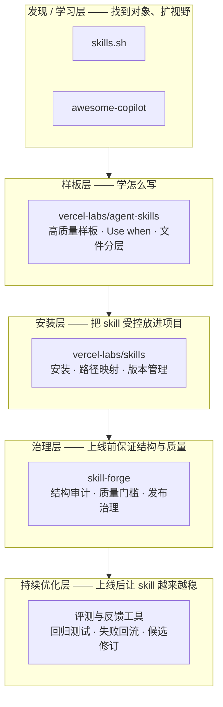
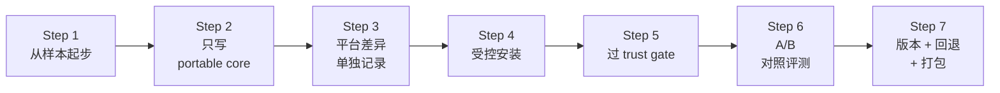
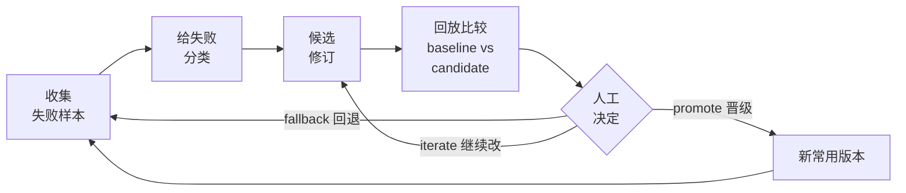
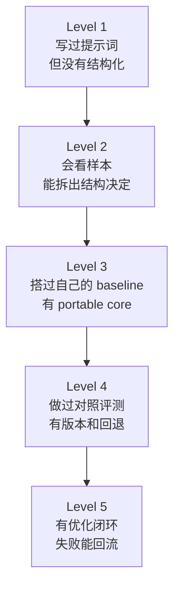

# Skill 实践 Playbook：从借鉴到持续演进

> 这份 Playbook 写给这样的人：
>
> 你已经在和 AI 一起工作，可能已经写过不少 skill。你知道 skill 很有用，甚至已经觉得"这东西我做得还挺顺"。但你仍然会在一些地方卡住——现成 skill 先看什么？看到了样本，怎么学而不是抄？生态里这么多对象，谁负责什么？为什么 skill 明明能跑，一改就容易坏？
>
> 这不是研究报告。这是一份实践指南，目标是把你从"会做一点"带到"知道怎样系统地借鉴、搭基线、做判断、持续演进"。
>
> 为了让这些概念不只停留在抽象层面，整份 Playbook 会跟着一个**代码审查 skill** 从出生到成熟的完整故事走。你会看到它从一段散落的提示词，一步步长成一个有结构、有版本、有评测闭环的成熟能力包。

## 这套包怎么读

不必从头到尾线性阅读。根据你最关心的问题，可以直接跳到对应章节：

| 你现在最关心什么 | 先读哪里 | 想深入再去 |
| --- | --- | --- |
| skill 到底是什么 | 第 1-2 节 | [附录F-术语解释与常见误解](./附录F-术语解释与常见误解.md) |
| 现成样本先看什么、怎么读 | 第 3 节 | [附录A-代表性样本与阅读路径](./附录A-代表性样本与阅读路径.md) |
| 生态对象到底怎么分层 | 第 4-5 节 | [附录B-对象分层与Baseline组合比较](./附录B-对象分层与Baseline组合比较.md) |
| 跨平台写 skill 时哪些能通用 | 第 6 节 | [附录C-Cross-Surface兼容边界与Portable-Core](./附录C-Cross-Surface兼容边界与Portable-Core.md) |
| skill 在各平台装哪个目录 | 第 6 节 Step 4 | [附录H-各平台Skill安装路径与发现机制速查](./附录H-各平台Skill安装路径与发现机制速查.md) |
| skill 为什么上线后还要继续改 | 第 7-8 节 | [附录D-持续优化闭环与评测操作](./附录D-持续优化闭环与评测操作.md) |
| 关键判断的证据回指 | 有疑问时 | [附录E-证据总表与引用索引](./附录E-证据总表与引用索引.md) |
| 高阶样本、评测工具链、生态反证 | 走完全程后 | [附录G-进阶话题与深度参考](./附录G-进阶话题与深度参考.md) |

## 先记住五句话

如果你现在只能记住五句话，先记这几句。后面整份 Playbook 都是在展开它们：

1. **难的不再是找到 skill，而是会不会读、会不会拆。** 发现入口已经很多了，门槛在阅读和拆解上。
2. **没有"单一赢家"，只有各司其职的组合。** 就像组球队——前锋、中场、后卫各有擅长，没有一个位置能包办全场。
3. **好的 skill 是能力包，不是一段话。** 想想工具箱和便利贴的区别：便利贴上写了"记得检查"就贴墙上了；工具箱里有扳手、有螺丝刀、有说明书，按需取用。
4. **能跑不等于成熟。** skill 第一次能用，就像药刚开出来——还要回诊看疗效，没好就换方案。
5. **最高杠杆的路径：先借鉴，再搭自己的。** 先找好样本学结构，再编自己的版本，比从空白页硬写快得多。

---

## 1. 这份 Playbook 到底在解决什么问题

最终卡住大家的，往往不是"skill 是什么"这个概念本身，而是更实际的三个困惑。

**困惑一：看了很多 skill，不知道先学谁。** 生态对象越来越多，目录站有上百条，社区聚合也在膨胀。但"看得到"和"知道该先看谁"之间隔着一道很实际的鸿沟——信息太多的时候，选择本身就变成了负担。

**困惑二：找到了现成 skill，落到自己工作里就散了。** 你看到一个写得不错的样本，试着照猫画虎写了一个，放到真实任务里一跑，要么没触发，要么触发了但过程乱成一团。问题往往不在"写得好不好看"，而在结构、触发和分层上有暗坑。

**困惑三：skill 已经能用了，一改就容易坏。** 上线一个月还挺顺，改了两行"优化一下措辞"，结果旧任务反而出问题了。这时候你才意识到，skill 的维护比想象中复杂得多。

这就是为什么整套 Playbook 不只讲"skill 是什么"，而是要带你走完一条从借鉴到落地、再到持续演进的完整路径。

> 一句话概括：当现成 skill 已经很多以后，一个实践者怎样借样本、搭基线、保留纪律，并把 skill 逐步做成稳定资产。

---

## 2. Skill 到底是什么

最朴素的理解：skill 是一种**按需加载的能力包**。

想象你桌上放着两样东西。一个是一张便利贴，上面写着"记得仔细审查 PR"。另一个是一个小工具箱，里面有一份检查清单、一个脚本、一份参考标准，还有一个标签写着"做 PR 审查的时候打开我"。

便利贴有没有用？有。但工具箱能做到的事情多得多——它知道什么时候该被打开，打开以后有明确的步骤，细节都有去处，以后还能升级。

skill 更像那个工具箱。它通常是一个目录，里面有一个 `SKILL.md` 作为入口，再按需要挂上说明文件、例子、脚本或参考资料。

### 一个 skill 目录长什么样

```
skills/code-review/
├── SKILL.md            ← 入口：写明什么时候用、主线步骤
├── references/
│   └── review-checklist.md  ← 详细检查项（不塞在正文里）
├── scripts/
│   └── review-pass.sh       ← 可重复运行的检查脚本
└── examples/
    └── good-review.md       ← 一个高质量审查的样例
```

### 一个 skill 的诞生：从便利贴到能力包

让我们跟着一个具体例子走。假设你经常要做代码审查，于是写了这么一段话给 AI：

```md
# PR Review

Please review the pull request carefully. Check logic, tests, security,
performance, style, edge cases, rollback risk, and deployment impact.
```

这段话能用吗？能用。但问题也很明显：什么时候该触发它？步骤的先后顺序是什么？"logic, tests, security, performance..." 这一长串里，哪些该先看？细节全挤在一起，以后想改哪条都牵一发动全身。

更像"能力包"的写法，会把它拆成这样：

```md
---
name: code-review
description: Use when reviewing a pull request and you need a structured
  risk-first review pass.
---

1. 先确认这是功能改动、修复改动，还是重构改动。
2. 先看改动范围、测试覆盖和回滚风险。
3. 详细检查项见 `references/review-checklist.md`。
4. 如果需要固定检查顺序，运行 `scripts/review-pass.sh`。
```

变化在哪？`description` 告诉系统什么时候该调用它（路由）；正文只管主线动作；详细检查项下沉到 `references/`；重复操作交给 `scripts/`。每一层各管各的，以后改任何一层，都不会把其他层搅乱。

> **这个代码审查 skill 会陪你走完整份 Playbook。** 你会在后面的章节里看到它被样本启发、被结构化改写、被安装到项目里、在上线后遇到失败、再通过优化闭环变得更稳。

### 别混淆了这五样东西

初次接触 skill 时，最常见的陷阱是把几样长得像的东西混成一类：

| 它叫什么 | 更像什么 | 一句话区分 |
| --- | --- | --- |
| `AGENTS.md` | 常驻规则 | 一直生效的项目约定，像"公司规章制度" |
| `SKILL.md` skill 包 | 按需能力包 | 只在某类任务时才需要，像"急救箱" |
| installer | 安装工具 | 负责把 skill 放进你的项目，像"快递员" |
| directory | 发现入口 | 帮你找到 skill，像"黄页" |
| governance | 治理层 | 检查 skill 的质量和安全，像"质检部门" |

这个区分为什么重要？因为一旦混掉，你就会犯一些看起来合理但其实很危险的错误——比如把黄页当成质检报告（"在目录站上能找到，所以应该挺靠谱"），或者把快递员当成质检员（"能安装成功，说明质量没问题"）。

### 读完这一节的检查点

先不急着新建 skill。停下来问自己一个问题：你脑子里有没有把"常驻规则"和"按需 skill"分开？如果还混着，先去 [附录F-术语解释与常见误解](./附录F-术语解释与常见误解.md) 里看看基础对象术语，花五分钟就能理清。

---

## 3. 为什么要先读后编

今天真正难的，已经不是"能不能找到现成 skill"。目录站、社区聚合、官方样板库和第三方教程层，已经把"去哪找"这件事做得很容易了。**真正的门槛在于：找到了以后，会不会看。**

大多数人找到一个 skill 样本，翻一遍觉得"嗯，写得挺好"，然后关掉页面，回去继续从空白文档硬写自己的版本。这就像看了一本菜谱的目录就以为自己会做菜了——你需要的不是"扫一眼"，而是真正拆开来看它为什么这样组织。

### 回到我们的例子

还记得那个代码审查 skill 吗？假设你决定不从空白页硬写，而是先去找一个现成的高质量样本来学。你在 `vercel-labs/agent-skills` 里找到了一个结构类似的样本。

你打开它，发现三件事特别值得注意：

**第一，它的 `description` 不只是在描述功能，而是在做路由。** 它写的不是 "This skill reviews code"，而是 "Use when reviewing a pull request and you need a structured risk-first review pass"。这句话同时告诉系统"什么时候该用我"和"什么时候不该用我"。你的原始版本根本没有这层考虑。

**第二，正文只有主线步骤，细节被放到了别处。** 一个二十行的检查清单被放到了 `references/` 目录里，正文只写了"详细检查项见 xxx"。这意味着以后想改检查项，不用碰正文；想改主线流程，不用碰检查项。各改各的，互不干扰。

**第三，有些重复操作被做成了脚本。** 不是"请记得按这个顺序检查"，而是直接 `scripts/review-pass.sh`——能自动化的就不留给人工记忆。

现在你学到了三件比"抄内容"更有价值的事情：路由怎么写、正文和细节怎么分层、什么时候该用脚本。这就是"先读后编"的真正意思——不是复制别人的文字，而是学会别人的结构决定。

### 最值得先看的三类入口

如果你现在就想开始"先读后编"，最值得先看的三个地方是：

1. **`skills.sh`** —— 像一本黄页，帮你快速知道外面已经有什么。它解决的是"去哪找"，不解决"能不能信"。
2. **`github/awesome-copilot`** —— 像一个社区学习中心，把教程、样本和工具入口聚到了一起。适合扩视野，但别当工程基座用。
3. **`vercel-labs/agent-skills`** —— 像一个高质量的样板间。最适合拆结构、学 `Use when`、看支撑文件怎么分层。

> 如果只记一个动作：**先找三个样本来拆，不要先写三段说明。**

### 看样本时真正要看什么

翻开一个样本时，别只看"它写了什么内容"。试着回答这几个更底层的问题：它的 `description` 是怎么做路由的？正文是在列步骤，还是在堆知识？哪些细节被分出去了，分到了哪里？哪些地方体现了边界（而不是号称万能）？

这些问题的答案，才是你后面自己写 skill 时最用得上的东西。

### 读完这一节的检查点

如果这周你只做一个动作，去 [附录A-代表性样本与阅读路径](./附录A-代表性样本与阅读路径.md)，按顺序拆一个目录站、一个样板库、一个系统级样本。不急着复制代码——先写下你看到了哪些"结构决定"。

---

## 4. 当前生态应该怎样分层理解

现成 skill 生态看起来很热闹，但真正让人糊涂的不是对象太少，而是**对象长得太像**。如果你不主动分层，很容易把"适合学习的对象"和"适合做工程基线的对象"混成一类，然后做出看起来合理但其实站不住的判断。

打个比方：一家大医院里有门诊、药房、检验科、护理部、质控处。你不会因为门诊的医生态度很好，就默认药房的药一定没问题，对吧？skill 生态也是一样——不同对象负责不同的事情，能力强不强要看它负责的是哪件事。

### 六层分工

当前最稳的分层大致是这样的：



从下往上看：先通过发现层找到对象，再到样板层学怎么写，然后用安装层把 skill 装进项目，装之前过治理层检查质量，最后上线以后靠持续优化层让它越来越稳。

这里面最重要的一个认知是：**学习价值和工程成熟度不是一回事。** 一个对象可能非常适合学习——你从它那里学到了很好的结构——但它本身不适合直接拿来做工程基线。反过来，一个工程上很成熟的对象，你仍然需要做独立审查和评测，不能"装了就算可信"。

### 为什么要组"球队"而不是追"MVP"

回到之前球队的类比：你不会问"前锋和门将谁更厉害"——这个问题本身就问错了。目前的 skill 生态也是这样：样板库擅长教你结构，installer 擅长帮你装，治理层擅长检查质量，目录站擅长帮你发现新对象。把这些职责全压到一个"谁第一"的问题里，答出来的结论反而会误导你。

所以本套 Playbook 不会给你一个总排行榜，而是给你四件更实用的东西：最值得先学的入口、最值得先搭的组合、使用时要保留的纪律、上线后要坚持的优化闭环。

### 读完这一节的检查点

试着把你目前最常提到的三个 skill 相关对象分别标注一下：它属于学习层、安装层，还是治理层？如果三个都落在同一层，说明你的视角可能还偏窄——下一步不是继续在这层找对象，而是补另一层。

---

## 5. 最值得先学的入口，与最值得先搭的 baseline

### 先学什么

前面已经提到了三个最值得先看的入口——`skills.sh`、`github/awesome-copilot`、`vercel-labs/agent-skills`。它们帮你解决的是同一类问题：让你知道外面已经有什么，少走"从空白页硬写"的弯路，更快建立对成熟写法的感觉。

但它们帮不了的也要讲清楚：它们不保证安全可信、不保证安装即有效、也不代表直接适合生产。这些需要后面的层来补。

### 先搭什么

当前最值得先搭的 baseline（基线）组合是三层叠起来用：

1. **用 `vercel-labs/agent-skills` 学结构。** 这是你的样板间，你在这里学会 skill 应该长什么样。
2. **用 `vercel-labs/skills` 做受控安装。** 这是你的快递系统，负责把 skill 安装到项目里，并且保证能列出、能更新、能回滚。
3. **用 `skill-forge` 补治理。** 这是你的质检部门，负责结构审计、质量门槛和发布前把关。

这三层加在一起，覆盖了"学 → 装 → 查"的最小闭环。但还不够完整——因为 skill 上线后仍然需要持续优化，这要到第 7-8 节才展开。

### 四条纪律

光有工具组合，没有使用纪律，还是会乱。至少保留四条：

**安装前先审查。** 不把"在目录站上找得到"当成"可以信任"。就像搬进新家前先检查水电——房东说"放心"你也不会真的不检查。

**装完后做对照评测。** 不问"它能不能触发"，而是问"它是不是比不用更好"。拿几组任务，有 skill 跑一次、没 skill 跑一次，看真实差异。

**给版本、留退路。** 不把"最新版"当"最好版"。一旦改坏了，要能退回上一个验证过的版本。

**按角色打包，别全量激活。** 只给代码审查角色暴露审查相关的 skill，别把所有 skill 一股脑全开。skill 太多反而会让系统选择困难。

### 读完这一节的检查点

别急着搜"还有没有更强的仓库"。先问自己一个问题：你现在缺的到底是哪一层——缺视野？缺样板？缺安装层？缺治理层？还是缺上线后的优化闭环？这个问题答清楚，比继续搜十个新仓库更有用。

---

## 6. 从样本到自己的 skill：最小可执行 workflow

如果你准备从"看了很多 skill"推进到"自己真的搭一套"，这一节带你走完全程。先看一下整体步骤的全景：



### 跟着代码审查 skill 走一遍

还记得我们在第 2 节里拆过的那个代码审查 skill 吗？在第 3 节里，你又从一个高质量样本里学到了路由写法、分层方式和脚本化的思路。现在，你准备把学到的东西变成自己的版本。

**Step 1：从样本起步。** 你不从空白文档开始。你打开之前拆过的那个样本，把它的结构——`description` 做路由、正文放主线、细节下沉到 `references/`、重复操作放 `scripts/`——作为你的起点。

**Step 2：只先写 portable core。** portable core（可移植核心）指的是不严重依赖某一个平台、换个地方也能沿用的核心写法。就像菜谱里"先腌后烤"的核心步骤——不管你用什么牌子的烤箱，这个顺序不变。对 skill 来说，portable core 就是 `SKILL.md`、`name`、`description`、核心步骤、以及指向支撑文件的导航。平台特有的扩展先不写。

**Step 3：平台差异单独记录。** 如果你的 skill 可能在多个平台（Codex、GitHub、Claude 等）上使用，不要假装它们完全一样。更稳的做法是主体保持 portable core，然后单独写一节 compatibility note（兼容性说明），标出"哪些能力依赖特定平台"。详见 [附录C](./附录C-Cross-Surface兼容边界与Portable-Core.md)。

**Step 4：受控安装。** 先在一个项目范围内试装，不要一上来全局铺开。重点不是"装得快"，而是"出问题时退得掉"。不同平台的安装目录不同——Codex 放 `.agents/skills/`，Claude Code 放 `.claude/skills/`，Cursor 放 `.cursor/skills/`。详见 [附录H-各平台Skill安装路径与发现机制速查](./附录H-各平台Skill安装路径与发现机制速查.md)。

**Step 5：过 trust gate。** 装之前先读一遍这个 skill 到底会做什么——看 `SKILL.md`、看 `scripts/`、看有没有权限越界或隐藏行为。把 skill 当成一种像代码一样需要审查的资产。就像搬进新家前检查水电，这一步不能省。

**Step 6：做 A/B 对照评测。** 拿几组代表性的 PR 审查任务，一组不加载 skill 跑一遍，一组加载 skill 跑一遍。看结果：是真的减少了遗漏和错误？还是只是让回答更像模板？这一步往往比"多加几个字段"更能决定 skill 值不值得留。

**Step 7：给版本、留退路、做打包。** 你的代码审查 skill 现在准备常用了。给它标上版本号，记录这个版本通过了哪些任务的验证，出问题时能退回上一个版本。如果你有多个 skill，考虑按角色打包——比如只给审查角色暴露审查相关的 skill。

### 读完这一节的检查点

如果你已经有一个常用的 skill，检查它有没有这四样东西：清楚的 `description`、至少一个支撑文件、一个回退方式、一组最小对照任务。缺哪一样，就先补哪一样。

---

## 7. 为什么 skill 上线不等于 skill 成熟

很多 skill 在第一次能用的时候，会给人一种错觉："都已经能跑了，后面大概只是润色一下文案。"

让我们回到代码审查 skill 的故事。

你按照第 6 节的流程把它搭好、做了对照评测、装进了项目。前两周用得很顺利。然后，问题开始出现了。

**第一个问题：有个同事说"这个 skill 好像没啥用啊"。** 你去一看——原来问题不是 skill 写得差，而是它压根**没被触发**。同事在做的是 merge request review，但你的 `description` 写的是 "pull request review"，系统觉得不匹配，直接跳过了。

**第二个问题：另一个同事说"它让我先改代码再检查问题，这不是反了吗？"** 你一看确实是——skill 触发了，但步骤**顺序搞反了**。它先建议修复问题，再建议做检查。对一个代码审查 skill 来说，应该是先检查、后修复。

**第三个问题：你自己改了两行 description 想"优化一下"，结果旧任务反而出问题了。** 原来你不小心把一个关键的触发条件改掉了。新版本在新任务上好了一点，但在三个旧任务上全坏了——这就是典型的**回归**。

注意，这三个问题完全不一样：第一个是触发问题，第二个是步骤问题，第三个是版本问题。如果你不区分它们，每次都"把正文再润色一遍"，你永远修不到点子上。

### "最终答案看起来不错"不够

这里还有一个更微妙的陷阱。workflow skill（工作流型 skill）经常不是输在最后一句回答，而是输在过程里。就像老师批改考卷——答案碰巧对了，但解题过程全错，下次一定会出问题。

所以当你评估一个 skill 有没有用的时候，不能只看最后输出的结论像不像样，还要看中间步骤：它调了该调的工具吗？参数传对了吗？步骤顺序对吗？

### 到这里的小结

如果你读到了这里，你已经建立了一个很重要的认知：skill 的成熟度不是一个"有或没有"的开关，而是在几个维度上逐步变好的过程——触发越来越准、步骤越来越稳、工具使用越来越可靠、版本更新可以回退、真实失败能回流到下一轮修改。

下一节会告诉你怎么把这个认知变成一套可操作的闭环。

### 读完这一节的检查点

回想你最常用的那个 skill，试着写下它最近三次失败是**怎么失败的**。如果你只能写出"感觉不太好"而写不出失败类型（是触发问题？步骤问题？还是改了之后坏了的回归问题？），那你缺的不是更多 skill，而是一个更清楚的失败分类方法。

---

## 8. 持续优化闭环：怎样让 skill 逐步变稳

feedback loop（反馈闭环）这个词听起来很技术，但意思很日常：**不是做完就完了，而是把用的过程中发现的问题带回来，改进下一版。** 医生开药不是开完就走——要回诊看疗效，疗效不好就换方案。skill 也一样。

这件事一旦做起来，skill 才会从一次性作品慢慢变成长期资产。



### 继续代码审查 skill 的故事

上一节里，你的代码审查 skill 出了三个问题：触发没命中、步骤顺序反了、改完之后旧任务坏了。现在你要用最小闭环来修。

**第一步：给失败分类。** 不是笼统地说"不太行"，而是明确地写下来：问题 A 是触发问题，问题 B 是步骤问题，问题 C 是回归问题。这三类问题的修法完全不同——触发问题改 `description`，步骤问题改流程顺序，回归问题需要先回退再重新验证。如果你不分类，每次都"整体优化一下"，结果往往是改了东、坏了西。

（主文里只讲这三种最常见的失败类型。如果你想看完整的七类失败分类和每类的详细解决路径，见 [附录D-持续优化闭环与评测操作](./附录D-持续优化闭环与评测操作.md)。）

**第二步：一次只修一类。** 你决定先修触发问题。你把 `description` 从 "pull request review" 改成 "Use when reviewing a pull request or merge request"，增加了一个同义表达。其他的先不动。

**第三步：跑对照。** 你准备了 8 个代表性 PR 审查任务。先用修改前的版本（baseline）跑一遍，记录结果。再用修改后的版本（candidate）跑一遍，对照看：哪些任务变好了？有没有原来好的现在变差了？

**第四步：看过程，不只看最终结果。** 你不只看最后的审查意见像不像样，还检查中间步骤——它这次触发了吗？触发后先做了什么？工具调用顺序对不对？步骤数量正常吗？就像老师不只看答案，还看解题过程——这在 workflow skill 里特别重要。

**第五步：决定 promote、fallback 还是继续改。** 对照结果出来了：8 个任务里，6 个变好了，1 个没变化，1 个变差了。变差的那个是因为新的 description 匹配太宽，触发了一个不该触发的场景。你决定再缩窄一点 description，继续 iterate（迭代），而不是直接 promote（晋级）。

### 一个最小闭环就够你起步

你不需要一上来就搭一个大型评测系统。一个最小闭环就已经很有用了：

1. 留下 5-10 个代表性任务。
2. 每次改 skill，只改一类问题。
3. 改完后重跑这些任务，记录哪些变好、哪些变差。
4. 如果变差了，先退回去，不硬上。

只要你真的坚持这几步，skill 的成熟度就会比"凭感觉改"高出一截。

### 到这里的小结

如果你读到了这里，你已经走完了整条路径：从理解 skill 是什么，到学会怎么看样本，到看懂生态分层，到搭出自己的 workflow，到理解上线后为什么还要继续优化，再到掌握一套最小闭环。

整套方法的核心其实就是一种动作顺序：先借鉴，再抽结构；先搭基线，再谈扩展；先做对照，再做推广；先看失败怎样回流，再谈 skill 怎样成熟。

---

## 9. 下一步先练什么

如果你想把整套方法变成自己的能力，最推荐分三个阶段来练，不要同时做太多。

### 第一阶段：练阅读

目标是能区分常驻规则、skill、安装层、目录站、治理层，并且会拆样本结构。

具体做法：选三个样本——一个目录站、一个样板库、一个系统级样本。每个样本写下两件事：它最值得借的结构决定是什么，以及最容易被误抄的地方在哪里。

### 第二阶段：练最小 workflow

目标是从样本走到自己的第一版 baseline。

具体做法：为一个你经常做的任务（比如代码审查、文档撰写、测试编写），按第 6 节的七步走一遍。重点不是做得完美，而是真正走完全程——从样本起步、写 portable core、受控安装、做对照评测。

### 第三阶段：练持续优化闭环

目标是不再把 skill 当一次性作品。

具体做法：给你最常用的那个 skill，留 5-10 个代表性任务，给最近的失败分类型，每次只改一类，跑回放，看对照结果，再决定晋级还是回退。

如果你愿意把这三个阶段真正走一遍，你对 skill 的理解就会从"我会写一点"变成"我会经营一套长期变好的能力包"。

### 成熟度阶梯

最后用一张图来看你可能处在哪个位置：



不必急着爬到最高层。每往上一级，你对 skill 的掌控就更稳一分。

如果你已经到了 Level 4-5，或者想知道天花板在哪——[附录G-进阶话题与深度参考](./附录G-进阶话题与深度参考.md) 覆盖了高阶 skill 系统的真实仓库、评测工具链的接入方式、回归 harness 的工程规格，以及生态层一些需要清醒面对的判断。

## 最后一句话

如果你接下来只做一件事，就去 [附录A-代表性样本与阅读路径](./附录A-代表性样本与阅读路径.md) 选一个样本开始拆。对大多数人来说，那会比从空白页硬写更快把能力往前推进。
