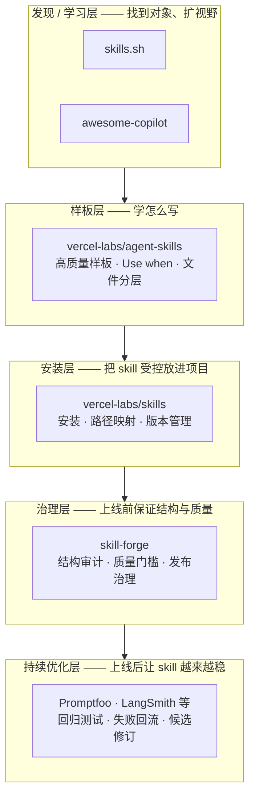
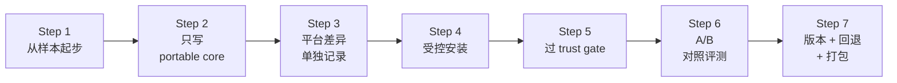
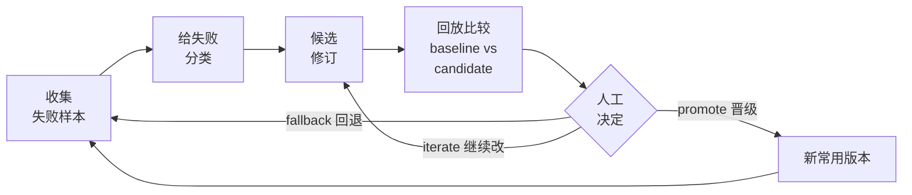

# Skill 实践 Playbook：从借鉴到持续演进

> 这份 Playbook 写给这样的人：
>
> - 你已经在和 AI 一起工作，可能已经写过不少 skill
> - 你知道 skill 很有用，甚至已经觉得"这东西我做得还挺顺"
> - 但你仍然会在下面这些地方卡住：
>   - 现成 skill 到底先看什么
>   - 看到了样本，怎么学，不怎么抄
>   - 生态里这么多对象，谁负责发现，谁负责安装，谁负责治理
>   - 为什么 skill 明明能跑，却还不算成熟
>   - skill 上线后，到底怎么让它越来越稳
>
> 这不是研究报告。
> 这是一份实践 Playbook，目标是把你从"会做一点"带到"知道怎样系统地借鉴、搭 baseline（基线）、做判断、持续演进"。

## 这套包怎么读

如果你最关心的是不同问题，建议这样读：

| 你现在最关心什么 | 先读哪里 | 再去哪里 |
| --- | --- | --- |
| skill 到底是什么，不是什么 | 本文第 `1-2` 节 | [附录E-术语解释与常见误解](./附录E-术语解释与常见误解.md) |
| 现成样本先看什么、怎么读 | 本文第 `3` 节 | [附录A-代表性样本与阅读路径](./附录A-代表性样本与阅读路径.md) |
| 生态对象到底怎么分层 | 本文第 `4-5` 节 | [附录B-对象分层与Baseline组合比较](./附录B-对象分层与Baseline组合比较.md) |
| 跨平台写 skill 时哪些能通用 | 本文第 `6` 节 | [附录C-Cross-Surface兼容边界与Portable-Core](./附录C-Cross-Surface兼容边界与Portable-Core.md) |
| skill 为什么上线后还要继续改 | 本文第 `7-8` 节 | [附录D-持续优化闭环与评测操作](./附录D-持续优化闭环与评测操作.md) |

## 先给结论

如果你只想先记住几句话，先记这五条：

1. 现在最难的已经不是"网上有没有现成 skill"，而是"你会不会读、会不会拆、会不会把别人的经验变成自己的判断"。发现入口的成本已经很低了，真正的门槛在阅读和拆解能力上。
2. 当前最稳的答案不是"单一赢家"，而是分角色推荐加上 baseline 组合——因为现有对象里没有哪一个在发现、安装、治理和优化这四件事上同时最强，不同对象各做自己擅长的一层。
3. 一个好的 skill，不只是几句提示词，而是一个按需加载的能力包，里面通常会有入口、说明、支撑文件、脚本和边界。
4. skill 能跑，不代表 skill 成熟。真正稳定的 skill，必须经历评测、版本治理和失败回流。
5. 真正高杠杆的成长路径不是闭门从空白页起草，而是先借样本、再抽结构、再搭自己的最小工作流，最后再进入持续优化闭环。

## 1. 这份 Playbook 到底在解决什么问题

这轮 research 最开始当然是在研究 skill，但最终卡住大家的，不只是"skill 是什么"，而是更实际的三类问题：

- 看了很多 skill，为什么还是不知道先学谁
- 明明找到现成 skill 了，为什么一落到自己的工作里就会散
- 明明 skill 已经能用，为什么一改就容易坏

这就是为什么这套 final 不能只写成"生态盘点"或"研究归档"。  
真正要交付的，是一条从借鉴到落地、再到持续演进的实践路径。

换句话说，这份 Playbook 要帮你完成的，不是"知道更多名词"，而是下面四个动作：

1. 看懂 skill 的边界。
2. 看懂哪些对象该学，哪些对象该装，哪些对象该拿来治理。
3. 搭出自己的最小可执行工作流。
4. 在上线后继续把 skill 变稳，而不是停在第一次可用。

如果把整套包压缩成一句话，它研究的其实是：

> 当现成 skill 已经很多、生态也开始成形以后，一个实践者怎样不闭门造车，而是借样本、搭基线、保留纪律，并把 skill 逐步做成稳定资产。

## 2. Skill 到底是什么，不是什么

先给一个最朴素的定义。

在这份 Playbook 里，skill 先被理解成一种按需加载的能力包。  
它通常是一个目录，里面有一个 `SKILL.md` 作为入口，再按需要挂上说明文件、例子、脚本或参考资料。它不是"一段散落的提示词"，也不是"任何和 AI 有关的说明都算 skill"。

第一次遇到 skill 时，很多人容易把下面几类东西混在一起：

| 对象 | 更像什么 | 什么时候该用 |
| --- | --- | --- |
| `AGENTS.md` | 常驻规则 | 适合一直生效的项目约定、测试命令、目录禁区 |
| `SKILL.md` skill 包 | 按需能力包 | 适合只在某类任务里才需要的步骤、规则、工具边界 |
| installer（安装层） | 安装与映射工具 | 适合把 skill 受控地放到项目或个人环境里 |
| directory（目录站） | 发现入口 | 适合找对象、找线索、扩视野 |
| governance（治理层） | 审计与发布 | 适合检查结构、安全、可发布性与质量门槛 |

这个边界一旦混掉，后面几乎每一个判断都会出问题。比如：

- 把目录站当质量背书
- 把 installer 当评测系统
- 把样板库当全链路工程基座

这些误读，在生态里都很常见。

### 一个最小例子

很多人第一次写 skill，会写成这样：

```md
# PR Review

Please review the pull request carefully. Check logic, tests, security,
performance, style, edge cases, rollback risk, and deployment impact.
```

这段话不是完全没用，但它的问题也很明显：

- 什么时候触发不清楚
- 主线步骤不清楚
- 细节都挤在一起
- 以后很难维护

更像 skill 的写法，通常会把它拆成下面这样：

```md
---
name: pr-review
description: Use when reviewing a pull request and you need a structured risk-first review pass.
---

1. 先确认这是功能改动、修复改动，还是重构改动。
2. 先看改动范围、测试覆盖和回滚风险。
3. 详细检查项见 `references/review-checklist.md`。
4. 如果需要固定检查顺序，运行 `scripts/review-pass.sh`。
```

这时你得到的就不只是"多写了一点字"，而是一个更像能力包的东西：

- `description` 负责路由，也就是告诉系统什么时候该调用它
- 主文负责主线动作
- `references/` 负责长说明
- `scripts/` 负责重复动作

这就是 skill 和普通提示词真正拉开差距的地方。

### 读完这一节，你现在该做什么

先不要急着新建自己的 skill。  
先去确认你脑子里有没有把下面四层分开：

- 常驻规则
- 按需 skill
- 安装层
- 发现层

如果这四层还混着，先去看 [附录E-术语解释与常见误解](./附录E-术语解释与常见误解.md) 里的基础对象术语。

## 3. 为什么要先读后编，而不是闭门写

今天真正难的，已经不是"能不能找到现成 skill"，而是"找到了以后，会不会看"。  
目录站、社区聚合、官方样板库和第三方教程层，已经把入口成本降得很低了——发现不再是瓶颈，读懂才是。

这带来一个很现实的变化：

> 对大多数实践者来说，冷启动最省时间的路径，已经不是从空白页开始硬写，而是先读几个高质量样本，先学结构、触发写法、边界和分层，再开始编自己的版本。

为什么"先读后编"这么重要？

因为现成样本最能帮你缩短三种摸索：

1. 什么时候该触发。
2. 正文和支撑文件怎么分层。
3. 哪些细节应该靠脚本或清单稳定下来。

如果不先看样本，很容易出现一种假熟练：

- 你能很快写出一个 `SKILL.md`
- 但它只是比较长的说明文
- 真放到真实任务里，触发不稳、边界不稳、回头难改

### 最值得先看的三类入口

当前最值得先学的三个入口仍然是：

1. `skills.sh`
   - 用来知道现成 skill 到底有多容易找到
   - 它解决的是"去哪找"，不是"能不能信"
2. `github/awesome-copilot`
   - 用来知道社区是怎样组织学习入口和教程层的
   - 它解决的是"从哪里扩视野"，不是"直接当基座"
3. `vercel-labs/agent-skills`
   - 用来学高质量样板库怎么组织
   - 它解决的是"怎么学结构"，不是"怎么安装和治理"

如果只记一个动作，就记这个：

> 先找三个样本，不要先写三段说明。

### 看样本时别只看"内容"，要看这五件事

1. 它的 `Use when` 或 `description` 到底怎么写。
2. 正文承载的是步骤，还是知识堆积。
3. 哪些细节被下沉到 `references/`、`examples/`、`scripts/`。
4. 哪些地方体现了边界，而不是万能口吻。
5. 它最容易被误抄的是哪一层。

这也是为什么附录 A 不会做成"样本越多越好"的清单，而是会告诉你哪些样本最值得先拆、各自适合学什么。

### 读完这一节，你现在该做什么

如果你这周只做一个动作，去 [附录A-代表性样本与阅读路径](./附录A-代表性样本与阅读路径.md)，按顺序拆三个对象：

- 一个目录站
- 一个样板库
- 一个本地系统级样本

不要急着复制代码，先写下你看到了哪些"结构决定"。

## 4. 当前生态应该怎样分层理解

现成 skill 生态看起来很热闹，但真正会让人糊涂的，不是对象太少，而是对象太容易长得像。  
如果你不主动分层，就会很容易把"很适合学习的对象"和"适合当工程基线的对象"混成一类。

当前最稳的分层，大致可以这样理解：

| 层 | 它负责什么 | 当前代表对象 |
| --- | --- | --- |
| 样板层 | 教你看成熟 skill 怎么写 | `vercel-labs/agent-skills` |
| 安装层 | 负责安装、列出、更新、映射 | `vercel-labs/skills` |
| 治理层 | 负责审计、质量门槛、发布 | `skill-forge` |
| 发现层 | 负责找到对象、扩视野 | `skills.sh` |
| 学习层 | 负责教程、社区入口、案例聚合 | `github/awesome-copilot` |
| 场景化增强层 | 负责特定运行环境或特定管理需求 | `open-skills`、`Ai-Agent-Skills` |

用图来看，这几层在实践里的关系大致是这样的：



这里最重要的不是记住名字，而是记住一个判断：

> learning value（学习价值）和 engineering maturity（工程成熟度）不是同一件事。

一个对象可能非常适合学习，但不适合直接重押。  
另一个对象可能很适合进入工程 workflow，但仍然需要外部审查和任务级评测。

### 为什么不能追"单一赢家"

因为当前没有哪个对象在所有维度上同时最强：

- 样板库擅长教你结构
- installer 擅长装进去
- 治理层擅长查结构和质量门槛
- 目录站擅长帮你找到更多对象
- 持续优化层擅长让 skill 变稳

把这些职责都压到一个"谁第一"的问题里，最后得到的结论往往会误导人。

这也是为什么本套 Playbook 不会给你一个无语义总榜，而是会给你：

- 最值得先学的入口
- 最值得先搭的 baseline 组合
- 使用时必须保留的纪律
- 上线后必须保留的持续优化闭环

### 读完这一节，你现在该做什么

先去 [附录B-对象分层与Baseline组合比较](./附录B-对象分层与Baseline组合比较.md)，把你目前最常说的三个对象分别标成：

- 学习层
- 安装层
- 治理层

如果你发现自己最常推荐的三个对象其实都落在同一层，那你的视角很可能还偏窄。

## 5. 最值得先学的入口，与最值得先搭的 baseline

在当前证据下，最稳的推荐语法不是总榜，而是分层表达。

### 最值得先学的入口

当前最值得先学的三个入口是：

- `skills.sh`
- `github/awesome-copilot`
- `vercel-labs/agent-skills`

它们共同解决的是：

- 让你知道外面已经有什么
- 让你少走"从空白页硬写"的弯路
- 让你更快建立对成熟写法的感觉

但它们不共同保证：

- 安全可信
- 安装即有效
- 直接适合生产

这些仍然要靠后面的层来补。

### 最值得先搭的 baseline 组合

当前最值得先搭的 baseline（基线）组合是：

- `vercel-labs/agent-skills`
- `vercel-labs/skills`
- `skill-forge`

可以把它们理解成三层：

1. 用样板库学结构。
2. 用安装层做受控引入。
3. 用治理层补质量门槛、发布纪律和 artifact（工件）级检查。

这仍然不够完整。  
因为如果你要让 skill 真正稳定下来，还必须保留一条 optimization loop（优化闭环），也就是 skill 上线后的持续修改与回放机制——skill 上线只是开始，不是终点。

### 使用时必须保留的纪律

至少保留四条纪律：

1. install 之前先审查来源和内容，不把"好找"当"可信"。
2. install 之后做 with/without evaluation（有 skill / 无 skill 的对照评测），不把"能加载"当"真有效"。
3. 给 skill 版本、回退路径和验证记录，不把"最新"当"最好"。
4. 尽量按角色或任务打包 skill，不做全量默认激活，避免选择过载。

### 读完这一节，你现在该做什么

不要立刻追"还有没有更强的仓库"。  
先问自己：你现在缺的是哪一层？

- 缺视野
- 缺样板
- 缺安装层
- 缺治理层
- 缺上线后的优化闭环

这个问题答清楚，比继续搜十个新仓库更有用。

## 6. 从样本到自己的 skill：最小可执行 workflow

如果你准备把"看了很多 skill"推进到"自己真的搭一套工作流"，先看一下整体步骤，再往下读每一步的细节：



### Step 1：先从现成样本起步

先不要从空白文档开始。  
先选一个高质量样板库，再选一个与你的任务相近的样本，先看它的入口、结构、边界和支撑文件是怎么配合的。

### Step 2：只先写 portable core（可移植核心）

`portable core（可移植核心）` 指的是不严重依赖某一个平台、换个宿主大体还能沿用的核心写法。  
最稳的做法不是一上来把所有平台能力都写满，而是先写：

- `SKILL.md`
- `name`
- `description`
- 核心步骤
- 对支撑文件的导航

平台特有扩展可以后写，不要先写。

### Step 3：把平台差异单独写成 compatibility note

如果你要兼容多个 surface（宿主表面），例如 Codex、GitHub 或 Claude，不要假装它们完全一样。  
更稳的写法是：

- 主体保持 portable core
- 扩展写成单独 compatibility note（兼容性说明）

这一步会明显降低你后面迁移或排查时的混乱。详细做法见 [附录C-Cross-Surface兼容边界与Portable-Core](./附录C-Cross-Surface兼容边界与Portable-Core.md)。

### Step 4：受控安装，不要一上来全局铺开

优先做 controlled install（受控安装）：

- 先 project scope（项目范围）
- 再小规模试用
- 先能回滚
- 再考虑更广泛共享

这一步的重点不是"装得快"，而是"出问题时退得掉"。

### Step 5：先过 trust gate（信任门）

`trust gate（信任门）` 指的不是形式上的点头，而是装进去之前先读一遍这个 skill 到底会做什么。

至少检查：

- `SKILL.md`
- 会被带入上下文的支撑文件
- `scripts/`
- 有没有权限越界、隐藏执行或明显拼接痕迹

把 skill 当成一种 code-like asset（像代码一样要审查的资产），这个纪律非常重要。

### Step 6：做 with/without A/B evaluation

不要只问"它能不能触发"，要问"它是不是比不用更好"。  
最简单的做法就是拿几组代表性任务做对照：

- 没加载这个 skill 的基线结果
- 加载这个 skill 的结果

看它是：

- 真正减少了遗漏
- 还是只是让回答更像模板

这一步往往比"多加几个字段"更能决定 skill 值不值得留。

### Step 7：给它版本、回退和打包方式

一旦 skill 准备常用，就不要只保留"最新版"。

至少要有：

- 版本或快照
- 最近验证通过的版本记录
- 出问题时的 rollback（回退）方式
- role-based bundles（按角色打包）或 task bundles（按任务打包）

这会显著降低后面"越加越乱"的问题。

### 读完这一节，你现在该做什么

如果你已经有一个自己常用的 skill，立刻检查它有没有下面四样东西：

- 清楚的 `description`
- 至少一个支撑文件
- 一个回退方式
- 一组最小对照任务

缺哪一样，就先补哪一样。

## 7. 为什么 skill 上线不等于 skill 成熟

很多 skill 在第一次能用的时候，会给人一种错觉：

> 都已经能跑了，后面大概只是润色一下文案。

这通常不对。  
因为 skill 真正优化的对象，不只是 prompt，而是整个 artifact，也就是整个能力包本身。

一个 skill 可能在下面这些地方出问题：

- 根本没被触发
- 被误触发
- 工具调用顺序错了
- 参数传错了
- 主线步骤没走完
- 版本更新后旧任务反而坏了

这些问题里，很多都不是"多改两句正文"能解决的。

### 为什么"最终答案看起来不错"还不够

因为 workflow skill（工作流型 skill）经常不是输在最后一句回答，而是输在过程里。

比如：

- 本来应该先做检查，再做修改，结果顺序颠倒
- 本来该调用工具，结果跳过去了
- 本来该走三步，结果只走了一步

这就是为什么 `final answer pass（最终答案通过）` 不等于 `workflow pass（工作流通过）`。

### skill 真正会在哪些地方逐步变稳

当前最稳的看法是，skill 成熟度至少和五件事有关：

1. 触发是不是更准。
2. 步骤是不是更稳。
3. 工具使用是不是更可靠。
4. 版本更新是不是可回退。
5. 真实失败有没有回流进下一轮修订。

如果整套 Playbook 只覆盖"怎么起步"，却不覆盖"怎么长期变好"，就只是讲了一半。

### 读完这一节，你现在该做什么

回想你最常用的那个 skill，写下它最近三次失败是怎么失败的。  
如果你只能写出"感觉不太好"而写不出失败类型，那你现在缺的不是更多 skill，而是一个更清楚的失败分类方法。

## 8. 持续优化闭环：怎样让 skill 逐步变稳

`feedback loop（反馈闭环）` 指的不是"收集点意见"，而是把真实使用中暴露出来的问题重新带回下一轮修改。  
这件事一旦做起来，skill 才会从一次性作品慢慢变成长期资产。

当前最实用的持续优化闭环，大致可以理解成五步：



### 第一步：失败不要只记"感觉不好"

最常见的低效做法，是把所有问题都写成"这个 skill 不太稳"。  
更有效的做法，是先分清它到底是哪种失败：

- discoverability（可发现性）失败
- workflow executability（工作流可执行性）失败
- tool-use contract（工具使用契约）失败
- structural / packaging（结构或打包）失败
- versioning / regression（版本与回归）失败

只要失败分类更清楚，后面的修订就会更准。

### 第二步：不要只看最后结果，要看过程轨迹

`trajectory regression（轨迹回归）` 的意思是：你不只检查最后结果，而是检查中间步骤有没有跑偏。  
这在 workflow skill 里尤其重要。

至少可以看：

- 是否触发
- 触发后调用了什么工具
- 参数是不是合理
- 步骤顺序是不是对
- step count（步骤数量）是不是异常

这一步会让你更早发现"看起来成功，但其实过程已经坏了"的问题。

### 第三步：让线上问题回流到线下

很多团队的问题不是没见过失败，而是失败见过就过去了。  
更稳的做法是把 production trace（生产轨迹）、用户修正、人工审阅和注释队列，慢慢沉淀成 offline dataset（离线样本集）。

这样你每次改 skill 时，就不是凭感觉对着空气修改，而是拿着一组越来越像真实世界的数据去比较。

### 第四步：自动修订可以帮忙，但别替代人工门槛

`candidate revision（候选修订）` 指的是先生成一个候选版本，看它能不能修掉某类问题。  
这一步可以借鉴自动优化思路，但它更适合做：

- `description` 微调
- 步骤重排
- 示例补充
- 支撑文件结构调整

它不适合直接替代人工判断。  
真正稳的做法仍然是：

- 自动化先给候选
- 回放比较 baseline 和 candidate
- 人工再决定要不要晋级到常用版本

这就是 `human promotion gate（人工晋级门槛）` 的意义。

### 一个最小闭环就够你起步

你不必一上来就有很大的评测系统。  
一个最小闭环就已经很有用：

1. 留下 5-10 个代表性任务。
2. 每次改 skill，只改一类问题。
3. 改完后重跑这 5-10 个任务。
4. 记录哪些变好、哪些变差。
5. 如果变差，先回退，不硬上。

只要你真的坚持这五步，skill 的成熟度就会比"凭感觉改"高很多。

### 读完这一节，你现在该做什么

给你最常用的一个 skill 建一份最小回放表：

- 任务名
- 旧结果
- 新结果
- 是否变好
- 如果没变好，是哪类失败

这张表会比再搜五个新 skill 更直接地提高质量。

## 9. 下一步先练什么

如果你现在想把整套方法变成自己的动作，最推荐的不是"同时做很多"，而是按下面三个阶段来练。

### 第一阶段：练阅读，不急着写新 skill

目标：

- 会区分常驻规则、skill、安装层、目录站、治理层
- 会拆样本结构

动作：

- 读三个样本
- 每个样本写下它最值得借的结构决定
- 每个样本写下一条最容易误抄的地方

### 第二阶段：练最小 workflow

目标：

- 从样本走到自己的第一版 baseline

动作：

- 为一个高频任务写一个 portable core
- 单独写兼容性说明
- 受控安装
- 做最小对照评测
- 记录版本与回退

### 第三阶段：练持续优化闭环

目标：

- 不再把 skill 当一次性作品

动作：

- 留代表性任务
- 给失败分类
- 每次只改一类问题
- 跑回放
- 人工决定是否晋级

如果你愿意把这三阶段真正走一遍，你对 skill 的理解就会从"我会写一点"变成"我会经营一套会长期变好的能力包"。

## 最后再压成一句话

这套 Playbook 最想帮你建立的，不是更多名词，而是一种更稳的动作顺序：

先借鉴，再抽结构；先搭基线，再谈扩展；先做对照，再做推广；先看失败怎样回流，再谈 skill 怎样成熟。

如果你接下来只做一件事，就去 [附录A-代表性样本与阅读路径](./附录A-代表性样本与阅读路径.md) 选一个样本开始拆。  
对大多数人来说，那会比从空白页硬写更快把能力往前推进。
