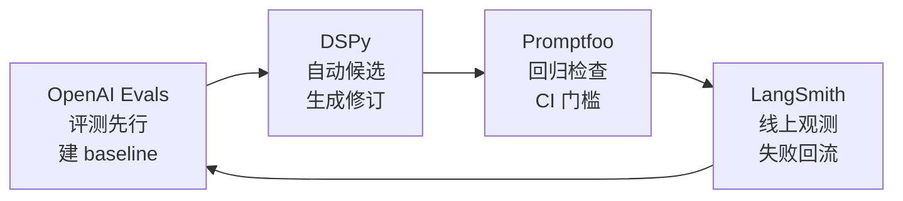
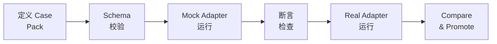

# 附录 F：进阶话题与深度参考

主文和附录 A-E 覆盖了从"怎么读样本"到"怎么搭闭环"的完整学习路径，但为了让那条路径更容易爬，有些高阶话题被有意压轻了。这份附录把它们集中呈现，适合以下读者：

- 你已经走完主文第 1-8 节，想知道"天花板"在哪里
- 你想找真实的高阶 skill 系统来学，不只是教程级的样本
- 你准备在自己的团队里搭评测基础设施，想知道现有工具链怎么接
- 你对"生态里的 skill 到底有没有用"这个问题有严肃的好奇心

每一节开头都有前置条件提示。如果你还没到那个阶段，完全可以跳过，以后再回来看。

---

## F1. 去哪里找高阶 skill 样本

> **前置条件：** 你已经读过附录 A 的样本拆解方法（尤其 A4 的拆解示范），能区分"入口设计""workflow 步骤""辅助文件分层"这些概念。

主文第 3 节和附录 A 讲了「先看什么、怎么拆」，但一直没有点名具体的仓库。这是故意的——初学阶段更重要的是方法，而不是迷失在某个大仓库里。但到了进阶阶段，你需要知道真实的高质量 skill 系统长什么样。

下面是四个我们深入研究过的仓库。它们不是"最好的四个"——skill 领域变化太快，排名没有意义。它们是"最适合学不同维度的四个"，各有独特的设计取向，拿来一起对比读会收获最大。

### agent-skills——结构化学习的最佳起点

**GitHub 地址：** [vercel-labs/agent-skills](https://github.com/vercel-labs/agent-skills)

**一句话定位：** 按软件工程生命周期分层的 skill 样板库，不是提示词合集。

这个仓库把 AI agent 在真实工程中应该遵守的行为，拆成了可组合的 skill。它的核心目标不是让 agent "更会写代码"，而是让 agent 少跳步骤、少靠猜、少过度实现、少把没验证的结果当完成——更像一个有流程纪律的资深工程师。

整个仓库围绕六个生命周期阶段组织：

- **Define**：先定义问题和边界（`idea-refine`、`spec-driven-development`）
- **Plan**：把工作拆成可执行单元（`planning-and-task-breakdown`）
- **Build**：按切片实现（`incremental-implementation`、`test-driven-development`、`context-engineering`、`frontend-ui-engineering`、`api-and-interface-design`）
- **Verify**：证明结果是真的（`browser-testing-with-devtools`、`debugging-and-error-recovery`）
- **Review**：在合并前压质量（`code-review-and-quality`、`code-simplification`、`security-and-hardening`、`performance-optimization`）
- **Ship**：准备发布（`git-workflow-and-versioning`、`ci-cd-and-automation`、`deprecation-and-migration`、`documentation-and-adrs`、`shipping-and-launch`）

另外还有一个 Meta 级的 `using-agent-skills`，告诉 agent 怎么使用这套技能体系本身。

**最值得学什么：**

这个仓库的价值不在于单个 skill 的文案写得多好，而在于它的**链路设计**。观察它怎样用 7 个命令入口（`/spec`、`/plan`、`/build`、`/test`、`/review`、`/code-simplify`、`/ship`）串起 20 个 skill 的功能地图。特别注意每个 skill 的 `Use when` 部分——这是触发设计的优秀范例。

**推荐先看：**

1. 先看 `using-agent-skills` 的 `SKILL.md`，理解整体调度逻辑
2. 再看 `spec-driven-development` 和 `planning-and-task-breakdown`，体会 Define/Plan 阶段怎样把"问题定义、成功标准、边界、checkpoint"提前固定
3. 最后看 `code-review-and-quality`，对比你自己写的代码审查 skill 有什么差距

**不适合当什么用：** 这是一个学习结构和流程纪律的样板库，不是拿来直接安装到项目里的工程基座。它没有安装脚本、没有 runtime 支撑、没有多宿主适配——这些是其他仓库的长项。

---

### gstack——产品化 AI sprint 系统的天花板

**怎么找到它：** gstack 不是一个公开的大众仓库，而是一个私有/半私有的产品化项目。你不太可能在 GitHub 搜索里直接找到它。最现实的途径是通过 skill 社区和聚合站（如 `awesome-copilot`）关注相关讨论，或者通过团队内部渠道获取。我们之所以能研究它，是因为做了完整的本地 snapshot 拆解。

**一句话定位：** 一套把 AI 工程流程产品化的完整 sprint 系统，远超 slash command 集合。

如果说 agent-skills 是"教科书"，gstack 就是"毕业论文级的工程实践"。它不是给 agent 多装几个命令，而是把整个 sprint 流程——从策略评审到构建、QA、发布、回顾——变成了一套可运行的系统。

它的规模本身就很说明问题：40 个 `SKILL.md`（36 个顶层 + 4 个跨平台原生 skill）、37 个 `SKILL.md.tmpl`（模板母版）。但数字不是重点，**系统层才是**。

**看 gstack 时最容易犯的错误**是数命令数量和看 README 营销文案。真正该盯的是这几层：

**模板层** `SKILL.md.tmpl`：每个 skill 不是直接写死的 Markdown，而是从模板生成。这让 skill 的公共部分（前言、更新纪律、遥测设定）统一下沉，减少文档漂移——想象一下 37 个 skill 各自手写前言的维护噩梦。

**浏览器 runtime**：gstack 内置了持久化浏览器 daemon。这意味着 QA skill 不是在空想"如果我能看到页面"，而是真的在操作浏览器、截取截图、验证交互行为。从 `ARCHITECTURE.md` 和 `browse/src/*` 可以看到这套系统的设计。

**审查专家体系**：`review/specialists/*.md` 不是一个笼统的 "review" skill，而是拆成了 CEO 评审、工程评审、设计评审、DX 评审、安全审查等多角色专家。QA 同样有独立的 `issue-taxonomy.md` 和报告模板。

**评测 harness**：这是 gstack 与其他仓库最大的分水岭。它有完整的 E2E 评测基础设施——LLM-as-judge 评分、多 surface session runner、结构化 trace 存储、before/after 对比。后面 F3 节会详细讲这套 harness。

**推荐先看：**

1. `ARCHITECTURE.md` 理解整体系统设计
2. 任意一个 skill 的 `SKILL.md.tmpl` 和对应的生成产物 `SKILL.md`，看模板和产物的关系
3. `review/specialists/` 目录，看多角色审查怎么做
4. `test/` 目录，看评测 harness 的结构

**不适合当什么用：** 不适合冷启动。如果你还在搭第一个 skill，gstack 的复杂度会让你淹没。它更适合作为"我的 skill 系统该往哪走"的参考样本——你不需要复制它，但需要知道天花板在哪。

---

### superpowers——workflow 强制执行的进阶形态

**GitHub 地址：** [obra/superpowers](https://github.com/obra/superpowers)

**一句话定位：** 通过 hooks、宿主适配和行为测试来**强制** agent 遵循工作流的 skill 插件。

大多数 skill 仓库的隐含假设是："我把规则写好了，agent 应该会遵守。" superpowers 不这样想。它关心的核心问题是：**agent 是否真的按规则使用了 skill？** 这让它在 skill 领域里占据了一个很独特的位置。

它有 14 个显式 skill（从 `brainstorming` 到 `verification-before-completion`），但它的真正独特性在于 skill 之外的三层结构：

**注入层**：通过 `hooks/hooks.json` 和 `hooks/session-start`，在 agent 会话启动时自动注入"如何使用技能"的规则。agent 不需要被告知"你有哪些 skill"——启动时就知道了。

**适配层**：为多个宿主提供安装和适配说明——`.claude-plugin/plugin.json`、`.cursor-plugin/plugin.json`、`.codex/INSTALL.md`、`.opencode/INSTALL.md`、`gemini-extension.json`。这不是复制粘贴，而是认真处理了不同宿主的发现机制和注入方式。另外还有一层 `commands/` 下的旧命令桥接（`brainstorm.md`、`write-plan.md`、`execute-plan.md`），让从旧系统迁移过来的用户也能用。

**行为测试层**：这是最关键的差异。`tests/` 目录下有多组测试——`claude-code/`、`skill-triggering/`、`explicit-skill-requests/`、`opencode/`、`subagent-driven-dev/`——它们测的不是"脚本能不能跑"，而是"agent 是否在真实会话中按预期触发并执行了 skill"。

**推荐先看：**

1. `skills/using-superpowers/SKILL.md`——理解 bootstrap 怎么做
2. `hooks/` 目录——看 session 注入的机制
3. `tests/skill-triggering/`——看行为测试怎么验证 skill 触发
4. 任一宿主的安装文件（如 `.claude-plugin/plugin.json`）——看适配怎么做

**不适合当什么用：** 不适合当最小通用 baseline。它的设计深度绑定了特定的工作流理念（spec → plan → execute → review → finish），如果你的场景和这条链路不匹配，直接搬过来会水土不服。学它的**注入、适配和测试三件套**的设计思路，比照搬它的 skill 内容更有价值。

---

### get-shit-done——五层组合系统的另一种可能

**怎么找到它：** 和 gstack 类似，get-shit-done 也不是一个容易在 GitHub 上直接搜到的公开仓库。它更像一个特定团队/社区的工程实践产物。你可以通过 `awesome-copilot` 聚合站或 skill 社区的讨论来追踪相关线索。我们的研究基于完整的本地 snapshot 拆解。

**一句话定位：** 一套由 command / agent / workflow / reference / template 五层组成的 skill runtime 系统。

如果前面三个仓库让你觉得"skill 就是 SKILL.md"，get-shit-done 会彻底打破这个印象。它证明了 skill-like 的能力系统可以长成完全不同的样子。

它的五层结构各有分工：

**命令层** `commands/gsd/*.md`：能力入口。有 front matter，声明名称、描述、`allowed-tools`，通过 `execution_context` 跳转到 workflow——它本质上是在说"这个能力叫什么、允许动什么工具、执行上下文在哪"。

**角色层** `agents/*.md`：专职角色，不是简单的人设。每个 agent 有明确的 `tools` 和能力边界，是强约束的 skill persona。

**编排层** `workflows/*.md`：skill 的"路由器 + 调度器"。虽然不一定有 YAML front matter，但结构极强——`purpose`、`required_reading`、`process`、`step`、上下文加载、agent 调度、状态推进，一环扣一环。

**规则层** `references/`：共享的稳定规则，让不同的 command 和 workflow 遵守一致的约定。

**产物层** `templates/`：固定产出物的形状。这让 skill 不只是"说法一致"，连产出的东西长什么样都提前定好了。

**最值得学什么：**

不要去学它的具体文案——文案不是它的重点。学它怎样把**结构层级和调度关系**设计出来。观察一个 command 怎样引用一个 workflow，workflow 怎样调度 agents，agents 怎样使用 references，最后产出 templates 定义的产物。这条链路本身就是一堂 skill 系统架构课。

**推荐先看：**

1. 选一个 command 入口（`commands/gsd/` 目录下任意一个），顺着它的 `execution_context` 找到对应 workflow
2. 看那个 workflow 怎样声明 `required_reading`（引用了哪些 references）和 `process`（调度了哪些 agents）
3. 看被调度的 agent 的能力边界声明

**不适合当什么用：** 不适合当跨平台规范判断的依据。它是一个特定工程哲学下的实践产物，不是通用标准。它最大的教学价值在于让你理解：**skill 的可复用性不只来自文案质量，更来自入口、角色、编排和产物结构的设计**。

---

### 对比阅读建议

如果你有时间，最推荐的阅读方式不是一个个仓库从头到尾看，而是挑一个主题横向对比：

| 你关心什么 | 对比看什么 |
| --- | --- |
| 生命周期怎么分层 | agent-skills（六阶段命令地图）vs get-shit-done（五层结构分工） |
| 审查怎么做 | agent-skills（单个 review skill）vs gstack（多角色 review specialists） |
| 触发和注入 | superpowers（hooks + session-start）vs agent-skills（Use when 描述） |
| 测试和验证 | superpowers（行为测试）vs gstack（E2E eval harness） |
| 模板和治理 | gstack（SKILL.md.tmpl 模板系统）vs get-shit-done（references + templates 层） |

---

## F2. 自动评测与 CI 集成

> **前置条件：** 你已经理解附录 D 的七类失败分类，并且对主文第 8 节的"最小闭环"思路（分类 → 修改 → 对照 → promote/fallback）不陌生。

主文和附录 D 讲了为什么需要评测闭环、失败怎么分类、手动怎么做对照。但一个自然的问题是：**有没有工具能帮我自动化这些步骤？**

答案是"部分可以"——但需要清楚每个工具解决的是闭环中的哪一步，而不是指望任何一个工具包打一切。

下面介绍四个可以迁移到 skill 评测场景的工具体系。它们原本不是为 skill 设计的，但它们各自解决的子问题和 skill 优化闭环高度相关。

### Promptfoo——轨迹回归与 CI 质量门

**解决闭环中的哪一步：** 主要解决"修改之后怎么知道没改坏"——回归测试和发布门槛。

传统的 LLM 评测大多只看最终输出：你给一个 prompt，看返回的答案对不对。但 skill 不是单轮问答——一个代码审查 skill 可能经过触发判断、加载辅助文件、执行多个步骤、调用工具、最后产出审查结果。两次运行可能最终输出一样，但中间的行为路径完全不同。

Promptfoo 的核心价值在于它支持**轨迹级别的断言**，而不只是答案匹配。在 skill 场景中，可以映射为：

- **触发检查**：`trajectory:tool-used` 类断言——skill 该触发时是否真的被加载了
- **步骤顺序**：`trajectory:tool-sequence` 类断言——agent 是否按 skill 定义的步骤顺序执行
- **工具使用**：`trajectory:tool-args-match` 类断言——调用的工具参数是否符合 skill 的工具契约
- **步骤膨胀**：`trajectory:step-count` 类断言——总步骤数是否合理，有没有陷入循环

在 CI 层面，Promptfoo 支持把评测嵌入持续集成管线：输出 JSON/HTML/XML 报告；设置 **pass-rate 阈值**（比如"通过率低于 90% 就失败"）；**fail-on-error** 模式让任何关键回归直接阻断合并；还可以做 token 和 cost 追踪。

**最小接入路径：** 为你的 skill 定义一组测试 case（至少包含"应该触发""不应该触发""应该按这个步骤走"三类），写成 Promptfoo 配置；在 CI 中运行，设置通过率门槛。

**已知限制：** Promptfoo 原生面向 agent 和 prompt 评测，不直接理解 `SKILL.md` 的概念。你需要写一个**适配层**——把 skill 的安装、触发、宿主行为桥接成 Promptfoo 能理解的输入输出格式。这个适配成本不算高，但不能省。

---

### LangSmith——线上线下评测闭环

**解决闭环中的哪一步：** 主要解决"线上真实失败怎么回流成离线测试 case"——从观测到改进的完整循环。

附录 D 讲失败分类时，隐含了一个前提：你得先发现失败。在真实使用中，很多 skill 的失败不是一次性暴露的——用户可能用了一个月才发现某类任务上 skill 总是走偏。

LangSmith 提供的核心能力是把**线上观测和离线评测连成一个环**：

**线上侧**：在生产环境中记录每次 skill 被调用的完整轨迹（runs/threads），包括输入、输出、中间步骤、延迟、metadata。当你发现异常时，可以把这条轨迹标记为问题样本。

**离线侧**：把标记的线上样本加入离线测试集（datasets/examples），在离线环境中复现和验证修复。修复后重跑离线测试集确认不回归，然后重新部署到线上。

**人工反馈**：LangSmith 的 annotation queue 让团队成员可以对线上结果打标注、写反馈，这些标注直接变成未来的训练和评测数据。

**与 skill 场景的对齐点：** 要用 LangSmith 跟踪 skill，你需要定义一个"skill run schema"——什么算一次 skill 调用的开始和结束、触发信号是什么、加载了哪些内容、轨迹怎么记录、输出是什么、用户反馈怎么采集。这个 schema 不是 LangSmith 给你的，需要你根据自己的 skill 结构来定义。

**已知限制：** LangSmith 是一个应用/agent 观测平台，不是 skill 包的原生工具。它不知道 `SKILL.md` 是什么，也不理解 `description` 和触发机制。桥接成本比 Promptfoo 更高，但一旦接上，线上→线下的闭环能力是其他工具不容易提供的。

---

### DSPy——程序级优化器的借鉴

**解决闭环中的哪一步：** 主要提供"怎么自动生成候选修订"的思路——自动化候选产生，但不替代人工验收。

主文第 8 节强调"自动化是候选修订的生成器，不是发布者"。DSPy 的 optimizer 模式正好印证了这个定位。

DSPy 把 LLM 应用看成"程序"，optimizer 通过 metric + 小训练集 + traces 来搜索更好的指令、示例和规则——不是让人手动改 prompt，而是让系统自动探索改法。其中几个 optimizer 和 skill 修订直接相关：

- **MIPROv2**：搜索指令和示例的组合，适合优化 skill 的 description 和 workflow 表述
- **SIMBA**：从失败样本反推规则和成功示例，适合针对特定失败类型生成修订建议
- **GEPA**：从运行轨迹反思差距、生成补充 prompt，适合发现 skill 步骤中的遗漏

**关键警告：** 对整个 skill 做全自动优化风险很高——overfitting 几乎是必然的。更安全的做法是把 optimizer 的作用范围限定在 skill 的**局部部件**上：description 的措辞、单个步骤的表述、工具契约的示例等。每次 optimizer 提出修订后，仍然需要回放 baseline case 确认没有回归，再通过人工 promotion gate。

**已知限制：** DSPy 的模型是"程序/模块"，不是 `SKILL.md`。迁移需要把 skill 的结构拆成 DSPy 能理解的模块——这不是开箱即用的事。更务实的方式是借鉴它的**方法论**（metric + 小训练集 + 局部搜索 + 回归验证），而不是强行套用它的 API。

---

### OpenAI Evals——评测先行的飞轮

**解决闭环中的哪一步：** 主要提供"修改前先建 baseline 评测"的纪律——不做无测量的优化。

OpenAI 的优化指南里有一条最朴素但最容易被忽略的建议：**先写评测，再改 prompt。** 在 skill 场景中翻译过来就是：**先有 baseline eval，再动 SKILL.md。**

这意味着在修改 skill 之前，你应该：

1. 准备一组代表性测试输入（不是随便想几个，而是覆盖正常用例、边界用例和已知失败）
2. 用当前版本的 skill 跑一遍，记录结果作为 baseline
3. 修改 skill
4. 用同样的测试输入再跑一遍，和 baseline 对比
5. 只有对比结果确实变好了（且没有新回归），才推进

这个 flywheel 听起来简单，但在 skill 领域有一个特殊的挑战：agent 行为是非确定性的。同一个 skill、同一个输入，跑两遍可能走不同的路径。所以 baseline 不能只跑一次——需要多次运行取分布，才能区分"真的变好了"和"这次碰巧好了"。

**与 skill 场景的对齐点：** 传统 evals 关注"最终输出是否正确"。skill evals 需要扩展到：触发行为是否正确、workflow 是否被遵循、工具契约是否被遵守、辅助文件是否被正确加载、版本管理是否到位。

---

### 四个工具怎么组合

这四个工具不是竞争关系，而是各管一段：

- **OpenAI Evals 的理念**告诉你"先有测量再改东西"
- **DSPy 的模式**帮你自动探索修订方案（但只当候选）
- **Promptfoo 的断言**帮你验证候选是否比 baseline 好且没有回归
- **LangSmith 的闭环**帮你把线上新发现的失败变成下一轮优化的输入

你不需要四个全用。最小可行的起点是：**手动写几个 case + 手动对比结果**（主文第 8 节已经够了）。当 case 变多、修改变频繁时，再逐步引入工具自动化。

---

## F3. 回归 Harness 工程规格

> **前置条件：** 你已经理解 F2 中的工具思路，现在想知道"如果我要自己搭一套 skill 回归测试系统，架构应该长什么样"。

上面讲的四个工具各有所长，但它们都不是为 `SKILL.md` 原生设计的。如果你要搭一套真正面向 skill 包的回归系统，需要一个更清晰的工程框架。gstack 的本地评测 harness 是目前我们看到的最接近"可运行的 skill 回归系统"的实现参考。

### 整体流程

一个 skill 回归系统的核心流程可以概括为六步：

**先 Mock 后 Real** 是一条关键纪律。如果你一上来就接真实 agent surface，assertion 的语义还没稳定就会被 agent 的非确定性行为和 CLI/model 的随机差异干扰。先用 mock 把"什么算通过、什么算回归"的判断逻辑跑通，再接真实 surface。

### Case Pack 设计

Case pack 是回归系统的核心资产——它定义了"这个 skill 在哪些场景下应该表现出什么行为"。

每个 case 应该有以下字段：

- **name**：唯一标识，比如 `trigger-code-review-on-pr`
- **category**：属于七类失败中的哪一类（`trigger`、`no-trigger`、`trajectory`、`tool-contract`、`safety`、`output-contract`、`portable-core`）
- **input**：模拟的用户输入或场景描述
- **skill_package**：被测 skill 的路径和版本
- **expected**：预期行为的断言（不是精确的输出文本，而是行为级别的断言——"应该触发""应该调用 X 工具""不应该超过 5 步"）
- **tier**：`gate`（每次提交必跑）还是 `periodic`（定期深度回放）

Case 不需要一次写完。主文第 8 节建议的"5-10 个代表性任务"就是第一版 case pack。随着使用，不断把真实失败转化成新 case。

### 结构化结果存储

跑完之后的结果不应该只是一段日志，而应该是结构化数据。gstack 的 eval-store 提供了一个有参考价值的 schema：

**运行级别**：`schema_version`、`version`、`branch`、`git_sha`、`tier`、`total_tests`、`passed`、`failed`、`total_cost_usd`、`total_duration_ms`

**单个 case 级别**：`transcript`（完整对话记录）、`output`（最终输出）、`turns_used`（轮次数）、`browse_errors`（浏览器错误）、`exit_reason`、`model`、`first_response_ms`、`max_inter_turn_ms`

为什么这些字段重要？因为 skill 的回归不只是"输出变了"——一个 skill 可能输出没变，但耗时翻倍、cost 飙升、步骤膨胀。没有这些结构化数据，你就无法捕捉这类"隐性回归"。

### Before/After 对比

gstack 的 eval-compare 提供了一套对比逻辑，核心思路是：

1. 找到同 tier 的上一次运行结果
2. 按 case name 逐一匹配
3. 标记每个 case 的状态变化：improved / regressed / unchanged
4. 计算 cost、duration、turns、tool-call counts 的 delta
5. **回归优先展示**——先看哪些变坏了，再看哪些变好了

这个"回归优先"的展示顺序不是偶然的。人在审查对比结果时，最容易犯的错误是被改进吸引而忽略回归。系统设计上就应该把红灯放在绿灯前面。

### 多 Surface 适配

如果你的 skill 需要在多个宿主上运行（比如 Claude、Codex、Gemini），回归系统需要支持多 surface adapter。gstack 的做法是：

- **Claude adapter**：解析 stream-json NDJSON，提取 assistant tool uses
- **Codex adapter**：把 skill 安装到临时 `HOME` 的 `.codex/skills/{skillName}/SKILL.md`，用 `codex exec --json` 运行
- **Gemini adapter**：解析 stream-json events，依赖 `.agents/skills/` 从工作目录发现 skill

所有 adapter 都归一化输出：output、tool calls、duration、exit code、raw trace lines。这样 case 定义可以跨 surface 复用，adapter 封装宿主差异。

### Touchfile 与分级运行

当 case 变多后，不可能每次提交都全跑。gstack 用 touchfile 机制做智能选择：

- 每个 case 映射到它关心的源文件
- 只有被修改的文件涉及的 case 才会被选中运行
- `gate` 级别的 case 在每次提交时都跑
- `periodic` 级别的 case 在定期全量回放时跑
- 如果修改了共享/全局文件（比如 preamble 或模板），触发所有 case

这个机制让日常迭代的回归成本可控，同时保证定期做全面检查。

---

## F4. 生态层的清醒判断

> **前置条件：** 你已经在主文第 4-5 节理解了生态分层和"没有单一赢家"的判断，现在想知道更深层的证据。

主文讲生态时，基调是正面的——"发现入口已经很多了""先借鉴再搭自己的"。这个建议对大多数人是对的。但如果你准备认真投入 skill 建设（比如在团队层面推广），有一些清醒的判断需要提前知道。

### 公开 skill 的效果并不显著

这可能是最反直觉的发现：在一项针对 49 个公开 SWE 类 skill 的独立研究中，覆盖 565 个任务实例和 6 个 SWE 子领域，结果是——39 个 skill **没有观测到提升**，平均收益仅 +1.2%。只有 7 个 skill 显著正面，还有 3 个显著负面（性能变差了）。

负面效果的主要驱动因素是**版本不匹配**（skill 假设的环境和实际环境不一致）和**上下文不匹配**（skill 适用的场景和任务实际场景不对齐）。

这不是说公开 skill 没有学习价值——F1 推荐的四个仓库正是很好的学习对象。但它提醒我们：**"共享"不等于"对你的任务有帮助"**。采用任何公开 skill 都需要在你自己的代表性任务上做验证，而不是看到 star 数高就直接用。

### 生态规模的扭曲

生态目录里的 skill 数量可能给人一种"丰富多彩"的印象，但深入看会发现几个结构性问题：

**克隆膨胀**：在一项对约 196K 个公开 skill 实例的分析中，抽样 20K 个发现了约 258K 对克隆关系。75% 的 skill 存在克隆对（同一内容在不同地方出现），40% 是跨作者克隆。换句话说，生态的实际规模可能只有目录显示的三分之一左右。其中 41% 的克隆家族已经被更好的变体取代了。

**安全结构弱点**：skill 的数据和指令之间边界弱、一旦安装就获得持久信任、目录站缺乏强制安全审查——这些因素意味着"看到就能装"的便利性背面是非零的安全风险。已有 5 起公开确认的安全事件。

**验证与行为脱钩**：在一项对 673 个 skill（41 个仓库）的结构分析中，22% 没通过基本结构验证；52% 的 token 分布在非标准文件中；66 个 skill 存在 reference 文件中的隐性内容污染。最关键的发现是：**结构验证得分和实际任务表现之间的相关性极低**（r ≈ 0.077，n=19）——也就是说，"结构看起来规范"并不能预测"用起来有效"。

### 四层判断框架

这些证据指向一个核心建议：**不要用同一把尺子衡量所有事情**。对生态中的任何对象，应该分四层做判断：

1. **Discovery（发现）**：知道它存在，知道在哪找。目录站和聚合入口解决的就是这层。
2. **Learning（学习）**：它的设计有没有值得学的地方。F1 推荐的四个仓库优先满足这层。
3. **Trust（信任）**：它的质量和安全性是否足以直接使用。需要单独评估，不能等同于 star 数或目录排名。
4. **Effectiveness（效果）**：它在你的实际任务上是否真的带来提升。只有用你自己的代表性任务验证后才能回答。

很多人把前两层的积极信号（"我找到了""看起来设计不错"）直接当成后两层的结论（"可以信任""肯定有效"）。这是最常见的判断失误。

---

## F5. 编排、Recall 与规模化

> **前置条件：** 你已经有几个 skill 在用了，开始遇到"skill 太多、agent 不知道该用哪个"或者"更新一个 skill 不知道会不会影响别的"的问题。

主文第 5 节的 baseline 组合讲了"怎么把 skill 装进项目"。但当 skill 数量增长到一定程度，安装和分发已经不是主要问题了——**选择和编排**才是。

### Skill 过多时的 recall 问题

想象一个场景：你的团队有 30 个 skill，覆盖从代码审查到部署检查到安全扫描。某天一个初级开发者提交了一段有潜在安全问题的代码。理想情况下，security-hardening skill 应该被触发。但 agent 同时看到了 code-review skill、performance-optimization skill、code-simplification skill 的 description 也沾得上边。结果 agent 选了 code-review skill 而不是更精确的 security-hardening skill。

这不是 skill 写得不好的问题，而是**recall（选择/召回）**的问题。当 skill 池变大时，agent 基于 description 做的路由决策会变得不稳定。

应对思路有三种，可以组合使用：

**缩小活跃范围**：不是所有 skill 都需要同时激活。按角色、按项目阶段、按任务类型来划定 skill 子集。比如在审查阶段只激活 review 类 skill，在构建阶段只激活 build 类 skill。

**角色打包（role bundles）**：把 skill 按角色组合成 bundle——"安全审查员"bundle 包含 security-hardening + dependency-audit + access-control-check；"代码审查员"bundle 包含 code-review + code-simplification + performance-optimization。agent 不是在 30 个 skill 里挑，而是先确定角色，再在 5-8 个 skill 里挑。

**改进选择机制**：如果你有能力影响 skill 的路由逻辑，可以从简单的 description 匹配升级到更结构化的选择。研究中有人探索过基于树的检索（tree-based retrieval）和 DAG 编排（有依赖关系的 skill 按图调度），在同等 skill 集上效果优于平铺调用。但这些目前更多是研究方向，不是开箱即用的产品。

### 版本 Pinning 与 Fallback

当 skill 进入生产使用后，版本管理变得和代码一样重要。核心纪律两条：

**版本锁定**：生产环境中使用的 skill 应该锁定到特定版本，而不是"总是用最新的"。这样当你更新 skill 时，生产环境不会被意外影响。

**回退机制**：每次更新 skill 之前，保留上一个稳定版本的快照。如果新版本在生产中出了问题，可以快速切回。这和代码发布的 rollback 逻辑完全一样——区别只是回滚的对象是 `SKILL.md` 包而不是代码。

### 跨 Surface 同步缺口

一个容易被忽略的事实是：**自定义 skill 不会在不同宿主之间自动同步**。如果你在 Claude CLI 上创建了一个 skill，它不会自动出现在 Codex 或 Cursor 里。每个 surface 有自己的 skill 发现和加载路径，你需要手动确保一致性。

这意味着如果你的团队在多个 surface 上工作，skill 的分发和更新需要当成一个独立的工程问题来管理——要么用统一的 repo 加 per-surface 的安装脚本（类似 superpowers 的做法），要么接受不同 surface 上 skill 版本可能不一致的现实并做好标注。

---

## F6. 跨 Surface 运行时深水区

> **前置条件：** 你已经读过附录 C 的 portable core 写法指南，知道怎么写跨平台的 `SKILL.md`。这一节讲的不是"怎么写"，而是"运行时层面各 surface 有什么你应该知道的差异和限制"。

附录 C 讲 portable core 时，焦点在**写作层面**——哪些字段是通用的、哪些是平台特有的、写作顺序应该怎么安排。但当你的 skill 在不同 surface 上实际运行时，还有一层运行时差异是写作层面看不到的。

### 三层加载模型

不管是哪个宿主，skill 的加载大致都遵循三层模型：

**发现层（Discovery）**：agent 启动时扫描已安装的 skill，但只看**元数据**（name 和 description）——不会一上来就把所有 skill 的完整内容加载到上下文里。这就是为什么 description 的质量如此关键（参见附录 D2 的触发失败）。

**激活层（Activation）**：当 agent 判断某个 skill 和当前任务相关时，加载该 skill 的完整说明（SKILL.md 正文）。这一步才把详细步骤、工具约束、示例等信息送入上下文。

**资源层（Resources）**：当 skill 执行过程中需要引用辅助文件（scripts/、references/、examples/）时，按需加载。这就是渐进展开（progressive disclosure）在运行时的体现——不是一次加载所有辅助材料，而是用到时再拉取。

理解这三层的实际意义是：你的 `description` 对标的是发现层的路由决策；`SKILL.md` 正文对标的是激活层的行为指导；辅助文件对标的是资源层的按需扩展。如果你把所有内容都塞在 `SKILL.md` 正文里，不仅浪费上下文窗口，还可能干扰渐进展开的效果。

### SDK vs CLI 行为差异

以 Claude 为例，CLI（Claude Code 命令行）和 SDK（Agent SDK / API）在 skill 支持上并不完全一致：

- **`allowed-tools` frontmatter**：在 CLI 上直接支持，可以限制 skill 允许使用的工具。但这个字段在 API/SDK 通道上的行为可能不同，不能想当然地认为跨通道一致。
- **Hooks**：CLI 支持 session-start hooks（superpowers 就是这么做注入的），但 API 通道没有对等的 hook 机制。
- **Shell 执行**：CLI 可以直接执行 skill 中的 shell 脚本；API 环境中 shell 执行能力受限。

这意味着如果你的 skill 依赖了 CLI 特有的功能（hooks、shell scripts、特定 frontmatter 字段），在通过 API 调用时可能表现不同。附录 C 建议把这类平台特有功能放在 compatibility note 里而不是当成 portable core 的一部分，原因就在这里。

### API 运行时硬限制

如果你的 skill 通过 API 通道被调用（比如在 SaaS 产品中集成），需要注意这些硬限制：

- **Skill 数量上限**：单次请求最多附带 8 个 skill（具体限制因平台而异）
- **总上传体积上限**：所有 skill 包加起来不超过 30 MB
- **网络访问**：执行容器默认无外部网络访问
- **依赖安装**：不能在运行时安装新的依赖包——skill 不能假设 `npm install` 或 `pip install` 可用
- **容器隔离**：每次请求使用全新的隔离容器，上一次运行的状态不会保留

这些限制直接影响 skill 的设计：如果你的 skill 需要调用外部 API、安装依赖、或者依赖跨次保持的状态，它在 API 通道上会失败。设计时就应该把这些场景考虑进去，并在 compatibility note 中说明。

### 各 Surface 的发现路径差异

不同 surface 在哪里找 skill，路径规则也不同：

**Codex**：从当前目录向上扫描 `.agents/skills/` 直到 repo 根；同时查找用户级 `$HOME/.agents/skills` 和系统级 `/etc/codex/skills`；还支持在 `~/.codex/config.toml` 中配置 `[[skills.config]]`。

**Claude CLI（Claude Code）**：在项目级查找 `.claude/skills/` 目录下的 skill；个人级查找 `~/.claude/skills/`。此外也兼容 `.agents/skills/` 路径。CLI 还支持 plugin manifest 声明和 session-start hooks——superpowers 用的就是这条路。需要注意的是，CLI 特有的 frontmatter 字段（`allowed-tools`、`hooks`、`shell`、`agent` 等）不会在其他 surface 上自动生效。

**GitHub Copilot**：在项目级查找 `.github/skills/`、`.claude/skills/`、`.agents/skills/` 三个目录；个人级查找 `~/.copilot/skills/`、`~/.claude/skills/`、`~/.agents/skills/`。GitHub Copilot 是目前对多路径约定支持最广的 surface——它同时接受 GitHub 原生路径、Claude 路径和通用 `.agents` 路径。官方还推荐通过 `anthropics/skills` 和 `github/awesome-copilot` 发现社区 skill。

这意味着同一个 skill 包，在不同 surface 上的安装位置和发现机制不同。如果你要做多 surface 分发，需要为每个 surface 写安装说明或安装脚本——superpowers 在这方面做了很好的示范（参见 F1 中对 superpowers 适配层的描述）。

### Portable Core 在运行时层面的意义

回到附录 C 的 portable core 概念：在运行时层面，portable core 的意义更清晰了——它是**在所有 surface 的上述限制下都能正常工作的那个子集**。任何依赖特定 surface 的发现路径、hooks、shell 执行、网络访问或安装时依赖的功能，都不属于 portable core，应该在 compatibility note 中单独记录。

---

## 读完这份附录之后

如果你已经看完了主文和前五个附录再来看这份附录 F，说明你对 skill engineering 的认识已经远超"会写一个 SKILL.md"的阶段了。

回到主文结尾的成熟度阶梯：

- F1 的仓库阅读让你看到 **Level 4-5** 的实践者在做什么
- F2-F3 的工具链和 harness 是 **Level 5**（有优化闭环）的基础设施
- F4 的生态判断让你在做采用决策时不再只看 star 数
- F5-F6 的编排和运行时知识是 skill 从"个人使用"走向"团队推广"的必备认知

这些话题之所以放在进阶附录而不是主文，不是因为它们不重要，而是因为它们需要足够的基础才能发挥价值。没走完前面的路就直接跳到这里，容易陷入工具和概念的海洋而忘了最基本的事：**先写好一个 skill，再考虑系统化**。
