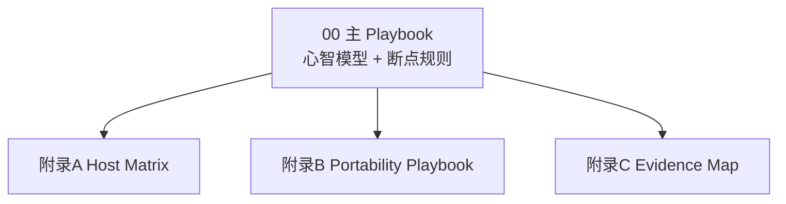
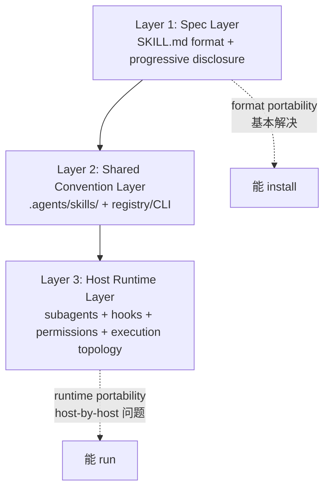

# AI Coding Skills 工程实战 Playbook

> 面向 AI Coding Engineer 的 2026 年 Skills 生态实战指南

---

你在 GitHub 上找到一个 skill——`repo-research-analyst`，周安装量 269，覆盖了 opencode、codex、cursor、gemini-cli、github-copilot、amp 六个 host。评分不错，描述清晰，安装也顺利。你装进 Claude Code，跑起来了，效果挺好。

两个月后，你的同事开始用 Codex CLI——它的沙箱环境更适合 CI，审批模式更透明。他把这个 skill 的文件夹复制过去，装上，运行。

出问题了。

你们花了半天排查。最后发现不是格式问题——SKILL.md 是标准的，frontmatter 也没错。问题出在 skill 的正文里：它在关键步骤用了 `Task(...)` 这个调用语法，然后假设 `subagent_type=”general-purpose”`。这两个都是 Claude Code 的 runtime 约定，Codex 里不存在等价的名称。更讽刺的是，这个 skill 的正文里还有一行写着 `The current year is 2025`。

这个 skill 能在六个 host 上 install，却在真正运行时露出了裂缝。格式层它通过了，runtime 层它带着过时的假设。

**这就是这份 Playbook 要解决的问题。**

---

## 0. 这套包怎么读

这份 Playbook 默认可以线性读，但你也可以按你的卡点跳读：

| 你现在最关心什么 | 先读哪里 | 再跳哪里 |
| --- | --- | --- |
| 我想先上手跑通一个 skill（不想先做完全部对比） | 第 2 章 `Quickstart` | 第 5 章（Writing）+ 附录 B |
| 我主要困惑是选 host | 第 3 章 | 附录 A + 第 6 章 |
| 我主要困惑是”能不能跨 host 用” | 第 4 章 | 附录 B |
| 我在做跨 host 协作（团队不同工具） | 第 6 章 | 附录 A + 附录 B |
| 我想追溯每个强判断的证据 | 附录 C | `../_reference/_INDEX.md` |

也可以先记住这张结构图：



工作区入口（如果你要继续维护/扩写）：

- Topic Registry：`../00-topic-registry.md`
- Round 1 状态真相源：`../../plan/skill-host-skills-deep-research-progressive-plan-round-1.status.md`
- Reference 索引入口：`../_reference/_INDEX.md`

## 1. 为什么 2026 年需要这份 Playbook

2026 年，AI Coding Skills 已经不是新鲜事了。Claude Code、Codex、Cursor、OpenCode 都支持 skills，`agentskills.io` 发布了公开规范，skills.sh registry 上每天都有新的 skill 发布。

但大多数 AI Coding Engineer 仍然卡在同一批问题上——不是”有没有 skill 可以用”，而是更深一层的困惑：

**”这个 skill 能用，还是只是能装？”**

有人在 GitHub 找到一个评分很高的 deep research skill，装进了自己的 host，跑起来了。结果团队里用另一个 host 的同事复用时，发现行为完全不一致，排查半天才发现 skill 里硬编码了原 host 的工具调用语法。

有人看到 `SKILL.md` 格式规范是共享的，以为格式兼容就等于运行兼容，结果在第一个需要 subagent 并发的步骤就卡住了。

有人团队用三个不同 host，想让 skill 在三个地方统一使用，结果三份文件慢慢 drift，成了三个互相矛盾的版本。

这些困惑有一个共同根源：**format portability 和 runtime portability 是两件事**。一个 skill 能 install 不代表它能 run。能 run 不代表换一个 host 还能 run。

这份 Playbook 是一份实战工程指南，不是技术规范文档。它的目的是帮你建立一套可操作的心智模型：

- Skills 到底是什么（为什么不能只把它当成”更长的 prompt”）
- 四大 Host 各自的 runtime contract 有什么本质差异，以及这些差异什么时候会影响你
- 可移植性为什么是分层的问题，而不是 yes/no 问题
- 跨 host 工作时，什么时候该直接复用、什么时候该翻译、什么时候该委托
- 什么能直接拿来用，什么必须先改造，什么改了也没用

**2026 年最重要的认知转变只有一句话**：问题不再是”哪个 host 有 skills”，而是”哪个 host 的 runtime contract 足够明确，能支撑我的工作流”。

---

## 2. Skills 的 3-Layer 生态模型

### Quickstart：先跑一个 skill，再理解框架

如果你还没跑过一个 skill，建议先用这三步把 Layer 1-3 走通一次，再回来读框架。实际体感比抽象描述更容易建立直觉。

**三步走**：

1) 安装一个写作 skill（以 `technical-writer` 为例）：
   - `npx skills add https://github.com/404kidwiz/claude-supercode-skills --skill technical-writer`
2) 打开它的 `SKILL.md`，用 5 个问题快速判读：
   - frontmatter 有没有 `name` + `description`？description 是否足够具体？
   - 第 1 步有没有做"边界检查"（不是这个场景就别启用）？
   - 大块规范/样例是否外置在 `references/`？
   - 是否把脆弱步骤推到 `scripts/` / resources，而不是写死在正文？
   - 是否出现明显的 host-shaped 假设（tool names / subagent labels / stale year）？
3) 做一次"最小改造"：
   - 把 `references/` 替换成你自己的品牌/文档规范/术语表
   - 把 `description` 改成你自己的触发条件（越具体越不容易误触发）
   - 在你使用的 host 里显式激活一次（建议显式启用，而不是让模型猜）

跑完这三步，你会立刻体感到：
- `spec layer` 给你什么（format + progressive disclosure）
- 共享约定（例如 `.agents/skills/`）为什么重要
- `description` 为什么是运行时契约的一部分（决定会不会被正确路由）
- 为什么 references 外置比把一切塞进 `SKILL.md` 更可维护

> writing skills 的完整分类、评估与改造路径见第 5 章。

---

### Skills 是什么？不是"更长的 prompt"

很多人第一次接触 skills 时，会把它理解成"一个更长、更结构化的 prompt"。这个理解不完全错，但错过了关键点。

Prompt 是一次性的。你每次对话都要重新输入，或者把它固定在系统提示词里——但那样它就会一直占用 token，无论你当前任务是否需要它。

Skill 的核心设计原则是 **progressive disclosure（渐进式披露）**：

- 启动时，只加载 `name` 和 `description`（几十个 token）
- 被激活时，才加载完整的 `SKILL.md` 主体（几百到几千 token）
- 需要时，才读取 `references/` 里的大块参考材料（可能上万 token）

这让 skill 能同时做到两件事：**强约束**（封装复杂的方法论和判断标准）和**低常驻成本**（不用的时候不占 token）。

这就是为什么 skill 不是"更长的 prompt"——它是一个**按需加载的工作流包**。

---

### 推导出 3-layer 模型

如果你把四个主流 host（Claude Code、Codex、Cursor、OpenCode）的 skill 支持拆开来看，会发现它们在三个层面上有不同程度的共享和差异：

**第一层：所有 host 都认同的"skill 长什么样"**

这是 `agentskills.io` 发布的公开规范定义的部分：
- 一个 skill 目录至少包含一个 `SKILL.md`
- `SKILL.md` 包含 YAML frontmatter（`name` 和 `description` 必填）和 Markdown 主体
- 可选的 `references/`、`scripts/`、`assets/` 目录
- Progressive disclosure 作为核心加载原则

这一层是 **Spec Layer（规范层）**。四个 host 在这一层基本兼容。

**第二层：大家都在用但不是规范强制的约定**

虽然规范没有强制要求，但实践中已经形成了一些跨 host 的共识：
- `.agents/skills/` 作为跨 host 共享 skill 的常见路径
- `skills` CLI 提供 `find/add/check/update` 等生命周期管理
- Registry（如 skills.sh）提供安装量、更新频率等遥测信号

这一层是 **Shared Convention Layer（共享约定层）**。不是规范的一部分，但已经被广泛采用。

**第三层：各 host 自己的运行时实现**

这是差异最大的一层，也是决定 skill 能否真正"跑起来"的关键：
- **Persistent Guidance**：Claude Code 用 `CLAUDE.md`，Codex 用 `AGENTS.md`，Cursor 用 Project Rules，OpenCode 同时支持多种
- **Runtime Composition**：subagents、hooks、plugins、MCP wiring 的实现方式各不相同
- **Permissions / Sandbox**：approval modes、protected paths、tool availability 的策略差异很大
- **Execution Topology**：local、worktree、cloud、SSH、self-hosted 的支持程度不一

这一层是 **Host Runtime Layer（宿主运行时层）**。这是 host-by-host 的问题。

---

### 为什么这个分层很重要

**因为它解释了为什么"能 install"不等于"能 run"。**

Layer 1（Spec Layer）的兼容性让一个 skill 可以在四个 host 上都 install 成功。但 Layer 3（Host Runtime Layer）的差异决定了它能不能真正跑起来，以及跑起来的行为是否一致。

这就是为什么开篇那个 `repo-research-analyst` skill 能在六个 host 上 install，却在运行时露出裂缝——它通过了 Layer 1，但在 Layer 3 带着过时的 runtime 假设。

下面这张图总结了三层的关系：



**关键洞察**：format portability（格式可移植性）在 Layer 1 已经基本解决，但 runtime portability（运行时可移植性）仍然是一个 host-by-host 的问题。

---

## 3. 四大 Host 的 Runtime Contract

这是整份 Playbook 的核心章节。

**不要试图找"最好的 host"。** 四个主流 host 都在认真支持 skills，但它们代表了不同的工程哲学取向，适合不同的工作流。选 host 的本质，是选一个 runtime contract 和你的工作方式最匹配的工具。

下面每个 host 的描述，我会在技术特性之后加上一段"什么时候你应该认真考虑它"的决策叙事。

---

### Claude Code：最强 Workflow Composition

Claude Code 的核心特征是**组合深度**。它的 skill 不是独立运行的——它是 `skill + hook + subagent + MCP + plugin` 五层组合栈的一部分。一旦 skill 开始和其他层交互，能力上限迅速提高，同时运维复杂度也随之上升。

具体能力：
- **Composition Stack**：`skill + hook + subagent + MCP + plugin` 五层组合，是目前最完整的
- **Plugin Marketplace**：有 semver 版本管理、local override、orphan cleanup
- **Permission Model**：permission-gated `WebSearch / WebFetch`，background subagent approval envelope
- **Persistence**：`CLAUDE.md` 支持 directory scope，import patterns，auto-memory

**你应该认真考虑 Claude Code，如果**：你的 skill 将来很可能不会"只是一个 skill"。当你的工作流开始涉及"先搜索、再分析、再写代码、再测试"这类多步骤编排时，Claude Code 的 composition stack 能让每一步都有清晰的 hook 点和 subagent 边界。这种组合能力是其他 host 目前还追赶中的。

**主要代价**：一旦开始 composition，workflow 会变成需要维护的 stack，而不是简单的"一个 skill 文件"。规模化之后运维更重。

---

### Codex：最强 Engineered Clarity

Codex 的核心特征是**约束可见**。它的 runtime 设计原则是：凡是影响 skill 行为的因素（model、approval、sandbox、search、subagent 继承），都应该可以配置，而且配置状态是可见的。

具体能力：
- **Constraint Visibility**：approvals、sandbox、web_search、subagent inheritance 都有明确的配置和文档
- **Scope Governance**：repo/user/admin/system 四层 scope，explicit disable controls
- **Model Transparency**：reasoning effort、context windows、snapshots、custom agent model config 都可见可配
- **AGENTS.md Chain**：layered instruction chain with overrides and size caps

**你应该认真考虑 Codex，如果**：你在乎"这个 skill 跑起来的时候，到底发生了什么"。CI 环境、合规场景、或者就是工程师直觉上需要审计的场景，Codex 的 approval/sandbox/search controls 的明确程度是其他 host 比不上的。同时它的 CLI 优先设计更适合不想打开 IDE 就能跑 skill 的工作方式。

**主要代价**：高级工作流的成本上升得快。一旦你开始依赖复杂的 subagent 编排，cost 会成为一个需要主动管理的变量。

---

### Cursor：最强 IDE-Native Layering

Cursor 的核心特征是**编辑器原生**。它把 skill 嵌入到 IDE 的上下文里，让 skill 能感知你正在看的文件、正在写的代码、正在打开的 terminal。同时它正在快速扩展执行拓扑，是目前 execution topology 野心最大的 host。

具体能力：
- **Dynamic Layering**：Project Rules + User Rules + `AGENTS.md` + Skills + Subagents，IDE 内分层最丰富
- **Execution Topology**：local、CLI、worktree、cloud、SSH、self-hosted，扩展最广
- **Plugin Bundles**：正在向 marketplace plugin bundles（skills/subagents/MCP/hooks/rules 打包）方向发展
- **Async Agents**：agents window、await tool、cloud runtime

**你应该认真考虑 Cursor，如果**：你的工作流高度依赖编辑器上下文。"一边写代码，一边让 skill 分析当前文件的架构问题"这类场景，Cursor 的 in-editor context 带来的体验是其他 host 很难复制的。异步 agent 执行的能力也让长时间的研究或分析任务可以在后台运行。

**主要代价**：runtime maturity 还不均匀。2026 年有记录在案的 duplicate-loading bug 和 server-side subagent routing 不透明的问题。部分关键行为隐藏在 backend，难以预测和调试。

---

### OpenCode：最强 Compatibility Bridge

OpenCode 的核心特征是**显式桥接**。它同时支持 `.opencode`、`.claude`、`.agents` 多种路径，permissive frontmatter parsing，并且把 skills、rules、agents、permissions、providers 之间的连接方式都明确化了。如果你的目标是"测试一个 skill 能跨多少 host 适配"，OpenCode 是最好的实验环境。

具体能力：
- **Path Compatibility**：同时支持 `.opencode`、`.claude`、`.agents` 路径，permissive frontmatter parsing
- **Explicit Bridge**：skills + rules + agents + permissions + providers 之间有明确的桥接机制
- **Provider Flexibility**：widest provider / local-model flexibility，支持多种 model provider
- **Constraint Model**：provider-gated `websearch`、documented tool defaults、plugin load order、compaction hooks

**你应该认真考虑 OpenCode，如果**：你的团队在多 host 环境下工作，需要一个能适配不同 host 的中间层；或者你在测试一个 skill 的跨 host 兼容性边界。OpenCode 的桥接能力让它成为"实验 + 适配"的最佳场所。

**主要代价**：高配置自由度是双刃剑。配置选项越多，drift 的风险和调试的复杂度就越高。如果团队纪律不足，OpenCode 的灵活性可能成为负担。

---

### Host 选择决策框架

| 你的目标 | 推荐倾向 |
|---------|---------|
| 最高 workflow composition ceiling | Claude Code |
| Explicit runtime governance + model transparency | Codex |
| IDE-native layering + multi-environment expansion | Cursor |
| Compatibility / bridging / provider flexibility | OpenCode |
| Predictable explicit constraints | 选 runtime assumptions 有文档的 host，避免 hidden backend routing |

**一个实用的判断方法**：如果你的 skill 主要是 guidance + examples + references（指导 + 示例 + 参考材料），四个 host 都能跑。如果你的 skill 依赖 subagents + hooks + plugins，先确认目标 host 的 runtime contract 再动手。

---

## 4. 可移植性的真相：Layered Portability

"这个 skill 能不能跨 host 用？"——这是一个错误的问题。正确的问题是："这个 skill 的哪些层能跨 host，哪些层不能？"

### 7 层可移植性框架

| 层级 | 名称 | 可移植性 | 说明 |
|-----|------|---------|------|
| 1 | File Format | 最强 | SKILL.md + frontmatter + references/scripts，公开规范支持 |
| 2 | Discovery / Install | 中等 | `.agents/skills/` 约定 + registry/CLI，但 host 路径有差异 |
| 3 | Workflow-Method | 中等 | 流程步骤、checklist、style guide、references，大部分 writing skills 在这层 |
| 4 | Execution-Topology | 弱 | worktrees、cloud execution、SSH、background waits，host 差异大 |
| 5 | Runtime-Orchestration | 弱 | subagents、hooks、plugin bundles、AGENTS/rules semantics、permissions |
| 6 | Tool-Surface / Backend-Policy | 弱 | websearch 可用性、task/subagent provisioning、backend routing |
| 6.5 | Runtime-Assumption | 弱 | skill 文本中的 stale call shapes、host-specific subagent names、过时的 year/model markers |
| 7 | External Dependency | 最弱 | API keys、env vars、local runtimes、provider-specific model behavior |

### 实战 Breakpoint Rules（断点规则）

这些规则帮你快速判断一个 skill 的可移植性：

1. **如果 skill 主要是 rules + examples + references**：先试直接复用
2. **如果需要满足多个 native skill directories**：先声明 canonical source（权威源），自动化 mirror sync，不要等 drift 积累
3. **如果 host 扫描多个 tool directories**：先验证 deduplication（去重）和 precedence（优先级）行为
4. **如果 skill 依赖 subagents + hooks + plugins**：只假设 partial portability（部分可移植）
5. **如果 skill 依赖特定 execution topology**（worktrees、cloud agents、background waits）：先测试这一层
6. **如果 skill 依赖 search / task / subagent tools**：先验证 tool availability 和 backend policy
7. **如果 skill 携带另一个 host 的 tool names 或 subagent labels**：这是 translation work（翻译工作），不是 copy work
8. **如果 skill 文本硬编码了 host call shapes、stale years、model/provider names**：installable but not yet trustworthy（能装但不能信）
9. **如果 skill 依赖 external APIs + env vars + shell permissions**：这是 integration project（集成项目），不是 copy operation

### 三大跨 Host 工作模式

当直接复用不够时，2026 年有三种 evidence-backed（有证据支持的）跨 host 工作模式：

**模式 1: Sync（同步）**

适用场景：多个 host 需要使用同一个 skill，但各自有不同的 native directory。

做法：
- 选择一个 canonical source（权威源）
- 用 `skills-sync` CLI 或 hook 自动化 mirror sync
- 用 `skills.yaml` 配置 wildcards 和 exclusions 控制同步范围
- 关键：在 drift 积累之前就开始 sync，不要事后补救

**模式 2: Translate（翻译）**

适用场景：skill 的方法论可以复用，但 call shape（调用形式）需要适配目标 host。

做法：
- 翻译 tool names（例如 Claude Code 的 `WebFetch` → Codex 的对应工具）
- 翻译 subagent labels 和 plan semantics
- 保留方法论，重写 host-specific shell
- 关键：翻译 call shape，不是翻译 method

**模式 3: Delegate（委托）**

适用场景：skill 的核心价值明确属于某个 host，强行在另一个 host 模拟不如直接调用。

做法：
- 将另一个 host 的 CLI 作为 worker 调用
- 用 plugin delegation 包装跨 host 调用
- 关键：这是 delegated portability（委托式可移植性），不是 native portability

### Mini Case：一个 Technical-Writer Skill 的迁移故事

框架读起来清晰，但真正的理解来自跑一遍。下面是一个 `technical-writer` skill 从 Claude Code 迁移到 Codex 的完整过程——它展示了 7 层框架里哪些层顺利通过，哪里开始断裂。

**背景**：团队的文档质量出了问题——不同人写的 API 文档风格差距很大，术语不统一，README 参差不齐。有人在 skills.sh registry 找到了一个 `technical-writer` skill（作者：404kidwiz，周安装量 105 次，覆盖 opencode、codex、cursor、claude-code 六个 host），装进 Claude Code，用了两个月，效果不错。工程师写文档时触发这个 skill，输出质量稳定了不少。

然后 CTO 宣布公司新项目要在 Codex CLI 上跑——它的沙箱模型更适合 CI 环境，审批流程更透明。问题来了：能不能把这个 skill 直接搬过去？

---

**Layer 1-2：格式和发现层，顺利**

把 `SKILL.md` 复制过来，`npx skills add` 一行命令装进 Codex，没有报错。frontmatter 兼容，目录结构没问题。这层没有悬念。

---

**Layer 3：Workflow-Method 层，基本可用——但有一个隐患**

打开 `SKILL.md` 仔细读。这个 skill 的核心是一套文档写作流程：

1. 读取目标文档的受众和用途
2. 检查 style rules（外置在 `references/style-guide.md`）
3. 生成草稿，应用风格约束
4. 自检：术语一致性、段落长度、代码示例格式

方法论本身是完全可移植的——它封装的是写作判断，不是工具调用。换哪个 host 都能理解"检查术语一致性"这件事。**Layer 3 通过。**

但有一个细节值得注意：`SKILL.md` 的开头写着一行说明：

> *"Optimized for use with Claude Code's `WebFetch` tool to retrieve brand guidelines from internal wiki."*

这条说明不影响主流程运行，但它暗示作者设想了一个具体的 tool 调用场景。记住这里，后面会用到。

---

**Layer 5-6：问题出现了**

团队的文档工作流里有一个步骤：当写到涉及竞品的部分时，skill 需要搜索最新的竞品发布信息来确保准确性。原来的 `SKILL.md` 里有这么一段：

```
当需要验证竞品信息时，使用 WebSearch 工具检索最新动态，
并通过 WebFetch 从官方文档页面提取关键数据点。
```

装进 Codex 之后，运行时报错：`WebFetch` 不是 Codex 的原生工具名。Codex 的对应能力需要通过 shell 命令或 MCP 调用，而不是 Claude Code 的 `WebFetch`。

这就是 **Layer 6（Tool-Surface）的 breakpoint**：工具名是 host-specific 的，不能直接移植。

同时发现另一个问题：原来的 skill 有一个可选步骤，会在验证阶段起一个 general-purpose subagent 来做并行检查。在 Codex 里，subagent 的调用语法和 label 都不一样——Claude Code 的 `general-purpose` 在 Codex 里需要映射到 `default` 或 `worker`。**Layer 5（Runtime-Orchestration）也出现了断层。**

---

**选择：Translate 还是 Delegate？**

团队的判断：

- Delegate 模式（让 Codex 去调用 Claude Code CLI）：可以，但引入了跨 host 的依赖，不适合 CI 环境
- Translate 模式：工具名是表层问题，核心方法论不变，翻译工作量可控

选 Translate。

具体改动只有两处：

1. `WebFetch` → 改为"通过 shell 命令或 MCP fetch 目标 URL"（行为描述，不绑定工具名）
2. `general-purpose subagent` → 改为"在 Codex 中使用 `worker` 类型的子代理，或直接在主 agent 内完成并行验证"

改完之后，重新装进 Codex，完整跑通。style rules、checklist、输出格式全部保留，方法论一字未改。

---

**这个案例告诉我们什么**

| 层级 | 结果 | 原因 |
|------|------|------|
| Layer 1（文件格式） | ✅ 直接通过 | SKILL.md 格式共享 |
| Layer 2（发现/安装） | ✅ 直接通过 | skills CLI 跨 host 兼容 |
| Layer 3（工作流方法） | ✅ 完整保留 | 写作判断不依赖 runtime |
| Layer 5（运行时编排） | ⚠️ 需要翻译 | subagent label 不同 |
| Layer 6（工具表面） | ⚠️ 需要翻译 | `WebFetch` 是 Claude Code 专属 |

改动量：2处工具名和 subagent label 的翻译，不到 10 行。代价很小，因为这个 skill 的价值集中在 Layer 3，Layer 5-6 只是薄薄的一层 host-specific shell。

如果这个 skill 的核心是"用 subagent 并行爬取 20 个源并做证据合并"（典型的 deep research skill 形态），Layer 5-6 的翻译工作就会复杂得多，这时候 Delegate 模式可能是更好的选择。

> **规律**：skill 的价值越集中在 Layer 3，跨 host 迁移就越轻松。一旦 Layer 5-6 成为核心执行逻辑，才需要认真评估 Translate vs Delegate。

---

### 一个关键警告

**Install spread ≠ semantic portability（安装扩散 ≠ 语义可移植性）**。

一个 skill 能在 4 个 host 上 install，不代表它能在 4 个 host 上正确运行。最常见的陷阱是 runtime-assumption drift（运行时假设漂移）：skill 文本中硬编码了某个 host 的 call shapes、tool names、year markers，换个 host 后这些假设就失效了。

---

## 5. 两大应用线：Writing Skills vs Deep Research Skills

理解了 3-layer 模型和可移植性框架之后，来看两个最有代表性的应用线。它们分别代表了可移植性光谱的两端。

### Writing Skills：高可移植性的典范

Writing skills 是 2026 年最适合"先找现成的，装起来，读懂，边用边改"的 skill 类型。

> 如果你还没跑过一个 writing skill，先回到第 2 章末尾的 `Quickstart`。

**为什么可移植性高**：
- 大部分 writing skills 停留在 Layer 3（Workflow-Method），主要封装 rules、checklists、examples、style contracts、doc-type templates
- 不依赖 host-specific subagents 或 execution topology
- 核心价值在方法论，不在 runtime

**2026 年 writing skills 的主要子类**：
- Technical writing / documentation standardization（技术写作/文档标准化）
- API documentation（API 文档）
- Structured engineering docs: ADR/RFC/design-doc/KB（结构化工程文档）
- Documentation as a product / documentation systems（文档即产品）
- Content marketing / brand voice（内容营销/品牌语气）
- Proofreading / style enforcement（校对/风格强制）
- UX writing / cross-host compatibility（UX 写作/跨 host 兼容）
- Multilingual document writing（多语言文档写作）

**如何评估一个现成 writing skill**：
1. 它解决的是风格问题、文档标准问题，还是内容流水线问题？
2. 它是不是只是一个长 prompt？（如果是，价值有限）
3. 它有没有把大块样例、品牌指南、术语表外置到 `references/`？
4. 它是不是依赖 host 专属能力（hooks、rules、plugins）？

**最小改造路径**：
- 可以直接复用：style rules、checklists、output templates
- 只需替换 reference 文件：品牌指南、术语表、样例库
- 必须跟着 host 改：hooks、settings、rules 联动部分

### Deep Research Skills：可移植性的压力测试

Deep research skills 是可移植性框架的最佳压力测试。它们暴露了 Layer 4-7 的所有 breakpoints。

**为什么可移植性低**：
- 依赖 tool availability（websearch、task、subagent tools）
- 依赖 permissions（approval modes、sandbox policy）
- 依赖 parallel execution（subagent 并发）
- 依赖 evidence discipline（验证、去重、引用控制）
- 这些全部是 host-specific 的

**2026 年 deep research skills 的分类**：
- 基础流程型：问题澄清 → 分解 → 搜集 → 评估 → 综合
- Orchestration 型：evidence table + parallel subagents + citation verification + multi-pass drafting
- Staged autonomous agent 型：显式拆出 planner、source evaluator、report generator
- Deterministic routing 型：按 use case 在通用研究和学术检索后端之间切换
- Tool-heavy domain search 型：依赖特定 API（如 Valyu）和显式运行前提
- Academic literature synthesis 型：围绕论文阅读、对话与综合
- Market intelligence 型：竞品、广告库、定位与信息抽取
- Knowledge-base research ops 型：在 Notion/知识库中检索、综合并生成结构化文档

**一个关键判断**："能搜"不等于"能做 deep research"。真正有价值的 deep research skill 不仅负责搜，还负责拆题、并发、验证、汇总和约束风险。

**跨 host 适配的现实**：
- 方法论（research discipline）可以作为 method 移植
- 但 tool routing 往往需要 translation
- 如果 skill 硬编码了某个 host 的 subagent type names 或 call shapes，需要重写
- Writing skills 是默认的"learn-by-reuse"入口；deep research skills 是比较 host 能力的最佳压力测试

---

## 6. Baseline 工作流

### Host 选择决策树

```
你的 skill 主要是什么？
│
├─ guidance + examples + references（指导型）
│  └─ 四个 host 都能跑，选你最熟悉的
│
├─ 需要 subagents + hooks + plugins（组合型）
│  ├─ 需要最高 composition ceiling → Claude Code
│  ├─ 需要 explicit runtime governance → Codex
│  ├─ 需要 IDE-native + async agents → Cursor
│  └─ 需要 compatibility bridge → OpenCode
│
└─ 需要跨 host 工作
   ├─ 多 host 用同一个 skill → Sync 模式
   ├─ 方法论可复用但 call shape 不同 → Translate 模式
   └─ 核心价值属于某个 host → Delegate 模式
```

### Skill 发现与评估 Checklist

拿到一个现成 skill 时，按这个顺序评估：

1. **Format check**：有没有标准的 `SKILL.md` + frontmatter？
2. **Method check**：核心方法论是什么？是不是只是一个长 prompt？
3. **Dependency check**：依赖哪些 host-specific 能力？（subagents、hooks、plugins、specific tools）
4. **Assumption check**：有没有 stale assumptions？（过时的 call shapes、year markers、model names）
5. **Portability check**：按 7 层框架评估，哪些层能移植，哪些层不能？

### Authoring Hygiene（编写卫生）

如果你在写 skill，遵循这些原则可以最大化跨 host 可复用性：

- **保持 format portability 容易**：minimal metadata、clear description、标准 frontmatter
- **将 fragile/deterministic steps 推入 scripts/resources**：不要把容易变化的逻辑写在 SKILL.md 主体里
- **将 runtime assumptions 视为 host-specific shells**：明确标注哪些部分是 host-specific 的
- **不要硬编码 tool names**：用通用描述，让 host 自己映射
- **不要假设 tool 可用性**：websearch、task、subagent 在不同 host 有不同的 availability 和 permission gates

---

## 7. 护栏与陷阱

### Install ≠ Run

**这是 2026 年最容易踩的坑，值得单独说清楚。**

一个 skill 能在 4 个 host 上 install，不代表它能在 4 个 host 上正确运行。Install 只通过了 Layer 1（文件格式），运行需要通过 Layer 3（Host Runtime）。这两件事之间有真实的断层。

registry 上那个 `repo-research-analyst` skill——周安装量 269，覆盖六个 host——它的 SKILL.md 里写着 `The current year is 2025`，用着 `Task(...)` 这个 Claude Code 的专属调用语法。它在任何一个 host 上都能 install，但在 Codex 上运行时，这些假设会让行为悄悄偏离你的预期，没有报错，只有错误的输出。

**安装信号告诉你一个 skill 是否流行，不告诉你它是否可信。**

---

### 五大警告信号

**警告 1："它到处都能装"**

这不是优点，这是一个需要你进一步检查的信号。问题不是"能不能装"，而是"装上去之后，行为是否和你预期一致"。先检查 stale assumptions，再用。

**警告 2："格式是共享的，所以 runtime 应该差不多"**

格式共享只解决了 Layer 1 的问题。execution topology、permissions、search tools、backend policy 在不同 host 之间差异很大。format 可以一样，runtime 可以完全不一样。

**警告 3："跨 host 扫描会让复用更容易"**

没有 dedup / precedence rules 的跨 host 扫描会导致 context waste（上下文浪费）和 version confusion（版本混乱）。Cursor 在 2026 年有记录在案的 duplicate-loading bug，就是这个问题的具体表现。

**警告 4："Research skills 就是更好的 search skills"**

真正有价值的 research skills 编码了 decomposition（分解）、validation（验证）、evidence discipline（证据纪律）和 output control（输出控制）。"能搜"和"能做 deep research"是两件不同的事。

**警告 5："Host 升级不会影响我的 skill"**

Host 升级可能改变 tool availability、subagent behavior、backend routing，从而改写 skill 的行为。Maintenance 现在是 **stack maintenance**，不是 file maintenance。你要维护的不只是 `SKILL.md`，而是整个 skill 赖以运行的 runtime 假设。

---

### 不要做的事

- 不要假设所有 host 都有 `websearch`——它在不同 host 有不同的 permission gates
- 不要假设 subagents 在所有 host 上行为一致——inheritance behavior 差异大
- 不要盲目复制 GitHub 上的 skill——先检查 stale assumptions
- 不要在没有 dedup rules 的情况下启用跨 host scanning
- 不要把"能 install"当成"能 run"的证据

---

## 8. 出发

现在你有了框架。

你知道 skill 是一个三层生态，format 层已经基本统一，runtime 层仍然是 host-by-host 的问题。你知道四个 host 各自的 runtime contract 取向不同，选 host 是选哲学，不是选功能清单。你知道可移植性是分层的，不同层有不同的迁移策略。你知道 Install ≠ Run。

**下一步是实践，不是继续读。**

一个经过验证的路径：

**第一步：选一个 host，装一个 writing skill，跑起来。**
用第 2 章的 Quickstart 三步完成。不需要做任何改造，先感受一次完整的 skill 生命周期。

**第二步：用 7 层框架评估这个 skill。**
这个 skill 的价值在第几层？它有没有 stale assumptions？它能不能直接在另一个 host 上运行？这个练习会让你对"可移植性是分层的"从概念变成直觉。

**第三步：尝试跨 host 工作。**
把这个 skill 带到另一个 host。记录哪一层开始不兼容。你选 Sync、Translate 还是 Delegate？为什么？把这个过程写下来——这是你团队最有价值的 runtime knowledge，不在任何文档里，只在你们自己的实践里。

**第四步：从改造开始写自己的 skill。**
不要从零写。找一个接近你需求的现有 skill，读懂它，改造它。遵循 authoring hygiene：把 host-specific 的工具调用隔离出来，把方法论保留为 host 中立的形式。

---

建立真实直觉的方式只有一种：跑。

---

> **维护者注**：以下是 2026 年 4 月的 open issues，供持续跟踪。
> 1. **官方迁移契约缺失**：目前没有 host 提供官方的 cross-host migration contract，跨 host 互操作主要依赖 sync/translate/delegate 社区实践。
> 2. **Repair-oriented failure cases 不足**：已有 duplicate-loading 和 drift/constraint 故障记录，缺少更多 before/after remediation 案例。
> 3. **Hidden backend constraints**：部分 host（特别是 Cursor）的 server-side routing 行为不完全透明。

---

> 附录导航：
> - [附录 A：Host Capability Matrix](./附录A-Host-Capability-Matrix.md) — 四大 Host 能力对比详表
> - [附录 B：Portability Playbook](./附录B-Portability-Playbook.md) — 可移植性分层详解与实战案例
> - [附录 C：Evidence Traceability Map](./附录C-Evidence-Traceability-Map.md) — 核心判断的证据溯源
